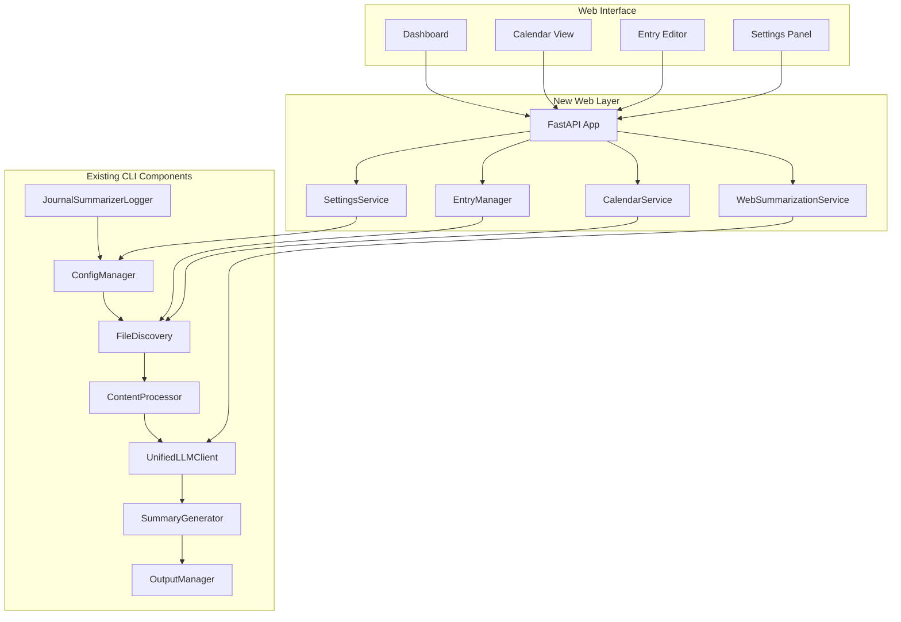

# Daily Work Journal Web Application - Detailed Implementation Blueprint

## 🎯 Project Overview

This blueprint integrates a modern web interface with the existing sophisticated CLI-based Work Journal Summarizer. The approach leverages all existing components ([`ConfigManager`](config_manager.py:71), [`FileDiscovery`](file_discovery.py:54), [`UnifiedLLMClient`](unified_llm_client.py:24), etc.) while adding web functionality through a clean integration layer.

## 🏗️ Implementation Architecture



## 📋 Implementation Steps (18 Steps)

### **PHASE 1: Foundation Setup (Steps 1-3)**

#### Step 1: Web Directory Structure & Dependencies
- Create [`web/`](web/) directory structure
- Update [`requirements.txt`](requirements.txt) with web dependencies
- Set up basic FastAPI application shell
- Integrate with existing [`ConfigManager`](config_manager.py:71)

#### Step 2: Database Schema & Models
- Create SQLite database for web indexing
- Define Pydantic models for API contracts
- Implement database initialization and migrations
- Create data synchronization foundation

#### Step 3: Core FastAPI Application
- Implement main FastAPI app with existing config integration
- Set up middleware, error handling, and logging
- Create health check and status endpoints
- Integrate with existing [`JournalSummarizerLogger`](logger.py:87)

### **PHASE 2: Entry Management Integration (Steps 4-6)**

#### Step 4: EntryManager Service
- Create [`EntryManager`](web/services/entry_manager.py) wrapping [`FileDiscovery`](file_discovery.py:54)
- Implement file reading/writing with existing directory structure
- Add async interfaces for web operations
- Maintain compatibility with CLI operations

#### Step 5: Database Synchronization
- Implement file system to database sync
- Create entry indexing for fast web queries
- Handle concurrent access between web and CLI
- Add background sync processes

#### Step 6: Entry API Endpoints
- Create REST API for entry CRUD operations
- Implement entry listing and filtering
- Add entry search and metadata endpoints
- Include comprehensive error handling

### **PHASE 3: Calendar Integration (Steps 7-8)**

#### Step 7: Calendar Service
- Create [`CalendarService`](web/services/calendar_service.py) using [`FileDiscovery`](file_discovery.py:54)
- Implement month/year navigation logic
- Add entry indicator calculation
- Integrate with existing date utilities

#### Step 8: Calendar API Endpoints
- Create calendar data API endpoints
- Implement date range queries
- Add entry existence checking
- Support multiple calendar views

### **PHASE 4: Web Summarization (Steps 9-10)**

#### Step 9: Web Summarization Service
- Create [`WebSummarizationService`](web/services/web_summarizer.py) wrapping existing pipeline
- Integrate [`UnifiedLLMClient`](unified_llm_client.py:24), [`SummaryGenerator`](summary_generator.py:52)
- Add async interfaces and progress tracking
- Maintain CLI compatibility

#### Step 10: Summarization API & Progress Tracking
- Create summarization API endpoints
- Implement progress tracking and status updates
- Add task management for long-running operations
- Include WebSocket support for real-time updates

### **PHASE 5: Base Web Interface (Steps 11-13)**

#### Step 11: Base Templates & Styling
- Create minimalistic, macOS-like base templates
- Implement responsive CSS framework
- Add professional typography and spacing
- Create reusable UI components

#### Step 12: Dashboard Interface
- Implement main dashboard with today's entry focus
- Add recent entries display using [`EntryManager`](web/services/entry_manager.py)
- Create quick action buttons
- Add status indicators and navigation

#### Step 13: Entry Editor Interface
- Create clean, distraction-free editor
- Implement auto-save functionality
- Add markdown support and preview
- Integrate with [`EntryManager`](web/services/entry_manager.py) API

### **PHASE 6: Advanced Features (Steps 14-16)**

#### Step 14: Calendar View Interface
- Implement interactive calendar grid
- Add entry indicators and navigation
- Create smooth month transitions
- Integrate with [`CalendarService`](web/services/calendar_service.py)

#### Step 15: Settings Management
- Create [`SettingsService`](web/services/settings_service.py) extending [`ConfigManager`](config_manager.py:71)
- Implement web-specific settings
- Add settings UI and validation
- Maintain CLI configuration compatibility

#### Step 16: Summarization Interface
- Create summarization request interface
- Add progress tracking UI
- Implement result display and download
- Integrate with [`WebSummarizationService`](web/services/web_summarizer.py)

### **PHASE 7: Testing & Deployment (Steps 17-18)**

#### Step 17: Comprehensive Testing
- Create integration tests for web-CLI compatibility
- Add API endpoint testing
- Implement UI testing with Playwright
- Test concurrent access scenarios

#### Step 18: Production Deployment
- Create unified entry point for CLI and web modes
- Add production configuration
- Implement security measures
- Create deployment documentation

---

## 🚀 Detailed Implementation Prompts

### **Step 1: Web Directory Structure & Dependencies**

```
Create the foundational web application structure that integrates seamlessly with the existing WorkJournalMaker CLI codebase. This step establishes the web layer while maintaining full backward compatibility with existing CLI functionality.

Requirements:
1. Create a clean web/ directory structure within the existing project
2. Update requirements.txt with essential web dependencies
3. Set up a basic FastAPI application that imports and uses existing components
4. Integrate with the existing ConfigManager and logging infrastructure
5. Ensure zero impact on existing CLI functionality

Project Structure to Create:
web/
├── __init__.py
├── app.py                    # Main FastAPI application
├── database.py               # SQLite database setup
├── models/                   # Pydantic models for API
│   ├── __init__.py
│   ├── journal.py           # Journal entry models
│   └── responses.py         # API response models
├── services/                 # Business logic services
│   ├── __init__.py
│   └── base_service.py      # Base service class
└── api/                      # REST API routes
    ├── __init__.py
    └── health.py            # Health check endpoints

Dependencies to Add to requirements.txt:
# Web Framework
fastapi>=0.104.0
uvicorn[standard]>=0.24.0

# Templates and Forms
jinja2>=3.1.0
python-multipart>=0.0.6

# Database
sqlalchemy>=2.0.0
aiosqlite>=0.19.0

# Additional utilities
python-dateutil>=2.8.0

Integration Points:
- Import and use existing ConfigManager from config_manager.py
- Import and use existing JournalSummarizerLogger from logger.py
- Maintain compatibility with existing config.yaml structure
- Use existing error handling patterns and logging infrastructure

Key Implementation Details:

1. FastAPI Application (web/app.py):
from fastapi import FastAPI, HTTPException
from fastapi.middleware.cors import CORSMiddleware
from contextlib import asynccontextmanager
import sys
from pathlib import Path

# Add parent directory to path for imports
sys.path.append(str(Path(__file__).parent.parent))

from config_manager import ConfigManager, AppConfig
from logger import create_logger_with_config, JournalSummarizerLogger

@asynccontextmanager
async def lifespan(app: FastAPI):
    # Initialize configuration and logging using existing infrastructure
    config_manager = ConfigManager()
    app.state.config = config_manager.get_config()
    app.state.logger = create_logger_with_config(app.state.config.logging)
    
    app.state.logger.info("Web application starting up...")
    yield
    app.state.logger.info("Web application shutting down...")

app = FastAPI(
    title="Work Journal Maker",
    description="Web interface for the Work Journal Summarizer",
    version="1.0.0",
    lifespan=lifespan
)

# Add CORS middleware for development
app.add_middleware(
    CORSMiddleware,
    allow_origins=["http://localhost:3000", "http://127.0.0.1:3000"],
    allow_credentials=True,
    allow_methods=["*"],
    allow_headers=["*"],
)

2. Database Setup (web/database.py):
from sqlalchemy.ext.asyncio import AsyncSession, create_async_engine, async_sessionmaker
from sqlalchemy.orm import DeclarativeBase
from sqlalchemy import Column, Integer, String, Date, Boolean, DateTime, Text
from datetime import datetime
import aiosqlite
from pathlib import Path

class Base(DeclarativeBase):
    pass

class JournalEntryIndex(Base):
    """Database index for journal entries (file system remains primary store)."""
    __tablename__ = "journal_entries"
    
    id = Column(Integer, primary_key=True, autoincrement=True)
    date = Column(Date, unique=True, nullable=False, index=True)
    file_path = Column(String, nullable=False)
    week_ending_date = Column(Date, nullable=False, index=True)
    word_count = Column(Integer, default=0)
    has_content = Column(Boolean, default=False)
    created_at = Column(DateTime, default=datetime.utcnow)
    modified_at = Column(DateTime, default=datetime.utcnow, onupdate=datetime.utcnow)

# Database session management
engine = None
SessionLocal = None

async def init_database(database_path: str = "web/journal_index.db"):
    """Initialize the database with proper async setup."""
    global engine, SessionLocal
    
    # Ensure directory exists
    Path(database_path).parent.mkdir(parents=True, exist_ok=True)
    
    engine = create_async_engine(f"sqlite+aiosqlite:///{database_path}")
    SessionLocal = async_sessionmaker(engine, class_=AsyncSession, expire_on_commit=False)
    
    # Create tables
    async with engine.begin() as conn:
        await conn.run_sync(Base.metadata.create_all)

async def get_db_session():
    """Get database session for dependency injection."""
    async with SessionLocal() as session:
        try:
            yield session
        finally:
            await session.close()

3. Base Models (web/models/journal.py):
from pydantic import BaseModel, Field
from datetime import date, datetime
from typing import Optional, List

class JournalEntryBase(BaseModel):
    """Base model for journal entries."""
    date: date = Field(..., description="Entry date")
    content: str = Field("", description="Entry content")

class JournalEntryCreate(JournalEntryBase):
    """Model for creating journal entries."""
    pass

class JournalEntryUpdate(BaseModel):
    """Model for updating journal entries."""
    content: str = Field(..., description="Updated entry content")

class JournalEntryResponse(JournalEntryBase):
    """Model for journal entry API responses."""
    word_count: int = Field(0, description="Word count")
    has_content: bool = Field(False, description="Whether entry has content")
    file_path: str = Field(..., description="File system path")
    week_ending_date: date = Field(..., description="Week ending date")
    created_at: Optional[datetime] = None
    modified_at: Optional[datetime] = None

    class Config:
        from_attributes = True

class RecentEntriesResponse(BaseModel):
    """Response model for recent entries list."""
    entries: List[JournalEntryResponse]
    total_count: int
    has_more: bool

4. Health Check API (web/api/health.py):
from fastapi import APIRouter, Depends, HTTPException
from fastapi.requests import Request
from pathlib import Path
import sys

# Add parent directory for imports
sys.path.append(str(Path(__file__).parent.parent.parent))

from config_manager import AppConfig
from logger import JournalSummarizerLogger

router = APIRouter(prefix="/api/health", tags=["health"])

@router.get("/")
async def health_check(request: Request):
    """Basic health check endpoint."""
    config: AppConfig = request.app.state.config
    logger: JournalSummarizerLogger = request.app.state.logger
    
    logger.debug("Health check requested")
    
    return {
        "status": "healthy",
        "service": "Work Journal Maker Web",
        "version": "1.0.0",
        "config_loaded": config is not None,
        "base_path": str(config.processing.base_path) if config else None
    }

@router.get("/config")
async def config_status(request: Request):
    """Configuration status endpoint."""
    config: AppConfig = request.app.state.config
    
    if not config:
        raise HTTPException(status_code=500, detail="Configuration not loaded")
    
    return {
        "llm_provider": config.llm.provider,
        "base_path": config.processing.base_path,
        "output_path": config.processing.output_path,
        "logging_level": config.logging.level.value
    }

Testing Requirements:
1. Verify FastAPI application starts without errors
2. Confirm existing CLI functionality remains unchanged
3. Test health check endpoints return expected data
4. Validate configuration integration works correctly
5. Ensure database initialization completes successfully

Success Criteria:
- Web server starts on http://localhost:8000
- Health check endpoints respond correctly
- Existing CLI commands work unchanged
- Configuration is properly loaded and accessible
- Database schema is created successfully
- All imports from existing modules work correctly

Write production-ready code with comprehensive error handling, proper logging integration, and maintain full backward compatibility with the existing CLI codebase.
```

---

### **Step 2: Database Schema & Models**

```
Expand the database schema and Pydantic models to support comprehensive web functionality while maintaining the file system as the primary data store. The database serves as a fast index for web queries, not as the source of truth.

Requirements:
1. Create comprehensive database schema for web indexing
2. Implement robust Pydantic models for all API operations
3. Add database migration and initialization system
4. Create data validation and serialization layers
5. Ensure thread-safe database operations for concurrent web/CLI access

Database Schema Expansion:

1. Enhanced Journal Entry Index (web/database.py):
from sqlalchemy import Column, Integer, String, Date, Boolean, DateTime, Text, Float
from sqlalchemy.ext.asyncio import AsyncSession, create_async_engine, async_sessionmaker
from sqlalchemy.orm import DeclarativeBase
from datetime import datetime
from pathlib import Path
import json

class Base(DeclarativeBase):
    pass

class JournalEntryIndex(Base):
    """Enhanced database index for journal entries."""
    __tablename__ = "journal_entries"
    
    id = Column(Integer, primary_key=True, autoincrement=True)
    date = Column(Date, unique=True, nullable=False, index=True)
    file_path = Column(String, nullable=False)
    week_ending_date = Column(Date, nullable=False, index=True)
    
    # Content metadata
    word_count = Column(Integer, default=0)
    character_count = Column(Integer, default=0)
    line_count = Column(Integer, default=0)
    has_content = Column(Boolean, default=False, index=True)
    
    # File system metadata
    file_size_bytes = Column(Integer, default=0)
    file_modified_at = Column(DateTime)
    
    # Web-specific metadata
    last_accessed_at = Column(DateTime)
    access_count = Column(Integer, default=0)
    
    # Timestamps
    created_at = Column(DateTime, default=datetime.utcnow, index=True)
    modified_at = Column(DateTime, default=datetime.utcnow, onupdate=datetime.utcnow)
    synced_at = Column(DateTime, default=datetime.utcnow)

class WebSettings(Base):
    """Web-specific settings and preferences."""
    __tablename__ = "web_settings"
    
    id = Column(Integer, primary_key=True, autoincrement=True)
    key = Column(String, unique=True, nullable=False, index=True)
    value = Column(Text, nullable=False)
    value_type = Column(String, nullable=False)  # 'string', 'integer', 'boolean', 'json'
    description = Column(String)
    created_at = Column(DateTime, default=datetime.utcnow)
    modified_at = Column(DateTime, default=datetime.utcnow, onupdate=datetime.utcnow)

class SyncStatus(Base):
    """Track synchronization status between file system and database."""
    __tablename__ = "sync_status"
    
    id = Column(Integer, primary_key=True, autoincrement=True)
    sync_type = Column(String, nullable=False)  # 'full', 'incremental', 'entry'
    started_at = Column(DateTime, nullable=False)
    completed_at = Column(DateTime)
    status = Column(String, nullable=False)  # 'running', 'completed', 'failed'
    entries_processed = Column(Integer, default=0)
    entries_added = Column(Integer, default=0)
    entries_updated = Column(Integer, default=0)
    entries_removed = Column(Integer, default=0)
    error_message = Column(Text)
    metadata = Column(Text)  # JSON metadata

2. Database Management (web/database.py continued):
import asyncio
from typing import Optional, Dict, Any
from contextlib import asynccontextmanager

class DatabaseManager:
    """Manages database operations and migrations."""
    
    def __init__(self, database_path: str = "web/journal_index.db"):
        self.database_path = database_path
        self.engine = None
        self.SessionLocal = None
        
    async def initialize(self):
        """Initialize database with proper async setup."""
        # Ensure directory exists
        Path(self.database_path).parent.mkdir(parents=True, exist_ok=True)
        
        self.engine = create_async_engine(
            f"sqlite+aiosqlite:///{self.database_path}",
            echo=False,  # Set to True for SQL debugging
            pool_pre_ping=True
        )
        self.SessionLocal = async_sessionmaker(
            self.engine, 
            class_=AsyncSession, 
            expire_on_commit=False
        )
        
        # Create tables
        async with self.engine.begin() as conn:
            await conn.run_sync(Base.metadata.create_all)
            
        # Initialize default settings
        await self._initialize_default_settings()
    
    async def _initialize_default_settings(self):
        """Initialize default web settings."""
        default_settings = [
            ("auto_save_interval", "30", "integer", "Auto-save interval in seconds"),
            ("theme", "light", "string", "UI theme preference"),
            ("editor_font_size", "14", "integer", "Editor font size"),
            ("show_word_count", "true", "boolean", "Show word count in editor"),
            ("calendar_start_day", "0", "integer", "Calendar start day (0=Sunday)"),
        ]
        
        async with self.get_session() as session:
            for key, value, value_type, description in default_settings:
                # Check if setting already exists
                result = await session.execute(
                    "SELECT id FROM web_settings WHERE key = ?", (key,)
                )
                if not result.fetchone():
                    setting = WebSettings(
                        key=key,
                        value=value,
                        value_type=value_type,
                        description=description
                    )
                    session.add(setting)
            await session.commit()
    
    @asynccontextmanager
    async def get_session(self):
        """Get database session with proper cleanup."""
        async with self.SessionLocal() as session:
            try:
                yield session
            except Exception:
                await session.rollback()
                raise
            finally:
                await session.close()
    
    async def health_check(self) -> Dict[str, Any]:
        """Check database health and return status."""
        try:
            async with self.get_session() as session:
                result = await session.execute("SELECT 1")
                result.fetchone()
                
                # Get basic stats
                entry_count = await session.execute(
                    "SELECT COUNT(*) FROM journal_entries"
                )
                entry_count = entry_count.scalar()
                
                return {
                    "status": "healthy",
                    "database_path": self.database_path,
                    "entry_count": entry_count,
                    "connection": "active"
                }
        except Exception as e:
            return {
                "status": "unhealthy",
                "error": str(e),
                "database_path": self.database_path
            }

# Global database manager instance
db_manager = DatabaseManager()

3. Enhanced Pydantic Models (web/models/journal.py):
from pydantic import BaseModel, Field, validator
from datetime import date, datetime
from typing import Optional, List, Dict, Any
from enum import Enum

class EntryStatus(str, Enum):
    """Entry status enumeration."""
    EMPTY = "empty"
    DRAFT = "draft"
    COMPLETE = "complete"

class JournalEntryMetadata(BaseModel):
    """Metadata for journal entries."""
    word_count: int = Field(0, ge=0, description="Word count")
    character_count: int = Field(0, ge=0, description="Character count")
    line_count: int = Field(0, ge=0, description="Line count")
    file_size_bytes: int = Field(0, ge=0, description="File size in bytes")
    has_content: bool = Field(False, description="Whether entry has content")
    status: EntryStatus = Field(EntryStatus.EMPTY, description="Entry status")

class JournalEntryBase(BaseModel):
    """Base model for journal entries."""
    date: date = Field(..., description="Entry date")
    
    @validator('date')
    def validate_date(cls, v):
        if v > date.today():
            raise ValueError('Entry date cannot be in the future')
        return v

class JournalEntryCreate(JournalEntryBase):
    """Model for creating journal entries."""
    content: str = Field("", description="Entry content")

class JournalEntryUpdate(BaseModel):
    """Model for updating journal entries."""
    content: str = Field(..., description="Updated entry content")

class JournalEntryResponse(JournalEntryBase):
    """Model for journal entry API responses."""
    content: Optional[str] = Field(None, description="Entry content")
    file_path: str = Field(..., description="File system path")
    week_ending_date: date = Field(..., description="Week ending date")
    metadata: JournalEntryMetadata = Field(..., description="Entry metadata")
    
    # Timestamps
    created_at: Optional[datetime] = None
    modified_at: Optional[datetime] = None
    last_accessed_at: Optional[datetime] = None
    file_modified_at: Optional[datetime] = None
    
    class Config:
        from_attributes = True

class EntryListRequest(BaseModel):
    """Request model for entry listing."""
    start_date: Optional[date] = Field(None, description="Start date filter")
    end_date: Optional[date] = Field(None, description="End date filter")
    has_content: Optional[bool] = Field(None, description="Filter by content presence")
    limit: int = Field(10, ge=1, le=100, description="Number of entries to return")
    offset: int = Field(0, ge=0, description="Offset for pagination")
    sort_by: str = Field("date", description="Sort field")
    sort_order: str = Field("desc", regex="^(asc|desc)$", description="Sort order")

class RecentEntriesResponse(BaseModel):
    """Response model for recent entries list."""
    entries: List[JournalEntryResponse]
    total_count: int = Field(..., ge=0, description="Total number of entries")
    has_more: bool = Field(..., description="Whether more entries are available")
    pagination: Dict[str, Any] = Field(..., description="Pagination metadata")

class CalendarEntry(BaseModel):
    """Model for calendar entry indicators."""
    date: date = Field(..., description="Entry date")
    has_content: bool = Field(False, description="Whether entry has content")
    word_count: int = Field(0, ge=0, description="Word count")
    status: EntryStatus = Field(EntryStatus.EMPTY, description="Entry status")

class CalendarMonth(BaseModel):
    """Model for calendar month data."""
    year: int = Field(..., ge=1900, le=3000, description="Year")
    month: int = Field(..., ge=1, le=12, description="Month")
    month_name: str = Field(..., description="Month name")
    entries: List[CalendarEntry] = Field(..., description="Entries in month")
    today: date = Field(..., description="Today's date")
    
class DatabaseStats(BaseModel):
    """Database statistics model."""
    total_entries: int = Field(0, ge=0, description="Total entries in database")
    entries_with_content: int = Field(0, ge=0, description="Entries with content")
    date_range: Optional[Dict[str, date]] = Field(None, description="Date range of entries")
    last_sync: Optional[datetime] = Field(None, description="Last sync timestamp")
    database_size_mb: float = Field(0.0, ge=0.0, description="Database size in MB")

4. Settings Models (web/models/settings.py):
from pydantic import BaseModel, Field, validator
from typing import Any, Dict, Optional, Union
from datetime import datetime

class WebSettingBase(BaseModel):
    """Base model for web settings."""
    key: str = Field(..., min_length=1, max_length=100, description="Setting key")
    value: str = Field(..., description="Setting value as string")
    value_type: str = Field(..., regex="^(string|integer|boolean|json)$", description="Value type")
    description: Optional[str] = Field(None, max_length=500, description="Setting description")

class WebSettingCreate(WebSettingBase):
    """Model for creating web settings."""
    pass

class WebSettingUpdate(BaseModel):
    """Model for updating web settings."""
    value: str = Field(..., description="Updated setting value")
    description: Optional[str] = Field(None, max_length=500, description="Updated description")

class WebSettingResponse(WebSettingBase):
    """Model for web setting API responses."""
    id: int = Field(..., description="Setting ID")
    parsed_value: Union[str, int, bool, Dict[str, Any]] = Field(..., description="Parsed value")
    created_at: datetime = Field(..., description="Creation timestamp")
    modified_at: datetime = Field(..., description="Last modification timestamp")
    
    class Config:
        from_attributes = True

class SettingsCollection(BaseModel):
    """Collection of settings for bulk operations."""
    settings: Dict[str, Union[str, int, bool, Dict[str, Any]]] = Field(..., description="Settings dictionary")
    
    @validator('settings')
    def validate_settings_keys(cls, v):
        allowed_keys = {
            'auto_save_interval', 'theme', 'editor_font_size', 
            'show_word_count', 'calendar_start_day'
        }
        invalid_keys = set(v.keys()) - allowed_keys
        if invalid_keys:
            raise ValueError(f'Invalid setting keys: {invalid_keys}')
        return v

Testing Requirements:
1. Test database initialization and table creation
2. Verify all Pydantic models validate correctly
3. Test database session management and cleanup
4. Validate setting initialization and retrieval
5. Ensure thread-safe database operations
6. Test model serialization and deserialization

Success Criteria:
- Database schema creates successfully with all tables
- All Pydantic models validate input correctly
- Database sessions handle concurrent access properly
- Default settings are initialized correctly
- Health check returns accurate database status
- Models serialize/deserialize without data loss

Write production-ready code with comprehensive error handling, proper validation, and robust database session management.
```

---

### **Step 3: Core FastAPI Application**

```
Implement the core FastAPI application with comprehensive middleware, error handling, and integration with the existing configuration and logging infrastructure. This establishes the foundation for all web functionality.

Requirements:
1. Create production-ready FastAPI application with proper middleware stack
2. Implement comprehensive error handling and logging integration
3. Add security middleware and CORS configuration
4. Create application lifecycle management
5. Integrate with existing ConfigManager and JournalSummarizerLogger
6. Add request/response logging and monitoring

Core Application Implementation:

1. Main FastAPI Application (web/app.py):
from fastapi import FastAPI, Request, HTTPException, Depends
from fastapi.middleware.cors import CORSMiddleware
from fastapi.middleware.trustedhost import TrustedHostMiddleware
from fastapi.responses import JSONResponse
from fastapi.staticfiles import StaticFiles
from fastapi.templating import Jinja2Templates
from contextlib import asynccontextmanager
import sys
import time
import traceback
from pathlib import Path
from typing import Dict, Any

# Add parent directory to path for imports
sys.path.append(str(Path(__file__).parent.parent))

from config_manager import ConfigManager, AppConfig
from logger import create_logger_with_config, JournalSummarizerLogger, ErrorCategory
from web.database import DatabaseManager, db_manager
from web.api import health
from web.middleware import LoggingMiddleware, ErrorHandlingMiddleware

class WorkJournalWebApp:
    """Main web application class with integrated lifecycle management."""
    
    def __init__(self):
        self.config: Optional[AppConfig] = None
        self.logger: Optional[JournalSummarizerLogger] = None
        self.db_manager: DatabaseManager = db_manager
        
    async def startup(self):
        """Application startup sequence."""
        try:
            # Initialize configuration
            config_manager = ConfigManager()
            self.config = config_manager.get_config()
            
            # Initialize logging
            self.logger = create_logger_with_config(self.config.logging)
            self.logger.info("Starting Work Journal Web Application...")
            
            # Initialize database
            await self.db_manager.initialize()
            self.logger.info("Database initialized successfully")
            
            # Log startup completion
            self.logger.info("Web application startup completed successfully")
            
        except Exception as e:
            if self.logger:
                self.logger.error(f"Failed to start web application: {str(e)}", 
                                ErrorCategory.SYSTEM_ERROR)
            raise
    
    async def shutdown(self):
        """Application shutdown sequence."""
        if self.logger:
            self.logger.info("Shutting down Work Journal Web Application...")
            
        # Close database connections
        if self.db_manager and self.db_manager.engine:
            await self.db_manager.engine.dispose()
            
        if self.logger:
            self.logger.info("Web application shutdown complete")

# Create application instance
web_app = WorkJournalWebApp()

@asynccontextmanager
async def lifespan(app: FastAPI):
    """Application lifespan management."""
    # Startup
    await web_app.startup()
    app.state.config = web_app.config
    app.state.logger = web_app.logger
app.state.db_manager = web_app.db_manager
    
    yield
    
    # Shutdown
    await web_app.shutdown()

# Create FastAPI application
app = FastAPI(
    title="Work Journal Maker",
    description="Web interface for the Work Journal Summarizer",
    version="1.0.0",
    lifespan=lifespan,
    docs_url="/api/docs",
    redoc_url="/api/redoc"
)

# Security middleware
app.add_middleware(
    TrustedHostMiddleware, 
    allowed_hosts=["localhost", "127.0.0.1", "*.localhost"]
)

# CORS middleware for development
app.add_middleware(
    CORSMiddleware,
    allow_origins=["http://localhost:3000", "http://127.0.0.1:3000", "http://localhost:8080"],
    allow_credentials=True,
    allow_methods=["GET", "POST", "PUT", "DELETE", "PATCH"],
    allow_headers=["*"],
)

# Custom middleware
app.add_middleware(LoggingMiddleware)
app.add_middleware(ErrorHandlingMiddleware)

# Include API routers
app.include_router(health.router)

# Static files and templates
app.mount("/static", StaticFiles(directory="web/static"), name="static")
templates = Jinja2Templates(directory="web/templates")

2. Custom Middleware (web/middleware.py):
from fastapi import Request, Response
from starlette.middleware.base import BaseHTTPMiddleware
from starlette.responses import JSONResponse
import time
import traceback
from typing import Callable
from logger import JournalSummarizerLogger, ErrorCategory

class LoggingMiddleware(BaseHTTPMiddleware):
    """Middleware for request/response logging."""
    
    async def dispatch(self, request: Request, call_next: Callable) -> Response:
        start_time = time.time()
        
        # Get logger from app state
        logger: JournalSummarizerLogger = getattr(request.app.state, 'logger', None)
        
        if logger:
            logger.debug(f"Request: {request.method} {request.url}")
        
        # Process request
        response = await call_next(request)
        
        # Log response
        process_time = time.time() - start_time
        if logger:
            logger.debug(
                f"Response: {response.status_code} for {request.method} {request.url} "
                f"in {process_time:.4f}s"
            )
        
        # Add timing header
        response.headers["X-Process-Time"] = str(process_time)
        
        return response

class ErrorHandlingMiddleware(BaseHTTPMiddleware):
    """Middleware for global error handling."""
    
    async def dispatch(self, request: Request, call_next: Callable) -> Response:
        try:
            response = await call_next(request)
            return response
        except Exception as e:
            # Get logger from app state
            logger: JournalSummarizerLogger = getattr(request.app.state, 'logger', None)
            
            if logger:
                logger.error(
                    f"Unhandled exception in {request.method} {request.url}: {str(e)}",
                    ErrorCategory.SYSTEM_ERROR
                )
                logger.debug(f"Exception traceback: {traceback.format_exc()}")
            
            # Return JSON error response
            return JSONResponse(
                status_code=500,
                content={
                    "error": "Internal server error",
                    "message": "An unexpected error occurred",
                    "request_id": getattr(request.state, 'request_id', None)
                }
            )

3. Enhanced Health Check (web/api/health.py):
from fastapi import APIRouter, Depends, HTTPException, Request
from pathlib import Path
import sys
import os
from datetime import datetime

# Add parent directory for imports
sys.path.append(str(Path(__file__).parent.parent.parent))

from config_manager import AppConfig
from logger import JournalSummarizerLogger
from web.database import DatabaseManager

router = APIRouter(prefix="/api/health", tags=["health"])

@router.get("/")
async def health_check(request: Request):
    """Comprehensive health check endpoint."""
    config: AppConfig = request.app.state.config
    logger: JournalSummarizerLogger = request.app.state.logger
    db_manager: DatabaseManager = request.app.state.db_manager
    
    logger.debug("Health check requested")
    
    # Check database health
    db_health = await db_manager.health_check()
    
    # Check file system access
    base_path = Path(config.processing.base_path).expanduser()
    fs_accessible = base_path.exists() and os.access(base_path, os.R_OK | os.W_OK)
    
    health_status = {
        "status": "healthy" if db_health["status"] == "healthy" and fs_accessible else "degraded",
        "service": "Work Journal Maker Web",
        "version": "1.0.0",
        "timestamp": datetime.utcnow().isoformat(),
        "components": {
            "database": db_health,
            "filesystem": {
                "status": "healthy" if fs_accessible else "unhealthy",
                "base_path": str(base_path),
                "accessible": fs_accessible
            },
            "configuration": {
                "status": "healthy" if config else "unhealthy",
                "llm_provider": config.llm.provider if config else None
            }
        }
    }
    
    return health_status

@router.get("/config")
async def config_status(request: Request):
    """Detailed configuration status endpoint."""
    config: AppConfig = request.app.state.config
    
    if not config:
        raise HTTPException(status_code=500, detail="Configuration not loaded")
    
    return {
        "llm": {
            "provider": config.llm.provider,
            "bedrock_region": config.bedrock.region,
            "bedrock_model": config.bedrock.model_id
        },
        "processing": {
            "base_path": config.processing.base_path,
            "output_path": config.processing.output_path,
            "max_file_size_mb": config.processing.max_file_size_mb
        },
        "logging": {
            "level": config.logging.level.value,
            "file_enabled": config.logging.file_enabled
        }
    }

@router.get("/metrics")
async def system_metrics(request: Request):
    """System metrics endpoint."""
    db_manager: DatabaseManager = request.app.state.db_manager
    
    # Get database stats
    db_stats = await db_manager.health_check()
    
    return {
        "database": {
            "entry_count": db_stats.get("entry_count", 0),
            "status": db_stats.get("status", "unknown")
        },
        "uptime": getattr(request.app.state, 'start_time', datetime.utcnow()).isoformat()
    }

Testing Requirements:
1. Test FastAPI application starts with all middleware
2. Verify error handling middleware catches exceptions
3. Test logging middleware records requests/responses
4. Validate health check endpoints return comprehensive status
5. Ensure database integration works correctly
6. Test CORS and security middleware function properly

Success Criteria:
- Web server starts on http://localhost:8000 with all middleware active
- Health check endpoints provide detailed system status
- Error handling middleware catches and logs exceptions properly
- Request/response logging works correctly
- Database integration is functional
- All existing CLI functionality remains unchanged
- API documentation is available at /api/docs

Write production-ready code with comprehensive error handling, proper middleware integration, and robust logging throughout the application lifecycle.
```

---

### **Step 4: EntryManager Service**

```
Create the EntryManager service that wraps the existing FileDiscovery system, providing web-friendly APIs while maintaining full compatibility with the CLI codebase. This service acts as the bridge between the web interface and the existing file system operations.

Requirements:
1. Create EntryManager class that uses existing FileDiscovery
2. Integrate with existing file structure and directory calculations
3. Use existing ConfigManager and JournalSummarizerLogger
4. Maintain compatibility with existing week ending calculation logic
5. Provide web-friendly async APIs
6. Add database indexing for fast web queries
7. Ensure thread-safe operations for concurrent web/CLI access

Service Implementation:

1. EntryManager Service (web/services/entry_manager.py):
import asyncio
from datetime import date, datetime, timedelta
from pathlib import Path
from typing import List, Optional, Dict, Any, Tuple
import aiofiles
import os
import sys
from contextlib import asynccontextmanager

# Add parent directory for imports
sys.path.append(str(Path(__file__).parent.parent.parent))

from file_discovery import FileDiscovery, FileDiscoveryResult
from config_manager import AppConfig
from logger import JournalSummarizerLogger, ErrorCategory
from web.database import DatabaseManager, JournalEntryIndex
from web.models.journal import (
    JournalEntryResponse, JournalEntryMetadata, EntryStatus,
    RecentEntriesResponse, EntryListRequest
)
from sqlalchemy import select, update, delete, and_, or_
from sqlalchemy.exc import IntegrityError

class EntryManager:
    """
    Manages journal entries by wrapping the existing FileDiscovery system
    and providing web-friendly async APIs with database indexing.
    """
    
    def __init__(self, config: AppConfig, logger: JournalSummarizerLogger, 
                 db_manager: DatabaseManager):
        self.config = config
        self.logger = logger
        self.db_manager = db_manager
        
        # Initialize FileDiscovery with existing configuration
        self.file_discovery = FileDiscovery(config.processing.base_path)
        
        # Cache for frequently accessed data
        self._entry_cache = {}
        self._cache_ttl = 300  # 5 minutes
        
    async def get_entry_content(self, entry_date: date) -> Optional[str]:
        """
        Get content for a specific journal entry date.
        
        Args:
            entry_date: Date of the entry to retrieve
            
        Returns:
            Entry content as string, or None if entry doesn't exist
        """
        try:
            # Use existing FileDiscovery to construct file path
            file_path = self.file_discovery._construct_file_path(entry_date)
            
            if not file_path.exists():
                self.logger.debug(f"Entry file does not exist: {file_path}")
                return None
            
            # Read file content asynchronously
            async with aiofiles.open(file_path, 'r', encoding='utf-8') as file:
                content = await file.read()
            
            # Update database index with access information
            await self._update_entry_access(entry_date, file_path)
            
            self.logger.debug(f"Retrieved entry content for {entry_date}")
            return content
            
        except Exception as e:
            self.logger.error(
                f"Failed to get entry content for {entry_date}: {str(e)}",
                ErrorCategory.FILE_ACCESS_ERROR
            )
            return None
    
    async def save_entry_content(self, entry_date: date, content: str) -> bool:
        """
        Save content for a specific journal entry date.
        
        Args:
            entry_date: Date of the entry to save
            content: Content to save
            
        Returns:
            True if save was successful, False otherwise
        """
        try:
            # Use existing FileDiscovery to construct file path
            file_path = self.file_discovery._construct_file_path(entry_date)
            
            # Ensure directory exists
            file_path.parent.mkdir(parents=True, exist_ok=True)
            
            # Write file content asynchronously
            async with aiofiles.open(file_path, 'w', encoding='utf-8') as file:
                await file.write(content)
            
            # Update database index
            await self._sync_entry_to_database(entry_date, file_path, content)
            
            self.logger.info(f"Saved entry content for {entry_date}")
            return True
            
        except Exception as e:
            self.logger.error(
                f"Failed to save entry content for {entry_date}: {str(e)}",
                ErrorCategory.FILE_ACCESS_ERROR
            )
            return False
    
    async def get_recent_entries(self, limit: int = 10) -> RecentEntriesResponse:
        """
        Get recent journal entries with metadata.
        
        Args:
            limit: Maximum number of entries to return
            
        Returns:
            RecentEntriesResponse with entry list and metadata
        """
        try:
            async with self.db_manager.get_session() as session:
                # Query recent entries from database index
                stmt = (
                    select(JournalEntryIndex)
                    .order_by(JournalEntryIndex.date.desc())
                    .limit(limit + 1)  # Get one extra to check if there are more
                )
                result = await session.execute(stmt)
                db_entries = result.scalars().all()
                
                # Check if there are more entries
                has_more = len(db_entries) > limit
                if has_more:
                    db_entries = db_entries[:limit]
                
                # Convert to response models
                entries = []
                for db_entry in db_entries:
                    entry_response = await self._db_entry_to_response(db_entry)
                    if entry_response:
                        entries.append(entry_response)
                
                return RecentEntriesResponse(
                    entries=entries,
                    total_count=len(entries),
                    has_more=has_more,
                    pagination={
                        "limit": limit,
                        "offset": 0,
                        "has_next": has_more
                    }
                )
                
        except Exception as e:
            self.logger.error(
                f"Failed to get recent entries: {str(e)}",
                ErrorCategory.DATABASE_ERROR
            )
            return RecentEntriesResponse(entries=[], total_count=0, has_more=False, pagination={})
    
    async def list_entries(self, request: EntryListRequest) -> RecentEntriesResponse:
        """
        List entries with filtering and pagination.
        
        Args:
            request: Entry list request with filters and pagination
            
        Returns:
            RecentEntriesResponse with filtered entries
        """
        try:
            async with self.db_manager.get_session() as session:
                # Build query with filters
                stmt = select(JournalEntryIndex)
                
                # Date range filter
                if request.start_date:
                    stmt = stmt.where(JournalEntryIndex.date >= request.start_date)
                if request.end_date:
                    stmt = stmt.where(JournalEntryIndex.date <= request.end_date)
                
                # Content filter
                if request.has_content is not None:
                    stmt = stmt.where(JournalEntryIndex.has_content == request.has_content)
                
                # Sorting
                if request.sort_by == "date":
                    if request.sort_order == "desc":
                        stmt = stmt.order_by(JournalEntryIndex.date.desc())
                    else:
                        stmt = stmt.order_by(JournalEntryIndex.date.asc())
                elif request.sort_by == "word_count":
                    if request.sort_order == "desc":
                        stmt = stmt.order_by(JournalEntryIndex.word_count.desc())
                    else:
                        stmt = stmt.order_by(JournalEntryIndex.word_count.asc())
                
                # Get total count for pagination
                count_stmt = stmt.with_only_columns(JournalEntryIndex.id).count()
                total_count = await session.scalar(count_stmt)
                
                # Apply pagination
                stmt = stmt.offset(request.offset).limit(request.limit + 1)
                
                result = await session.execute(stmt)
                db_entries = result.scalars().all()
                
                # Check if there are more entries
                has_more = len(db_entries) > request.limit
                if has_more:
                    db_entries = db_entries[:request.limit]
                
                # Convert to response models
                entries = []
                for db_entry in db_entries:
                    entry_response = await self._db_entry_to_response(db_entry)
                    if entry_response:
                        entries.append(entry_response)
                
                return RecentEntriesResponse(
                    entries=entries,
                    total_count=total_count,
                    has_more=has_more,
                    pagination={
                        "limit": request.limit,
                        "offset": request.offset,
                        "total": total_count,
                        "has_next": has_more,
                        "has_prev": request.offset > 0
                    }
                )
                
        except Exception as e:
            self.logger.error(
                f"Failed to list entries: {str(e)}",
                ErrorCategory.DATABASE_ERROR
            )
            return RecentEntriesResponse(entries=[], total_count=0, has_more=False, pagination={})
    
    async def sync_database_with_filesystem(self) -> Dict[str, int]:
        """
        Synchronize database index with file system using existing FileDiscovery.
        
        Returns:
            Dictionary with sync statistics
        """
        stats = {
            "processed": 0,
            "added": 0,
            "updated": 0,
            "removed": 0,
            "errors": 0
        }
        
        try:
            self.logger.info("Starting database synchronization with file system")
            
            # Use FileDiscovery to scan for all files in a reasonable date range
            end_date = date.today()
            start_date = end_date - timedelta(days=365 * 2)  # Last 2 years
            
            discovery_result = self.file_discovery.discover_files(start_date, end_date)
            
            async with self.db_manager.get_session() as session:
                # Process found files
                for file_path in discovery_result.found_files:
                    try:
                        # Extract date from file path using existing logic
                        entry_date = self._extract_date_from_path(file_path)
                        if entry_date:
                            await self._sync_entry_to_database_session(
                                session, entry_date, file_path
                            )
                            stats["processed"] += 1
                    except Exception as e:
                        self.logger.error(f"Error processing file {file_path}: {str(e)}")
                        stats["errors"] += 1
                
                await session.commit()
            
            self.logger.info(f"Database sync completed: {stats}")
            return stats
            
        except Exception as e:
            self.logger.error(
                f"Failed to sync database with filesystem: {str(e)}",
                ErrorCategory.DATABASE_ERROR
            )
            stats["errors"] += 1
            return stats
    
    async def _sync_entry_to_database(self, entry_date: date, file_path: Path, 
                                    content: Optional[str] = None) -> None:
        """Sync a single entry to database."""
        async with self.db_manager.get_session() as session:
            await self._sync_entry_to_database_session(session, entry_date, file_path, content)
            await session.commit()
    
    async def _sync_entry_to_database_session(self, session, entry_date: date, 
                                            file_path: Path, content: Optional[str] = None) -> None:
        """Sync a single entry to database within an existing session."""
        try:
            # Get file stats
            file_stats = file_path.stat() if file_path.exists() else None
            
            # Read content if not provided
            if content is None and file_path.exists():
                async with aiofiles.open(file_path, 'r', encoding='utf-8') as f:
                    content = await f.read()
            
            # Calculate metadata
            metadata = self._calculate_entry_metadata(content or "")
            
            # Calculate week ending date using existing logic
            week_ending_date = self.file_discovery._calculate_week_ending_for_date(entry_date)
            
            # Check if entry exists in database
            stmt = select(JournalEntryIndex).where(JournalEntryIndex.date == entry_date)
            result = await session.execute(stmt)
            existing_entry = result.scalar_one_or_none()
            
            if existing_entry:
                # Update existing entry
                update_stmt = (
                    update(JournalEntryIndex)
                    .where(JournalEntryIndex.date == entry_date)
                    .values(
                        file_path=str(file_path),
                        week_ending_date=week_ending_date,
                        word_count=metadata["word_count"],
                        character_count=metadata["character_count"],
                        line_count=metadata["line_count"],
                        has_content=metadata["has_content"],
                        file_size_bytes=file_stats.st_size if file_stats else 0,
                        file_modified_at=datetime.fromtimestamp(file_stats.st_mtime) if file_stats else None,
                        modified_at=datetime.utcnow(),
                        synced_at=datetime.utcnow()
                    )
                )
                await session.execute(update_stmt)
            else:
                # Create new entry
                new_entry = JournalEntryIndex(
                    date=entry_date,
                    file_path=str(file_path),
                    week_ending_date=week_ending_date,
                    word_count=metadata["word_count"],
                    character_count=metadata["character_count"],
                    line_count=metadata["line_count"],
                    has_content=metadata["has_content"],
                    file_size_bytes=file_stats.st_size if file_stats else 0,
                    file_modified_at=datetime.fromtimestamp(file_stats.st_mtime) if file_stats else None,
                    created_at=datetime.utcnow(),
                    modified_at=datetime.utcnow(),
                    synced_at=datetime.utcnow()
                )
                session.add(new_entry)
                
        except Exception as e:
            self.logger.error(f"Failed to sync entry {entry_date} to database: {str(e)}")
            raise
    
    def _calculate_entry_metadata(self, content: str) -> Dict[str, Any]:
        """Calculate metadata for entry content."""
        lines = content.split('\n')
        words = content.split()
        
        return {
            "word_count": len(words),
            "character_count": len(content),
            "line_count": len(lines),
            "has_content": len(content.strip()) > 0
        }
    
    def _extract_date_from_path(self, file_path: Path) -> Optional[date]:
        """Extract date from file path using existing naming convention."""
        try:
            # File name format: worklog_YYYY-MM-DD.txt
            filename = file_path.stem
            if filename.startswith('worklog_'):
                date_str = filename[8:]  # Remove 'worklog_' prefix
                return datetime.strptime(date_str, '%Y-%m-%d').date()
        except Exception:
            pass
        return None
    
    async def _db_entry_to_response(self, db_entry: JournalEntryIndex) -> Optional[JournalEntryResponse]:
        """Convert database entry to response model."""
        try:
            metadata = JournalEntryMetadata(
                word_count=db_entry.word_count,
                character_count=getattr(db_entry, 'character_count', 0),
                line_count=getattr(db_entry, 'line_count', 0),
                file_size_bytes=getattr(db_entry, 'file_size_bytes', 0),
                has_content=db_entry.has_content,
                status=EntryStatus.COMPLETE if db_entry.has_content else EntryStatus.EMPTY
            )
            
            return JournalEntryResponse(
                date=db_entry.date,
                file_path=db_entry.file_path,
                week_ending_date=db_entry.week_ending_date,
                metadata=metadata,
                created_at=db_entry.created_at,
                modified_at=db_entry.modified_at,
                last_accessed_at=getattr(db_entry, 'last_accessed_at', None),
                file_modified_at=getattr(db_entry, 'file_modified_at', None)
            )
        except Exception as e:
            self.logger.error(f"Failed to convert db entry to response: {str(e)}")
            return None
    
    async def _update_entry_access(self, entry_date: date, file_path: Path) -> None:
        """Update entry access statistics in database."""
        try:
            async with self.db_manager.get_session() as session:
                update_stmt = (
                    update(JournalEntryIndex)
                    .where(JournalEntryIndex.date == entry_date)
                    .values(
                        last_accessed_at=datetime.utcnow(),
                        access_count=JournalEntryIndex.access_count + 1
                    )
                )
                await session.execute(update_stmt)
                await session.commit()
        except Exception as e:
            self.logger.debug(f"Failed to update entry access for {entry_date}: {str(e)}")

Testing Requirements:
1. Test EntryManager integrates correctly with existing FileDiscovery
2. Verify file reading/writing maintains existing directory structure
3. Test database synchronization with file system
4. Validate async operations work correctly
5. Ensure thread-safe operations for concurrent access
6. Test error handling and logging integration

Success Criteria:
- EntryManager successfully wraps FileDiscovery functionality
- File operations maintain compatibility with existing CLI
- Database indexing provides fast web queries
- Async APIs work correctly for web interface
- Error handling and logging work as expected
- Concurrent web/CLI access is handled safely

Write production-ready code with comprehensive error handling, proper async patterns, and full integration with existing components.
```

---

### **Step 5: Database Synchronization**

```
Implement robust database synchronization between the SQLite index and the existing file system, ensuring consistency between web and CLI operations. This system maintains the file system as the source of truth while providing fast database queries for the web interface.

Requirements:
1. Implement file system to database synchronization
2. Create entry indexing for fast web queries
3. Handle concurrent access between web and CLI operations
4. Add background sync processes and scheduling
5. Implement conflict resolution and data consistency checks
6. Add comprehensive sync monitoring and reporting

Synchronization Implementation:

1. Database Synchronization Service (web/services/sync_service.py):
import asyncio
from datetime import date, datetime, timedelta
from pathlib import Path
from typing import Dict, List, Optional, Set, Tuple, Any
import sys
from contextlib import asynccontextmanager
from dataclasses import dataclass
from enum import Enum

# Add parent directory for imports
sys.path.append(str(Path(__file__).parent.parent.parent))

from file_discovery import FileDiscovery, FileDiscoveryResult
from config_manager import AppConfig
from logger import JournalSummarizerLogger, ErrorCategory
from web.database import DatabaseManager, JournalEntryIndex, SyncStatus
from sqlalchemy import select, update, delete, and_, or_, func
from sqlalchemy.exc import IntegrityError

class SyncType(Enum):
    """Types of synchronization operations."""
    FULL = "full"
    INCREMENTAL = "incremental"
    SINGLE_ENTRY = "single_entry"
    CLEANUP = "cleanup"

@dataclass
class SyncResult:
    """Result of a synchronization operation."""
    sync_type: SyncType
    started_at: datetime
    completed_at: Optional[datetime]
    success: bool
    entries_processed: int = 0
    entries_added: int = 0
    entries_updated: int = 0
    entries_removed: int = 0
    errors: List[str] = None
    metadata: Dict[str, Any] = None
    
    def __post_init__(self):
        if self.errors is None:
            self.errors = []
        if self.metadata is None:
            self.metadata = {}

class DatabaseSyncService:
    """
    Manages synchronization between file system and database index.
    Ensures data consistency while maintaining file system as source of truth.
    """
    
    def __init__(self, config: AppConfig, logger: JournalSummarizerLogger, 
                 db_manager: DatabaseManager):
        self.config = config
        self.logger = logger
        self.db_manager = db_manager
        self.file_discovery = FileDiscovery(config.processing.base_path)
        
        # Sync configuration
        self.sync_batch_size = 100
        self.sync_date_range_days = 730  # 2 years default
        self.cleanup_threshold_days = 30  # Remove orphaned entries older than 30 days
        
        # Sync state tracking
        self._sync_in_progress = False
        self._last_full_sync = None
        self._sync_lock = asyncio.Lock()
    
    async def full_sync(self, date_range_days: Optional[int] = None) -> SyncResult:
        """
        Perform full synchronization between file system and database.
        
        Args:
            date_range_days: Number of days to scan (default: 730)
            
        Returns:
            SyncResult with operation details
        """
        async with self._sync_lock:
            if self._sync_in_progress:
                raise RuntimeError("Sync already in progress")
            
            self._sync_in_progress = True
            
        sync_result = SyncResult(
            sync_type=SyncType.FULL,
            started_at=datetime.utcnow(),
            completed_at=None,
            success=False
        )
        
        try:
            self.logger.info("Starting full database synchronization")
            
            # Record sync start in database
            sync_id = await self._record_sync_start(SyncType.FULL)
            
            # Determine date range
            days = date_range_days or self.sync_date_range_days
            end_date = date.today()
            start_date = end_date - timedelta(days=days)
            
            # Discover files using existing FileDiscovery
            self.logger.info(f"Discovering files from {start_date} to {end_date}")
            discovery_result = self.file_discovery.discover_files(start_date, end_date)
            
            # Process files in batches
            file_batches = self._batch_files(discovery_result.found_files, self.sync_batch_size)
            
            for batch_num, file_batch in enumerate(file_batches, 1):
                self.logger.debug(f"Processing batch {batch_num}/{len(file_batches)}")
                batch_result = await self._process_file_batch(file_batch)
                
                sync_result.entries_processed += batch_result["processed"]
                sync_result.entries_added += batch_result["added"]
                sync_result.entries_updated += batch_result["updated"]
                sync_result.errors.extend(batch_result["errors"])
            
            # Cleanup orphaned database entries
            cleanup_result = await self._cleanup_orphaned_entries(discovery_result.found_files)
            sync_result.entries_removed = cleanup_result["removed"]
            sync_result.errors.extend(cleanup