# Git Branching Strategy for Work Journal Web App Refactor

## Overview
This document outlines the comprehensive branching and PR strategy for implementing the 18-step web application refactor as detailed in the `Daily_Work_Journal_Web_App_Implementation_Blueprint.md`.

## Current Status
- **Current Branch**: `planning_refactor`
- **Completed**: Step 1 (Web Directory Structure & Dependencies)
- **Remaining**: Steps 2-18 across 7 phases
- **Strategy**: Phase-based branches with step branches for parallel development

## Branch Architecture

```mermaid
graph TB
    main[main] --> dev[develop]
    dev --> phase1[feature/phase1-foundation]
    dev --> phase2[feature/phase2-entry-management]
    dev --> phase3[feature/phase3-calendar]
    dev --> phase4[feature/phase4-summarization]
    dev --> phase5[feature/phase5-web-interface]
    dev --> phase6[feature/phase6-advanced-features]
    dev --> phase7[feature/phase7-testing-deployment]
    
    phase1 --> step2[feature/step2-database-models]
    phase1 --> step3[feature/step3-core-fastapi]
    
    phase2 --> step4[feature/step4-entry-manager]
    phase2 --> step5[feature/step5-database-sync]
    phase2 --> step6[feature/step6-entry-api]
    
    phase3 --> step7[feature/step7-calendar-service]
    phase3 --> step8[feature/step8-calendar-api]
    
    phase4 --> step9[feature/step9-web-summarization]
    phase4 --> step10[feature/step10-summarization-api]
    
    phase5 --> step11[feature/step11-base-templates]
    phase5 --> step12[feature/step12-dashboard]
    phase5 --> step13[feature/step13-entry-editor]
    
    phase6 --> step14[feature/step14-calendar-view]
    phase6 --> step15[feature/step15-settings]
    phase6 --> step16[feature/step16-summarization-ui]
    
    phase7 --> step17[feature/step17-testing]
    phase7 --> step18[feature/step18-deployment]
```



## Branch Structure

### 1. Main Branches
- **`main`**: Production-ready code, protected branch
- **`develop`**: Integration branch for all features
- **`planning_refactor`**: Current work branch (Step 1 completed)

### 2. Phase Branches (Long-lived feature branches)
- **`feature/phase1-foundation`**: Steps 2-3 (Database Schema & Core FastAPI)
- **`feature/phase2-entry-management`**: Steps 4-6 (Entry Management Integration)
- **`feature/phase3-calendar`**: Steps 7-8 (Calendar Integration)
- **`feature/phase4-summarization`**: Steps 9-10 (Web Summarization)
- **`feature/phase5-web-interface`**: Steps 11-13 (Base Web Interface)
- **`feature/phase6-advanced-features`**: Steps 14-16 (Advanced Features)
- **`feature/phase7-testing-deployment`**: Steps 17-18 (Testing & Deployment)

### 3. Step Branches (Short-lived feature branches)
Each implementation step gets its own branch off the respective phase branch:

#### Phase 1 - Foundation Setup
- **`feature/step2-database-models`**: Enhanced database schema & Pydantic models
- **`feature/step3-core-fastapi`**: Core FastAPI application with middleware

#### Phase 2 - Entry Management Integration
- **`feature/step4-entry-manager`**: EntryManager service wrapping FileDiscovery
- **`feature/step5-database-sync`**: Database synchronization & background processes
- **`feature/step6-entry-api`**: REST API endpoints for entry operations

#### Phase 3 - Calendar Integration
- **`feature/step7-calendar-service`**: Calendar service using FileDiscovery
- **`feature/step8-calendar-api`**: Calendar API endpoints

#### Phase 4 - Web Summarization
- **`feature/step9-web-summarization`**: Web summarization service
- **`feature/step10-summarization-api`**: Summarization API & progress tracking

#### Phase 5 - Base Web Interface
- **`feature/step11-base-templates`**: Base templates & styling
- **`feature/step12-dashboard`**: Dashboard interface
- **`feature/step13-entry-editor`**: Entry editor interface

#### Phase 6 - Advanced Features
- **`feature/step14-calendar-view`**: Calendar view interface
- **`feature/step15-settings`**: Settings management
- **`feature/step16-summarization-ui`**: Summarization interface

#### Phase 7 - Testing & Deployment
- **`feature/step17-testing`**: Comprehensive testing
- **`feature/step18-deployment`**: Production deployment

## Workflow Process

### Initial Setup Commands
```bash
# 1. Clean up current work and commit Step 1
git checkout planning_refactor
git add .
git commit -m "Complete Step 1: Web Directory Structure & Dependencies

- Created web/ directory structure
- Updated requirements.txt with FastAPI dependencies
- Implemented basic FastAPI application shell
- Added database models and health check endpoints
- Integrated with existing ConfigManager and logging"

# 2. Create develop branch from main
git checkout main
git pull origin main
git checkout -b develop
git merge planning_refactor

# 3. Push develop branch
git push -u origin develop

# 4. Create first phase branch
git checkout -b feature/phase1-foundation
git push -u origin feature/phase1-foundation
```

### Step Implementation Pattern
```bash
# For each step implementation:

# 1. Create step branch from phase branch
git checkout feature/phase1-foundation
git pull origin feature/phase1-foundation
git checkout -b feature/step2-database-models

# 2. Implement the step following the blueprint
# ... development work ...

# 3. Commit changes with descriptive message
git add .
git commit -m "Implement Step 2: Database Schema & Models

- Enhanced JournalEntryIndex with metadata fields
- Added WebSettings and SyncStatus tables
- Implemented DatabaseManager with async operations
- Created comprehensive Pydantic models
- Added validation and serialization layers"

# 4. Push step branch
git push -u origin feature/step2-database-models

# 5. Create PR: step branch → phase branch
# 6. After review and merge, delete step branch
git branch -d feature/step2-database-models
git push origin --delete feature/step2-database-models
```

### Phase Completion Pattern
```bash
# After all steps in a phase are complete:

# 1. Merge phase branch to develop
git checkout develop
git pull origin develop
git merge feature/phase1-foundation

# 2. Push updated develop
git push origin develop

# 3. Create next phase branch
git checkout -b feature/phase2-entry-management
git push -u origin feature/phase2-entry-management

# 4. Optionally delete completed phase branch
git branch -d feature/phase1-foundation
git push origin --delete feature/phase1-foundation
```

## PR Templates

### Step-Level PR Template
```markdown
## Step [X]: [Step Name]

### Implementation Summary
Brief description of what this step accomplishes and how it fits into the overall architecture.

### Changes Made
- [ ] Core functionality implemented
- [ ] Integration with existing components verified
- [ ] Error handling and logging added
- [ ] Unit tests written and passing

### Key Files
- List of primary files added/modified
- Integration points with existing CLI code
- New dependencies or configuration changes

### Testing Checklist
- [ ] Unit tests pass
- [ ] Integration tests pass
- [ ] Manual testing completed
- [ ] CLI functionality still works (no regressions)
- [ ] Database migrations tested (if applicable)

### Integration Points
- How this step integrates with existing CLI components
- Any changes to shared interfaces or data structures
- Backward compatibility considerations

### Next Steps
- Dependencies for subsequent steps
- Any follow-up work needed
```

### Phase-Level PR Template
```markdown
## Phase [X]: [Phase Name] - Complete Implementation

### Phase Summary
Complete implementation of [phase description] including steps [X-Y].

### Integrated Features
- List of all features implemented in this phase
- How they work together as a cohesive unit
- Integration with existing CLI functionality

### Testing Summary
- [ ] All phase components work together
- [ ] CLI compatibility maintained throughout
- [ ] Database consistency verified
- [ ] Performance testing completed
- [ ] Error handling tested across all components

### Documentation Updates
- [ ] API documentation updated
- [ ] README updated with new features
- [ ] Architecture diagrams updated
- [ ] Configuration examples provided

### Deployment Readiness
- [ ] Configuration files updated
- [ ] Dependencies documented
- [ ] Migration scripts ready
- [ ] Rollback plan documented
```

## Branch Protection Rules

### `main` Branch
- Require pull request reviews (2 reviewers minimum)
- Require status checks to pass before merging
- Require branches to be up to date before merging
- Restrict pushes to repository administrators only
- Require signed commits

### `develop` Branch
- Require pull request reviews (1 reviewer minimum)
- Require status checks to pass before merging
- Allow administrators to bypass pull request requirements
- Enable automatic deletion of head branches

### Phase Branches
- Require pull request reviews (1 reviewer minimum)
- Require CI checks to pass
- Allow squash merging for step branches
- Enable automatic deletion of head branches after merge

## CI/CD Integration

### Automated Testing Pipeline
```yaml
# .github/workflows/test.yml
name: Test Suite
on:
  pull_request:
    branches: [ main, develop, feature/* ]
  push:
    branches: [ main, develop ]

jobs:
  test:
    runs-on: ubuntu-latest
    steps:
      - uses: actions/checkout@v3
      - name: Set up Python
        uses: actions/setup-python@v4
        with:
          python-version: '3.9'
      - name: Install dependencies
        run: |
          pip install -r requirements.txt
          pip install pytest pytest-asyncio
      - name: Run CLI tests
        run: pytest tests/ -v
      - name: Run web app tests
        run: pytest web/tests/ -v
      - name: Test CLI functionality
        run: python work_journal_summarizer.py --help
```

### Quality Checks
- Code formatting with `black`
- Import sorting with `isort`
- Type checking with `mypy`
- Linting with `flake8`
- Security scanning with `bandit`

## File Organization Updates

### Update .gitignore
Add web-specific ignores:
```gitignore
# Web application
web/journal_index.db
web/static/uploads/
web/logs/
*.db-journal

# Development
.env.local
.env.development
```

### Database Considerations
- SQLite database files should not be committed
- Include database schema migrations in version control
- Document database setup in README
- Provide sample data for development

## Parallel Development Strategy

### Phase Dependencies
- **Phase 1** (Foundation): Must complete before others
- **Phase 2** (Entry Management): Can start after Phase 1
- **Phase 3** (Calendar): Can develop in parallel with Phase 2
- **Phase 4** (Summarization): Can develop in parallel with Phases 2-3
- **Phase 5** (Web Interface): Depends on Phases 2-4
- **Phase 6** (Advanced Features): Depends on Phase 5
- **Phase 7** (Testing/Deployment): Final integration phase

### Team Coordination
- Assign different phases to different developers
- Regular sync meetings to discuss integration points
- Shared documentation for API contracts
- Early integration testing between phases

## Risk Management

### Rollback Strategy
- Each phase branch can be independently rolled back
- Database migrations include rollback scripts
- Feature flags for gradual rollout
- Comprehensive backup strategy

### Conflict Resolution
- Regular merging from develop to phase branches
- Early identification of integration conflicts
- Clear ownership of shared components
- Documented resolution procedures

## Success Metrics

### Per Step
- All tests passing
- No CLI functionality regressions
- Code review approval
- Documentation updated

### Per Phase
- Integration tests passing
- Performance benchmarks met
- Security review completed
- User acceptance criteria met

### Overall Project
- Full CLI compatibility maintained
- Web interface fully functional
- Performance targets achieved
- Production deployment successful

## Timeline Estimates

### Phase 1 (Steps 2-3): 1-2 weeks
- Database schema and models: 3-4 days
- Core FastAPI application: 3-4 days
- Integration and testing: 2-3 days

### Phase 2 (Steps 4-6): 2-3 weeks
- EntryManager service: 4-5 days
- Database synchronization: 5-6 days
- Entry API endpoints: 3-4 days

### Phase 3 (Steps 7-8): 1 week
- Calendar service: 3-4 days
- Calendar API: 2-3 days

### Phase 4 (Steps 9-10): 1-2 weeks
- Web summarization service: 4-5 days
- Summarization API: 3-4 days

### Phase 5 (Steps 11-13): 2-3 weeks
- Base templates: 3-4 days
- Dashboard interface: 4-5 days
- Entry editor: 4-5 days

### Phase 6 (Steps 14-16): 2-3 weeks
- Calendar view: 3-4 days
- Settings management: 3-4 days
- Summarization UI: 4-5 days

### Phase 7 (Steps 17-18): 1-2 weeks
- Comprehensive testing: 5-6 days
- Production deployment: 2-3 days

**Total Estimated Timeline: 10-14 weeks**

This branching strategy provides clear separation of concerns, enables parallel development, maintains code quality through reviews and testing, and ensures safe integration of the web application with the existing CLI functionality.

Parallel Development Opportunities
Phase 1 (Foundation) must complete first, but afterward you can run multiple phases concurrently:

Phases 2-4 can run in parallel: Entry Management, Calendar Integration, and Web Summarization can be developed simultaneously since they have minimal interdependencies
Phase 5 (Web Interface) requires Phases 2-4 to be complete
Phase 6 (Advanced Features) depends on Phase 5
Phase 7 (Testing/Deployment) is the final integration phase