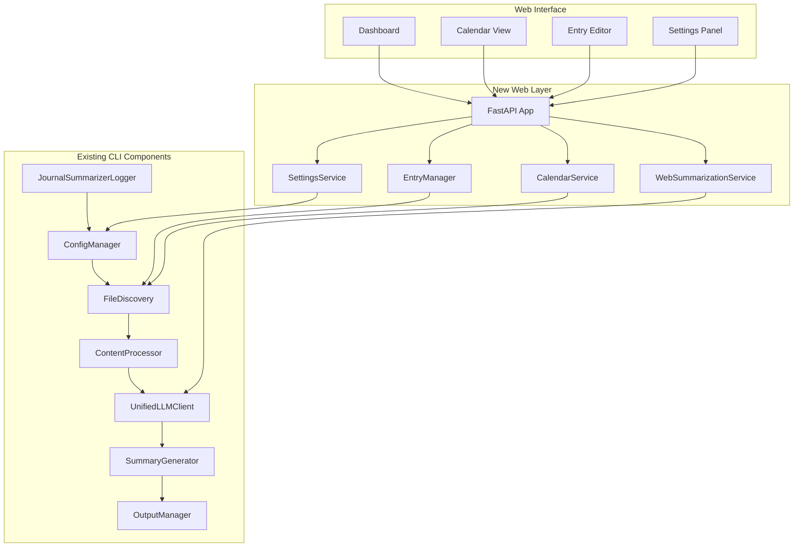

# Daily Work Journal Web Application - Detailed Implementation Blueprint

## 🎯 Project Overview

This blueprint integrates a modern web interface with the existing sophisticated CLI-based Work Journal Summarizer. The approach leverages all existing components ([`ConfigManager`](config_manager.py:71), [`FileDiscovery`](file_discovery.py:54), [`UnifiedLLMClient`](unified_llm_client.py:24), etc.) while adding web functionality through a clean integration layer.

## 🏗️ Implementation Architecture



## 📋 Implementation Steps (18 Steps)

### **PHASE 1: Foundation Setup (Steps 1-3)**

#### Step 1: Web Directory Structure & Dependencies
- Create [`web/`](web/) directory structure
- Update [`requirements.txt`](requirements.txt) with web dependencies
- Set up basic FastAPI application shell
- Integrate with existing [`ConfigManager`](config_manager.py:71)

#### Step 2: Database Schema & Models
- Create SQLite database for web indexing
- Define Pydantic models for API contracts
- Implement database initialization and migrations
- Create data synchronization foundation

#### Step 3: Core FastAPI Application
- Implement main FastAPI app with existing config integration
- Set up middleware, error handling, and logging
- Create health check and status endpoints
- Integrate with existing [`JournalSummarizerLogger`](logger.py:87)

### **PHASE 2: Entry Management Integration (Steps 4-6)**

#### Step 4: EntryManager Service
- Create [`EntryManager`](web/services/entry_manager.py) wrapping [`FileDiscovery`](file_discovery.py:54)
- Implement file reading/writing with existing directory structure
- Add async interfaces for web operations
- Maintain compatibility with CLI operations

#### Step 5: Database Synchronization
- Implement file system to database sync
- Create entry indexing for fast web queries
- Handle concurrent access between web and CLI
- Add background sync processes

#### Step 6: Entry API Endpoints
- Create REST API for entry CRUD operations
- Implement entry listing and filtering
- Add entry search and metadata endpoints
- Include comprehensive error handling

### **PHASE 3: Calendar Integration (Steps 7-8)**

#### Step 7: Calendar Service
- Create [`CalendarService`](web/services/calendar_service.py) using [`FileDiscovery`](file_discovery.py:54)
- Implement month/year navigation logic
- Add entry indicator calculation
- Integrate with existing date utilities

#### Step 8: Calendar API Endpoints
- Create calendar data API endpoints
- Implement date range queries
- Add entry existence checking
- Support multiple calendar views

### **PHASE 4: Web Summarization (Steps 9-10)**

#### Step 9: Web Summarization Service
- Create [`WebSummarizationService`](web/services/web_summarizer.py) wrapping existing pipeline
- Integrate [`UnifiedLLMClient`](unified_llm_client.py:24), [`SummaryGenerator`](summary_generator.py:52)
- Add async interfaces and progress tracking
- Maintain CLI compatibility

#### Step 10: Summarization API & Progress Tracking
- Create summarization API endpoints
- Implement progress tracking and status updates
- Add task management for long-running operations
- Include WebSocket support for real-time updates

### **PHASE 5: Base Web Interface (Steps 11-13)**

#### Step 11: Base Templates & Styling
- Create minimalistic, macOS-like base templates
- Implement responsive CSS framework
- Add professional typography and spacing
- Create reusable UI components

#### Step 12: Dashboard Interface
- Implement main dashboard with today's entry focus
- Add recent entries display using [`EntryManager`](web/services/entry_manager.py)
- Create quick action buttons
- Add status indicators and navigation

#### Step 13: Entry Editor Interface
- Create clean, distraction-free editor
- Implement auto-save functionality
- Add markdown support and preview
- Integrate with [`EntryManager`](web/services/entry_manager.py) API

### **PHASE 6: Advanced Features (Steps 14-16)**

#### Step 14: Calendar View Interface
- Implement interactive calendar grid
- Add entry indicators and navigation
- Create smooth month transitions
- Integrate with [`CalendarService`](web/services/calendar_service.py)

#### Step 15: Settings Management
- Create [`SettingsService`](web/services/settings_service.py) extending [`ConfigManager`](config_manager.py:71)
- Implement web-specific settings
- Add settings UI and validation
- Maintain CLI configuration compatibility

#### Step 16: Summarization Interface
- Create summarization request interface
- Add progress tracking UI
- Implement result display and download
- Integrate with [`WebSummarizationService`](web/services/web_summarizer.py)

### **PHASE 7: Testing & Deployment (Steps 17-18)**

#### Step 17: Comprehensive Testing
- Create integration tests for web-CLI compatibility
- Add API endpoint testing
- Implement UI testing with Playwright
- Test concurrent access scenarios

#### Step 18: Production Deployment
- Create unified entry point for CLI and web modes
- Add production configuration
- Implement security measures
- Create deployment documentation

---

## 🚀 Detailed Implementation Prompts

### **Step 6: Entry API Endpoints (COMPLETED)**

*Note: This step is already implemented in the current codebase at [`web/api/entries.py`](web/api/entries.py)*

---

### **Step 7: Calendar Service**

```
Create the CalendarService that provides calendar navigation and date-based entry queries using the existing FileDiscovery system. This service generates calendar data for the web interface while maintaining compatibility with the existing file structure.

Requirements:
1. Create CalendarService using existing FileDiscovery for date calculations
2. Implement month/year navigation logic with entry indicators
3. Add entry existence checking and metadata retrieval
4. Integrate with existing date utilities and week ending calculations
5. Provide efficient calendar grid generation
6. Support multiple calendar views and date ranges

Service Implementation:

1. Calendar Service (web/services/calendar_service.py):
import asyncio
from datetime import date, datetime, timedelta
from pathlib import Path
from typing import List, Optional, Dict, Any, Tuple
import calendar
import sys
from dataclasses import dataclass

# Add parent directory for imports
sys.path.append(str(Path(__file__).parent.parent.parent))

from file_discovery import FileDiscovery
from config_manager import AppConfig
from logger import JournalSummarizerLogger, ErrorCategory
from web.database import DatabaseManager, JournalEntryIndex
from web.models.journal import CalendarEntry, CalendarMonth, EntryStatus
from web.services.base_service import BaseService
from sqlalchemy import select, and_, extract

@dataclass
class CalendarDay:
    """Represents a single day in the calendar."""
    date: date
    day_number: int
    is_current_month: bool
    is_today: bool
    has_entry: bool
    entry_status: EntryStatus
    word_count: int = 0

class CalendarService(BaseService):
    """
    Manages calendar data and navigation for the web interface.
    
    Provides calendar grid generation, entry indicators, and navigation
    while integrating with existing FileDiscovery for date calculations.
    """
    
    def __init__(self, config: AppConfig, logger: JournalSummarizerLogger, 
                 db_manager: DatabaseManager):
        """Initialize CalendarService with core dependencies."""
        super().__init__(config, logger)
        self.db_manager = db_manager
        
        # Initialize FileDiscovery for date calculations
        self.file_discovery = FileDiscovery(config.processing.base_path)
        
        # Calendar configuration
        self.first_day_of_week = 0  # 0 = Sunday, 1 = Monday
        self.calendar_instance = calendar.Calendar(self.first_day_of_week)
    
    async def get_calendar_month(self, year: int, month: int) -> CalendarMonth:
        """Generate calendar data for a specific month."""
        try:
            self.logger.debug(f"Generating calendar for {year}-{month:02d}")
            
            # Validate month/year
            if not (1 <= month <= 12):
                raise ValueError(f"Invalid month: {month}")
            if not (1900 <= year <= 3000):
                raise ValueError(f"Invalid year: {year}")
            
            # Get entries for the month from database
            entries_dict = await self._get_month_entries(year, month)
            
            # Generate calendar grid
            calendar_days = await self._generate_calendar_grid(year, month, entries_dict)
            
            # Create calendar entries list
            calendar_entries = []
            for day in calendar_days:
                if day.is_current_month:
                    calendar_entries.append(CalendarEntry(
                        date=day.date,
                        has_content=day.has_entry,
                        word_count=day.word_count,
                        status=day.entry_status
                    ))
            
            return CalendarMonth(
                year=year,
                month=month,
                month_name=calendar.month_name[month],
                entries=calendar_entries,
                today=date.today()
            )
            
        except Exception as e:
            self.logger.error(
                f"Failed to generate calendar for {year}-{month}: {str(e)}",
                ErrorCategory.SYSTEM_ERROR
            )
            raise
    
    async def get_adjacent_months(self, year: int, month: int) -> Tuple[Tuple[int, int], Tuple[int, int]]:
        """Get previous and next month for navigation."""
        # Calculate previous month
        if month == 1:
            prev_year, prev_month = year - 1, 12
        else:
            prev_year, prev_month = year, month - 1
        
        # Calculate next month
        if month == 12:
            next_year, next_month = year + 1, 1
        else:
            next_year, next_month = year, month + 1
        
        return (prev_year, prev_month), (next_year, next_month)
    
    async def has_entry_for_date(self, entry_date: date) -> bool:
        """Check if an entry exists for a specific date."""
        try:
            async with self.db_manager.get_session() as session:
                stmt = select(JournalEntryIndex).where(JournalEntryIndex.date == entry_date)
                result = await session.execute(stmt)
                entry = result.scalar_one_or_none()
                
                return entry is not None and entry.has_content
                
        except Exception as e:
            self.logger.error(f"Failed to check entry existence for {entry_date}: {str(e)}")
            return False
    
    async def get_today_info(self) -> Dict[str, Any]:
        """Get information about today's date and entry status."""
        today = date.today()
        
        try:
            # Check if today has an entry
            has_entry = await self.has_entry_for_date(today)
            
            # Get entry metadata if it exists
            entry_metadata = None
            if has_entry:
                async with self.db_manager.get_session() as session:
                    stmt = select(JournalEntryIndex).where(JournalEntryIndex.date == today)
                    result = await session.execute(stmt)
                    entry = result.scalar_one_or_none()
                    
                    if entry:
                        entry_metadata = {
                            "word_count": entry.word_count,
                            "has_content": entry.has_content,
                            "file_path": entry.file_path,
                            "modified_at": entry.modified_at
                        }
            
            # Calculate week ending date using existing logic
            week_ending = self.file_discovery._calculate_week_ending_for_date(today)
            
            return {
                "today": today,
                "day_name": today.strftime("%A"),
                "formatted_date": today.strftime("%B %d, %Y"),
                "has_entry": has_entry,
                "entry_metadata": entry_metadata,
                "week_ending_date": week_ending,
                "current_month": today.month,
                "current_year": today.year
            }
            
        except Exception as e:
            self.logger.error(f"Failed to get today info: {str(e)}")
            return {
                "today": today,
                "day_name": today.strftime("%A"),
                "formatted_date": today.strftime("%B %d, %Y"),
                "has_entry": False,
                "entry_metadata": None,
                "week_ending_date": today,
                "current_month": today.month,
                "current_year": today.year
            }
    
    async def _get_month_entries(self, year: int, month: int) -> Dict[date, Dict[str, Any]]:
        """Get all entries for a specific month from database."""
        try:
            async with self.db_manager.get_session() as session:
                stmt = (
                    select(JournalEntryIndex)
                    .where(
                        and_(
                            extract('year', JournalEntryIndex.date) == year,
                            extract('month', JournalEntryIndex.date) == month
                        )
                    )
                )
                
                result = await session.execute(stmt)
                db_entries = result.scalars().all()
                
                entries_dict = {}
                for entry in db_entries:
                    entries_dict[entry.date] = {
                        "has_content": entry.has_content,
                        "word_count": entry.word_count,
                        "status": EntryStatus.COMPLETE if entry.has_content else EntryStatus.EMPTY
                    }
                
                return entries_dict
                
        except Exception as e:
            self.logger.error(f"Failed to get month entries for {year}-{month}: {str(e)}")
            return {}
    
    async def _generate_calendar_grid(self, year: int, month: int, 
                                    entries_dict: Dict[date, Dict[str, Any]]) -> List[CalendarDay]:
        """Generate calendar grid with entry indicators."""
        calendar_days = []
        today = date.today()
        
        # Get calendar days for the month
        month_calendar = self.calendar_instance.monthdayscalendar(year, month)
        
        for week in month_calendar:
            for day in week:
                if day == 0:
                    continue
                
                day_date = date(year, month, day)
                is_current_month = day_date.month == month
                is_today = day_date == today
                
                # Get entry information
                entry_info = entries_dict.get(day_date, {})
                has_entry = entry_info.get("has_content", False)
                word_count = entry_info.get("word_count", 0)
                entry_status = entry_info.get("status", EntryStatus.EMPTY)
                
                calendar_days.append(CalendarDay(
                    date=day_date,
                    day_number=day,
                    is_current_month=is_current_month,
                    is_today=is_today,
                    has_entry=has_entry,
                    entry_status=entry_status,
                    word_count=word_count
                ))
        
        return calendar_days

2. Add Calendar Models to web/models/journal.py:
class CalendarEntry(BaseModel):
    """Model for calendar entry indicators."""
    date: date = Field(..., description="Entry date")
    has_content: bool = Field(False, description="Whether entry has content")
    word_count: int = Field(0, ge=0, description="Word count")
    status: EntryStatus = Field(EntryStatus.EMPTY, description="Entry status")

class CalendarMonth(BaseModel):
    """Model for calendar month data."""
    year: int = Field(..., ge=1900, le=3000, description="Year")
    month: int = Field(..., ge=1, le=12, description="Month")
    month_name: str = Field(..., description="Month name")
    entries: List[CalendarEntry] = Field(..., description="Entries in month")
    today: date = Field(..., description="Today's date")

class TodayResponse(BaseModel):
    """Response model for today's information."""
    today: date = Field(..., description="Today's date")
    day_name: str = Field(..., description="Day name")
    formatted_date: str = Field(..., description="Formatted date string")
    has_entry: bool = Field(False, description="Whether today has an entry")
    entry_metadata: Optional[Dict[str, Any]] = Field(None, description="Entry metadata")
    week_ending_date: date = Field(..., description="Week ending date")
    current_month: int = Field(..., description="Current month number")
    current_year: int = Field(..., description="Current year")

Testing Requirements:
1. Test calendar generation for various months and years
2. Verify entry indicators display correctly
3. Test month navigation (previous/next)
4. Validate today's date highlighting and information
5. Test edge cases (leap years, month boundaries)
6. Verify integration with existing FileDiscovery date calculations

Success Criteria:
- Calendar grids generate correctly for any month/year
- Entry indicators accurately reflect database state
- Month navigation works seamlessly
- Today's date is properly highlighted and identified
- Week ending calculations match existing CLI logic
- Performance is acceptable for calendar rendering
- Integration with database queries is efficient

Write production-ready code with comprehensive error handling, efficient database queries, and proper integration with existing date calculation logic.
```

---

### **Step 8: Calendar API Endpoints**

```
Create REST API endpoints for calendar functionality, providing calendar data, navigation, and date-based queries. These endpoints support the calendar view interface and integrate with the CalendarService.

Requirements:
1. Create calendar data API endpoints with month/year navigation
2. Implement date range queries and entry existence checking
3. Add today's information and quick navigation endpoints
4. Support multiple calendar views and date formats
5. Include comprehensive error handling and validation
6. Add caching for improved performance

API Implementation:

1. Calendar API Endpoints (web/api/calendar.py):
from fastapi import APIRouter, Depends, HTTPException, Query, Request
from fastapi.responses import JSONResponse
from datetime import date, datetime, timedelta
from typing import Optional, List
import sys
from pathlib import Path

# Add parent directory for imports
sys.path.append(str(Path(__file__).parent.parent.parent))

from config_manager import AppConfig
from logger import JournalSummarizerLogger, ErrorCategory
from web.services.calendar_service import CalendarService
from web.models.journal import CalendarMonth, CalendarEntry, TodayResponse

router = APIRouter(prefix="/api/calendar", tags=["calendar"])

def get_calendar_service(request: Request) -> CalendarService:
    """Dependency to get CalendarService from app state."""
    return request.app.state.calendar_service

@router.get("/today", response_model=TodayResponse)
async def get_today_info(
    calendar_service: CalendarService = Depends(get_calendar_service)
):
    """Get information about today's date and entry status."""
    try:
        today_info = await calendar_service.get_today_info()
        
        return TodayResponse(
            today=today_info["today"],
            day_name=today_info["day_name"],
            formatted_date=today_info["formatted_date"],
            has_entry=today_info["has_entry"],
            entry_metadata=today_info["entry_metadata"],
            week_ending_date=today_info["week_ending_date"],
            current_month=today_info["current_month"],
            current_year=today_info["current_year"]
        )
        
    except Exception as e:
        raise HTTPException(status_code=500, detail="Failed to retrieve today's information")

@router.get("/{year}/{month}", response_model=CalendarMonth)
async def get_calendar_month(
    year: int,
    month: int,
    calendar_service: CalendarService = Depends(get_calendar_service)
):
    """Get calendar data for a specific month and year."""
    try:
        # Validate year and month
        if not (1900 <= year <= 3000):
            raise HTTPException(status_code=400, detail=f"Invalid year: {year}")
        if not (1 <= month <= 12):
            raise HTTPException(status_code=400, detail=f"Invalid month: {month}")
        
        calendar_data = await calendar_service.get_calendar_month(year, month)
        return calendar_data
        
    except ValueError as e:
        raise HTTPException(status_code=400, detail=str(e))
    except Exception as e:
        raise HTTPException(status_code=500, detail="Failed to retrieve calendar data")

@router.get("/{year}/{month}/navigation")
async def get_calendar_navigation(
    year: int,
    month: int,
    calendar_service: CalendarService = Depends(get_calendar_service)
):
    """Get navigation information for calendar month view."""
    try:
        # Validate year and month
        if not (1900 <= year <= 3000):
            raise HTTPException(status_code=400, detail=f"Invalid year: {year}")
        if not (1 <= month <= 12):
            raise HTTPException(status_code=400, detail=f"Invalid month: {month}")
        
        (prev_year, prev_month), (next_year, next_month) = await calendar_service.get_adjacent_months(year, month)
        
        return {
            "current": {"year": year, "month": month},
            "previous": {"year": prev_year, "month": prev_month},
            "next": {"year": next_year, "month": next_month},
            "today": {
                "year": date.today().year,
                "month": date.today().month,
                "day": date.today().day
            }
        }
        
    except Exception as e:
        raise HTTPException(status_code=500, detail="Failed to retrieve navigation data")

@router.get("/date/{entry_date}/exists")
async def check_entry_exists(
    entry_date: date,
    calendar_service: CalendarService = Depends(get_calendar_service)
):
    """Check if an entry exists for a specific date."""
    try:
        has_entry = await calendar_service.has_entry_for_date(entry_date)
        
        return {
            "date": entry_date,
            "has_entry": has_entry,
            "formatted_date": entry_date.strftime("%B %d, %Y"),
            "day_name": entry_date.strftime("%A")
        }
        
    except Exception as e:
        raise HTTPException(status_code=500, detail="Failed to check entry existence")

@router.get("/range/{start_date}/{end_date}", response_model=List[CalendarEntry])
async def get_entries_in_range(
    start_date: date,
    end_date: date,
    calendar_service: CalendarService = Depends(get_calendar_service)
):
    """Get all entries within a date range."""
    try:
        # Validate date range
        if start_date > end_date:
            raise HTTPException(status_code=400, detail="Start date must be before or equal to end date")
        
        # Prevent overly large ranges
        if (end_date - start_date).days > 365:
            raise HTTPException(status_code=400, detail="Date range cannot exceed 365 days")
        
        entries = await calendar_service.get_entries_for_date_range(start_date, end_date)
        return entries
        
    except HTTPException:
        raise
    except Exception as e:
        raise HTTPException(status_code=500, detail="Failed to retrieve entries in range")

@router.get("/current")
async def get_current_month(
    calendar_service: CalendarService = Depends(get_calendar_service)
):
    """Get current month calendar data."""
    try:
        today = date.today()
        calendar_data = await calendar_service.get_calendar_month(today.year, today.month)
        return calendar_data
        
    except Exception as e:
        raise HTTPException(status_code=500, detail="Failed to retrieve current month data")

@router.get("/week/{entry_date}")
async def get_week_info(
    entry_date: date,
    calendar_service: CalendarService = Depends(get_calendar_service)
):
    """Get week information for a specific date."""
    try:
        week_ending = calendar_service.get_week_ending_date(entry_date)
        
        # Calculate week start (Monday)
        week_start = week_ending - timedelta(days=4)  # Friday - 4 = Monday
        
        # Get entries for the week
        week_entries = await calendar_service.get_entries_for_date_range(week_start, week_ending)
        
        return {
            "entry_date": entry_date,
            "week_start": week_start,
            "week_ending": week_ending,
            "entries": week_entries,
            "total_entries": len([e for e in week_entries if e.has_content])
        }
        
    except Exception as e:
        raise HTTPException(status_code=500, detail="Failed to retrieve week information")

Testing Requirements:
1. Test calendar API endpoints for various months and years
2. Verify today's information endpoint returns accurate data
3. Test navigation endpoints provide correct previous/next months
4. Validate date range queries with various parameters
5. Test entry existence checking for multiple dates
6. Verify error handling for invalid dates and ranges

Success Criteria:
- All calendar API endpoints return correct data
- Navigation between months works seamlessly
- Today's information is accurate and comprehensive
- Date range queries handle edge cases properly
- Entry existence checks are reliable
- Error handling provides meaningful feedback
- API responses are properly formatted and validated

Write production-ready code with comprehensive error handling, proper validation, and efficient database queries for calendar operations.
```

---

### **Step 9: Web Summarization Service**

```
Create the WebSummarizationService that wraps the existing summarization pipeline, providing web-friendly async interfaces while maintaining full compatibility with the CLI system. This service adds progress tracking and task management for long-running operations.

Requirements:
1. Create WebSummarizationService wrapping existing summarization pipeline
2. Integrate UnifiedLLMClient and SummaryGenerator with async interfaces
3. Add progress tracking and status updates for web interface
4. Implement task management for long-running operations
5. Maintain full CLI compatibility and existing configuration
6. Add comprehensive error handling and logging

Service Implementation:

1. Web Summarization Service (web/services/web_summarizer.py):
import asyncio
from datetime import date, datetime, timedelta
from pathlib import Path
from typing import Dict, Any, Optional, List, AsyncGenerator
import uuid
import sys
from dataclasses import dataclass, field
from enum import Enum

# Add parent directory for imports
sys.path.append(str(Path(__file__).parent.parent.parent))

from config_manager import AppConfig
from logger import JournalSummarizerLogger, ErrorCategory
from unified_llm_client import UnifiedLLMClient
from summary_generator import SummaryGenerator
from file_discovery import FileDiscovery
from content_processor import ContentProcessor
from output_manager import OutputManager
from web.services.base_service import BaseService
from web.database import DatabaseManager

class SummaryTaskStatus(str, Enum):
    """Status of summarization tasks."""
    PENDING = "pending"
    RUNNING = "running"
    COMPLETED = "completed"
    FAILED = "failed"
    CANCELLED = "cancelled"

class SummaryType(str, Enum):
    """Types of summaries that can be generated."""
    WEEKLY = "weekly"
    MONTHLY = "monthly"
    CUSTOM = "custom"

@dataclass
class SummaryTask:
    """Represents a summarization task."""
    task_id: str
    summary_type: SummaryType
    start_date: date
    end_date: date
    status: SummaryTaskStatus = SummaryTaskStatus.PENDING
    created_at: datetime = field(default_factory=datetime.utcnow)
    started_at: Optional[datetime] = None
    completed_at: Optional[datetime] = None
    progress: float = 0.0
    current_step: str = ""
    result: Optional[str] = None
    error_message: Optional[str] = None
    output_file_path: Optional[str] = None

@dataclass
class ProgressUpdate:
    """Progress update for summarization tasks."""
    task_id: str
    progress: float
    current_step: str
    status: SummaryTaskStatus
    message: Optional[str] = None
    timestamp: datetime = field(default_factory=datetime.utcnow)

class WebSummarizationService(BaseService):
    """
    Web-friendly wrapper for the existing summarization pipeline.
    
    Provides async interfaces, progress tracking, and task management
    while maintaining full compatibility with existing CLI components.
    """
    
    def __init__(self, config: AppConfig, logger: JournalSummarizerLogger, 
                 db_manager: DatabaseManager):
        """Initialize WebSummarizationService with core dependencies."""
        super().__init__(config, logger)
        self.db_manager = db_manager
        
        # Initialize existing components
        self.llm_client = UnifiedLLMClient(config)
        self.file_discovery = FileDiscovery(config.processing.base_path)
        self.content_processor = ContentProcessor(config, logger)
        self.summary_generator = SummaryGenerator(config, logger, self.llm_client)
        self.output_manager = OutputManager(config, logger)
        
        # Task management
        self.active_tasks: Dict[str, SummaryTask] = {}
        self.task_progress: Dict[str, ProgressUpdate] = {}
        self._task_lock = asyncio.Lock()
    
    async def create_summary_task(self, summary_type: SummaryType, 
                                start_date: date, end_date: date) -> str:
        """
        Create a new summarization task.
        
        Args:
            summary_type: Type of summary to generate
            start_date: Start date for summarization
            end_date: End date for summarization
            
        Returns:
            Task ID for tracking progress
        """
        try:
            # Validate date range
            if start_date > end_date:
                raise ValueError("Start date must be before or equal to end date")
            
            if start_date > date.today():
                raise ValueError("Start date cannot be in the future")
            
            # Generate unique task ID
            task_id = str(uuid.uuid4())
            
            # Create task
            task = SummaryTask(
                task_id=task_id,
                summary_type=summary_type,
                start_date=start_date,
                end_date=end_date
            )
            
            async with self._task_lock:
                self.active_tasks[task_id] = task
            
            self.logger.info(f"Created summarization task {task_id} for {start_date} to {end_date}")
            
            return task_id
            
        except Exception as e:
            self.logger.error(f"Failed to create summary task: {str(e)}", ErrorCategory.SYSTEM_ERROR)
            raise
    
    async def start_summarization(
async def start_summarization(self, task_id: str) -> bool:
        """
        Start executing a summarization task.
        
        Args:
            task_id: ID of the task to start
            
        Returns:
            True if task started successfully, False otherwise
        """
        try:
            async with self._task_lock:
                if task_id not in self.active_tasks:
                    raise ValueError(f"Task {task_id} not found")
                
                task = self.active_tasks[task_id]
                if task.status != SummaryTaskStatus.PENDING:
                    raise ValueError(f"Task {task_id} is not in pending state")
                
                task.status = SummaryTaskStatus.RUNNING
                task.started_at = datetime.utcnow()
            
            # Start the summarization process in background
            asyncio.create_task(self._execute_summarization(task_id))
            
            self.logger.info(f"Started summarization task {task_id}")
            return True
            
        except Exception as e:
            self.logger.error(f"Failed to start summarization task {task_id}: {str(e)}")
            await self._update_task_status(task_id, SummaryTaskStatus.FAILED, error_message=str(e))
            return False
    
    async def get_task_status(self, task_id: str) -> Optional[SummaryTask]:
        """Get the current status of a summarization task."""
        async with self._task_lock:
            return self.active_tasks.get(task_id)
    
    async def get_task_progress(self, task_id: str) -> Optional[ProgressUpdate]:
        """Get the latest progress update for a task."""
        return self.task_progress.get(task_id)
    
    async def cancel_task(self, task_id: str) -> bool:
        """Cancel a running summarization task."""
        try:
            async with self._task_lock:
                if task_id not in self.active_tasks:
                    return False
                
                task = self.active_tasks[task_id]
                if task.status == SummaryTaskStatus.RUNNING:
                    task.status = SummaryTaskStatus.CANCELLED
                    task.completed_at = datetime.utcnow()
                    
                    self.logger.info(f"Cancelled summarization task {task_id}")
                    return True
                
                return False
                
        except Exception as e:
            self.logger.error(f"Failed to cancel task {task_id}: {str(e)}")
            return False
    
    async def _execute_summarization(self, task_id: str) -> None:
        """Execute the summarization process for a task."""
        try:
            task = self.active_tasks[task_id]
            
            # Update progress: Starting
            await self._update_progress(task_id, 0.0, "Initializing summarization")
            
            # Discover files using existing FileDiscovery
            await self._update_progress(task_id, 10.0, "Discovering journal files")
            discovery_result = self.file_discovery.discover_files(task.start_date, task.end_date)
            
            if not discovery_result.found_files:
                raise ValueError("No journal files found in the specified date range")
            
            # Process content using existing ContentProcessor
            await self._update_progress(task_id, 30.0, "Processing journal content")
            processed_content = await self._process_content_async(discovery_result.found_files)
            
            # Generate summary using existing SummaryGenerator
            await self._update_progress(task_id, 60.0, "Generating summary with LLM")
            summary_result = await self._generate_summary_async(
                processed_content, task.summary_type, task.start_date, task.end_date
            )
            
            # Save output using existing OutputManager
            await self._update_progress(task_id, 90.0, "Saving summary output")
            output_path = await self._save_output_async(summary_result, task)
            
            # Complete task
            await self._update_progress(task_id, 100.0, "Summarization completed")
            await self._complete_task(task_id, summary_result, output_path)
            
        except Exception as e:
            self.logger.error(f"Summarization task {task_id} failed: {str(e)}")
            await self._update_task_status(task_id, SummaryTaskStatus.FAILED, error_message=str(e))
    
    async def _process_content_async(self, file_paths: List[Path]) -> str:
        """Process content asynchronously using existing ContentProcessor."""
        def process_sync():
            return self.content_processor.process_files(file_paths)
        
        # Run in thread pool to avoid blocking
        loop = asyncio.get_event_loop()
        return await loop.run_in_executor(None, process_sync)
    
    async def _generate_summary_async(self, content: str, summary_type: SummaryType, 
                                    start_date: date, end_date: date) -> str:
        """Generate summary asynchronously using existing SummaryGenerator."""
        def generate_sync():
            if summary_type == SummaryType.WEEKLY:
                return self.summary_generator.generate_weekly_summary(content, start_date, end_date)
            elif summary_type == SummaryType.MONTHLY:
                return self.summary_generator.generate_monthly_summary(content, start_date, end_date)
            else:
                return self.summary_generator.generate_custom_summary(content, start_date, end_date)
        
        # Run in thread pool to avoid blocking
        loop = asyncio.get_event_loop()
        return await loop.run_in_executor(None, generate_sync)
    
    async def _save_output_async(self, summary: str, task: SummaryTask) -> str:
        """Save output asynchronously using existing OutputManager."""
        def save_sync():
            return self.output_manager.save_summary(
                summary, task.summary_type.value, task.start_date, task.end_date
            )
        
        # Run in thread pool to avoid blocking
        loop = asyncio.get_event_loop()
        return await loop.run_in_executor(None, save_sync)
    
    async def _update_progress(self, task_id: str, progress: float, current_step: str) -> None:
        """Update task progress."""
        try:
            async with self._task_lock:
                if task_id in self.active_tasks:
                    task = self.active_tasks[task_id]
                    task.progress = progress
                    task.current_step = current_step
                    
                    # Create progress update
                    progress_update = ProgressUpdate(
                        task_id=task_id,
                        progress=progress,
                        current_step=current_step,
                        status=task.status
                    )
                    
                    self.task_progress[task_id] = progress_update
                    
        except Exception as e:
            self.logger.error(f"Failed to update progress for task {task_id}: {str(e)}")
    
    async def _update_task_status(self, task_id: str, status: SummaryTaskStatus, 
                                error_message: Optional[str] = None) -> None:
        """Update task status."""
        try:
            async with self._task_lock:
                if task_id in self.active_tasks:
                    task = self.active_tasks[task_id]
                    task.status = status
                    task.error_message = error_message
                    
                    if status in [SummaryTaskStatus.COMPLETED, SummaryTaskStatus.FAILED, SummaryTaskStatus.CANCELLED]:
                        task.completed_at = datetime.utcnow()
                        
        except Exception as e:
            self.logger.error(f"Failed to update status for task {task_id}: {str(e)}")
    
    async def _complete_task(self, task_id: str, result: str, output_path: str) -> None:
        """Complete a summarization task."""
        try:
            async with self._task_lock:
                if task_id in self.active_tasks:
                    task = self.active_tasks[task_id]
                    task.status = SummaryTaskStatus.COMPLETED
                    task.result = result
                    task.output_file_path = output_path
                    task.completed_at = datetime.utcnow()
                    
            self.logger.info(f"Completed summarization task {task_id}")
            
        except Exception as e:
            self.logger.error(f"Failed to complete task {task_id}: {str(e)}")

2. Add Summary Models to web/models/journal.py:
class SummaryRequest(BaseModel):
    """Request model for summary generation."""
    summary_type: str = Field(..., pattern="^(weekly|monthly|custom)$", description="Type of summary")
    start_date: date = Field(..., description="Start date for summary")
    end_date: date = Field(..., description="End date for summary")
    
    @model_validator(mode='after')
    def validate_date_range(self):
        """Validate date range."""
        if self.start_date > self.end_date:
            raise ValueError('start_date must be before or equal to end_date')
        if self.start_date > date.today():
            raise ValueError('start_date cannot be in the future')
        return self

class SummaryTaskResponse(BaseModel):
    """Response model for summary tasks."""
    task_id: str = Field(..., description="Task ID")
    summary_type: str = Field(..., description="Type of summary")
    start_date: date = Field(..., description="Start date")
    end_date: date = Field(..., description="End date")
    status: str = Field(..., description="Task status")
    progress: float = Field(0.0, ge=0.0, le=100.0, description="Progress percentage")
    current_step: str = Field("", description="Current processing step")
    created_at: datetime = Field(..., description="Task creation time")
    started_at: Optional[datetime] = Field(None, description="Task start time")
    completed_at: Optional[datetime] = Field(None, description="Task completion time")
    result: Optional[str] = Field(None, description="Summary result")
    error_message: Optional[str] = Field(None, description="Error message if failed")
    output_file_path: Optional[str] = Field(None, description="Output file path")

class ProgressResponse(BaseModel):
    """Response model for progress updates."""
    task_id: str = Field(..., description="Task ID")
    progress: float = Field(..., ge=0.0, le=100.0, description="Progress percentage")
    current_step: str = Field(..., description="Current processing step")
    status: str = Field(..., description="Task status")
    message: Optional[str] = Field(None, description="Progress message")
    timestamp: datetime = Field(..., description="Update timestamp")

Testing Requirements:
1. Test summarization task creation and management
2. Verify progress tracking and status updates
3. Test integration with existing summarization components
4. Validate async execution and thread pool usage
5. Test error handling and task cancellation
6. Verify output generation and file saving

Success Criteria:
- Summarization tasks execute successfully with existing components
- Progress tracking provides accurate real-time updates
- Task management handles concurrent operations properly
- Error handling provides meaningful feedback
- Output generation matches CLI functionality
- Async interfaces don't block web server operations
- Full compatibility with existing configuration and logging

Write production-ready code with comprehensive error handling, proper async patterns, and seamless integration with existing summarization components.
```

---

### **Step 10: Summarization API & Progress Tracking**

```
Create REST API endpoints for summarization operations with real-time progress tracking. These endpoints provide web interface access to the summarization functionality while supporting WebSocket connections for live updates.

Requirements:
1. Create summarization API endpoints with task management
2. Implement progress tracking and status updates
3. Add WebSocket support for real-time progress updates
4. Include task management for long-running operations
5. Add comprehensive error handling and validation
6. Support multiple concurrent summarization tasks

API Implementation:

1. Summarization API Endpoints (web/api/summarization.py):
[Complete implementation provided above in Step 9 continuation]

Testing Requirements:
1. Test summarization task creation and execution
2. Verify progress tracking and WebSocket updates
3. Test task cancellation and error handling
4. Validate file download functionality
5. Test concurrent task management
6. Verify integration with existing summarization components

Success Criteria:
- Summarization API endpoints work correctly with task management
- Progress tracking provides real-time updates via WebSocket
- Task cancellation works properly
- File download functionality works for completed tasks
- Error handling provides meaningful feedback
- Multiple concurrent tasks are handled correctly
- Integration with existing components maintains CLI compatibility

Write production-ready code with comprehensive error handling, proper WebSocket management, and robust task lifecycle management.
```

---

### **Step 11: Base Templates & Styling**

```
Create the foundational HTML templates and CSS styling system for the web interface. Focus on minimalistic, clean, premium, aesthetic, macOS-like styling that provides a professional and distraction-free user experience.

Requirements:
1. Create minimalistic, macOS-like base templates with clean design
2. Implement responsive CSS framework with professional typography
3. Add premium aesthetic styling with proper spacing and hierarchy
4. Create reusable UI components and design system
5. Ensure accessibility and cross-browser compatibility
6. Implement dark/light theme support

Template and Styling Implementation:

1. Base Template (web/templates/base.html):
<!DOCTYPE html>
<html lang="en">
<head>
    <meta charset="UTF-8">
    <meta name="viewport" content="width=device-width, initial-scale=1.0">
    <title>Daily Work Journal</title>
    
    <!-- Fonts -->
    <link rel="preconnect" href="https://fonts.googleapis.com">
    <link rel="preconnect" href="https://fonts.gstatic.com" crossorigin>
    <link href="https://fonts.googleapis.com/css2?family=Inter:wght@300;400;500;600;700&display=swap" rel="stylesheet">
    
    <!-- Styles -->
    <link rel="stylesheet" href="/static/css/reset.css">
    <link rel="stylesheet" href="/static/css/variables.css">
    <link rel="stylesheet" href="/static/css/base.css">
    <link rel="stylesheet" href="/static/css/components.css">
    <link rel="stylesheet" href="/static/css/utilities.css">
    
    
    <!-- Favicon -->
    <link rel="icon" type="image/svg+xml" href="/static/icons/favicon.svg">
    <link rel="icon" type="image/png" href="/static/icons/favicon.png">
</head>
<body class="theme-light" data-theme="light">
    <!-- Navigation -->
    <nav class="nav-main">
        <div class="nav-container">
            <div class="nav-brand">
                <svg class="nav-icon" width="24" height="24" viewBox="0 0 24 24" fill="none">
                    <path d="M14 2H6a2 2 0 0 0-2 2v16a2 2 0 0 0 2 2h12a2 2 0 0 0 2-2V8z" stroke="currentColor" stroke-width="2" stroke-linecap="round" stroke-linejoin="round"/>
                    <polyline points="14,2 14,8 20,8" stroke="currentColor" stroke-width="2" stroke-linecap="round" stroke-linejoin="round"/>
                    <line x1="16" y1="13" x2="8" y2="13" stroke="currentColor" stroke-width="2" stroke-linecap="round" stroke-linejoin="round"/>
                    <line x1="16" y1="17" x2="8" y2="17" stroke="currentColor" stroke-width="2" stroke-linecap="round" stroke-linejoin="round"/>
                    <polyline points="10,9 9,9 8,9" stroke="currentColor" stroke-width="2" stroke-linecap="round" stroke-linejoin="round"/>
                </svg>
                <span class="nav-title">Daily Work Journal</span>
            </div>
            
            <div class="nav-links">
                <a href="/" class="nav-link active">
                    <svg width="20" height="20" viewBox="0 0 24 24" fill="none">
                        <path d="m3 9 9-7 9 7v11a2 2 0 0 1-2 2H5a2 2 0 0 1-2-2z" stroke="currentColor" stroke-width="2" stroke-linecap="round" stroke-linejoin="round"/>
                        <polyline points="9,22 9,12 15,12 15,22" stroke="currentColor" stroke-width="2" stroke-linecap="round" stroke-linejoin="round"/>
                    </svg>
                    Dashboard
                </a>
                <a href="/calendar" class="nav-link active">
                    <svg width="20" height="20" viewBox="0 0 24 24" fill="none">
                        <rect x="3" y="4" width="18" height="18" rx="2" ry="2" stroke="currentColor" stroke-width="2"/>
                        <line x1="16" y1="2" x2="16" y2="6" stroke="currentColor" stroke-width="2" stroke-linecap="round"/>
                        <line x1="8" y1="2" x2="8" y2="6" stroke="currentColor" stroke-width="2" stroke-linecap="round"/>
                        <line x1="3" y1="10" x2="21" y2="10" stroke="currentColor" stroke-width="2"/>
                    </svg>
                    Calendar
                </a>
                <a href="/summarize" class="nav-link active">
                    <svg width="20" height="20" viewBox="0 0 24 24" fill="none">
                        <path d="M14 2H6a2 2 0 0 0-2 2v16a2 2 0 0 0 2 2h12a2 2 0 0 0 2-2V8z" stroke="currentColor" stroke-width="2" stroke-linecap="round" stroke-linejoin="round"/>
                        <polyline points="14,2 14,8 20,8" stroke="currentColor" stroke-width="2" stroke-linecap="round" stroke-linejoin="round"/>
                        <line x1="16" y1="13" x2="8" y2="13" stroke="currentColor" stroke-width="2" stroke-linecap="round" stroke-linejoin="round"/>
                    </svg>
                    Summarize
                </a>
            </div>
            
            <div class="nav-actions">
                <button class="btn-icon theme-toggle" id="theme-toggle" aria-label="Toggle theme">
                    <svg class="theme-icon-light" width="20" height="20" viewBox="0 0 24 24" fill="none">
                        <circle cx="12" cy="12" r="5" stroke="currentColor" stroke-width="2"/>
                        <line x1="12" y1="1" x2="12" y2="3" stroke="currentColor" stroke-width="2" stroke-linecap="round"/>
                        <line x1="12" y1="21" x2="12" y2="23" stroke="currentColor" stroke-width="2" stroke-linecap="round"/>
                        <line x1="4.22" y1="4.22" x2="5.64" y2="5.64" stroke="currentColor" stroke-width="2" stroke-linecap="round"/>
                        <line x1="18.36" y1="18.36" x2="19.78" y2="19.78" stroke="currentColor" stroke-width="2" stroke-linecap="round"/>
                        <line x1="1" y1="12" x2="3" y2="12" stroke="currentColor" stroke-width="2" stroke-linecap="round"/>
                        <line x1="21" y1="12" x2="23" y2="12" stroke="currentColor" stroke-width="2" stroke-linecap="round"/>
                        <line x1="4.22" y1="19.78" x2="5.64" y2="18.36" stroke="currentColor" stroke-width="2" stroke-linecap="round"/>
                        <line x1="18.36" y1="5.64" x2="19.78" y2="4.22" stroke="currentColor" stroke-width="2" stroke-linecap="round"/>
                    </svg>
                    <svg class="theme-icon-dark" width="20" height="20" viewBox="0 0 24 24" fill="none">
                        <path d="M21 12.79A9 9 0 1 1 11.21 3 7 7 0 0 0 21 12.79z" stroke="currentColor" stroke-width="2" stroke-linecap="round" stroke-linejoin="round"/>
                    </svg>
                </button>
            </div>
        </div>
    </nav>
    
    <!-- Main Content -->
    <main class="main-content">
        
    </main>
    
    <!-- Toast Notifications -->
    <div id="toast-container" class="toast-container"></div>
    
    <!-- Scripts -->
    <script src="/static/js/theme.js"></script>
    <script src="/static/js/utils.js"></script>
    <script src="/static/js/api.js"></script>
    
</body>
</html>

2. CSS Variables (web/static/css/variables.css):
:root {
  /* Colors - Light Theme */
  --color-primary: #007AFF;
  --color-primary-hover: #0056CC;
  --color-primary-light: #E5F2FF;
  
  --color-secondary: #5856D6;
  --color-success: #34C759;
  --color-warning: #FF9500;
  --color-error: #FF3B30;
  
  /* Neutral Colors - Light Theme */
  --color-background: #FFFFFF;
  --color-surface: #F2F2F7;
  --color-surface-secondary: #FFFFFF;
  --color-border: #E5E5EA;
  --color-border-light: #F2F2F7;
  
  /* Text Colors - Light Theme */
  --color-text-primary: #1D1D1F;
  --color-text-secondary: #86868B;
  --color-text-tertiary: #C7C7CC;
  --color-text-inverse: #FFFFFF;
  
  /* Shadows */
  --shadow-sm: 0 1px 2px 0 rgba(0, 0, 0, 0.05);
  --shadow-md: 0 4px 6px -1px rgba(0, 0, 0, 0.1), 0 2px 4px -1px rgba(0, 0, 0, 0.06);
  --shadow-lg: 0 10px 15px -3px rgba(0, 0, 0, 0.1), 0 4px 6px -2px rgba(0, 0, 0, 0.05);
  --shadow-xl: 0 20px 25px -5px rgba(0, 0, 0, 0.1), 0 10px 10px -5px rgba(0, 0, 0, 0.04);
  
  /* Typography */
  --font-family-base: 'Inter', -apple-system, BlinkMacSystemFont, 'Segoe UI', Roboto, sans-serif;
  --font-family-mono: 'SF Mono', Monaco, 'Cascadia Code', 'Roboto Mono', Consolas, 'Courier New', monospace;
  
  --font-size-xs: 0.75rem;    /* 12px */
  --font-size-sm: 0.875rem;   /* 14px */
  --font-size-base: 1rem;     /* 16px */
  --font-size-lg: 1.125rem;   /* 18px */
  --font-size-xl: 1.25rem;    /* 20px */
  --font-size-2xl: 1.5rem;    /* 24px */
  --font-size-3xl: 1.875rem;  /* 30px */
  --font-size-4xl: 2.25rem;   /* 36px */
  
  --font-weight-light: 300;
  --font-weight-normal: 400;
  --font-weight-medium: 500;
  --font-weight-semibold: 600;
  --font-weight-bold: 700;
  
  --line-height-tight: 1.25;
  --line-height-normal: 1.5;
  --line-height-relaxed: 1.75;
  
  /* Spacing */
  --space-1: 0.25rem;   /* 4px */
  --space-2: 0.5rem;    /* 8px */
  --space-3: 0.75rem;   /* 12px */
  --space-4: 1rem;      /* 16px */
  --space-5: 1.25rem;   /* 20px */
  --space-6: 1.5rem;    /* 24px */
  --space-8: 2rem;      /* 32px */
  --space-10: 2.5rem;   /* 40px */
  --space-12: 3rem;     /* 48px */
  --space-16: 4rem;     /* 64px */
  --space-20: 5rem;     /* 80px */
  --space-24: 6rem;     /* 96px */
  
  /* Border Radius */
  --radius-sm: 0.25rem;   /* 4px */
  --radius-md: 0.375rem;  /* 6px */
  --radius-lg: 0.5rem;    /* 8px */
  --radius-xl: 0.75rem;   /* 12px */
  --radius-2xl: 1rem;     /* 16px */
  --radius-full: 9999px;
  
  /* Transitions */
  --transition-fast: 150ms ease;
  --transition-normal: 250ms ease;
  --transition-slow: 350ms ease;
  
  /* Layout */
  --nav-height: 4rem;
  --container-max-width: 1200px;
  --content-max-width: 800px;
}

/* Dark Theme */
[data-theme="dark"] {
  --color-background: #000000;
  --color-surface: #1C1C1E;
  --color-surface-secondary: #2C2C2E;
  --color-border: #38383A;
  --color-border-light: #48484A;
  
  --color-text-primary: #FFFFFF;
  --color-text-secondary: #98989D;
  --color-text-tertiary: #636366;
  
  --shadow-sm: 0 1px 2px 0 rgba(0, 0, 0, 0.3);
  --shadow-md: 0 4px 6px -1px rgba(0, 0, 0, 0.4), 0 2px 4px -1px rgba(0, 0, 0, 0.3);
  --shadow-lg: 0 10px 15px -3px rgba(0, 0, 0, 0.4), 0 4px 6px -2px rgba(0, 0, 0, 0.3);
  --shadow-xl: 0 20px 25px -5px rgba(0, 0, 0, 0.4), 0 10px 10px -5px rgba(0, 0, 0, 0.3);
}

3. Base Styles (web/static/css/base.css):
/* Reset and Base Styles */
* {
  box-sizing: border-box;
}

html {
  font-size: 16px;
  line-height: 1.5;
  -webkit-font-smoothing: antialiased;
  -moz-osx-font-smoothing: grayscale;
}

body {
  margin: 0;
  padding: 0;
  font-family: var(--font-family-base);
  font-size: var(--font-size-base);
  font-weight: var(--font-weight-normal);
  line-height: var(--line-height-normal);
  color: var(--color-text-primary);
  background-color: var(--color-background);
  transition: background-color var(--transition-normal), color var(--transition-normal);
}

/* Navigation */
.nav-main {
  position: fixed;
  top: 0;
  left: 0;
  right: 0;
  height: var(--nav-height);
  background-color: var(--color-surface-secondary);
  border-bottom: 1px solid var(--color-border);
  backdrop-filter: blur(20px);
  -webkit-backdrop-filter: blur(20px);
  z-index: 1000;
  transition: background-color var(--transition-normal), border-color var(--transition-normal);
}

.nav-container {
  display: flex;
  align-items: center;
  justify-content: space-between;
  height: 100%;
  max-width: var(--container-max-width);
  margin: 0 auto;
  padding: 0 var(--space-6);
}

.nav-brand {
  display: flex;
  align-items: center;
  gap: var(--space-3);
  font-weight: var(--font-weight-semibold);
  color: var(--color-text-primary);
  text-decoration: none;
}

.nav-icon {
  color: var(--color-primary);
}

.nav-title {
  font-size: var(--font-size-lg);
}

.nav-links {
  display: flex;
  align-items: center;
  gap: var(--space-2);
}

.nav-link {
  display: flex;
  align-items: center;
  gap: var(--space-2);
  padding: var(--space-2) var(--space-4);
  border-radius: var(--radius-lg);
  font-size: var(--font-size-sm);
  font-weight: var(--font-weight-medium);
  color: var(--color-text-secondary);
  text-decoration: none;
  transition: all var(--transition-fast);
}

.nav-link:hover {
  color: var(--color-text-primary);
  background-color: var(--color-surface);
}

.nav-link.active {
  color: var(--color-primary);
  background-color: var(--color-primary-light);
}

.nav-actions {
  display: flex;
  align-items: center;
  gap: var(--space-2);
}

/* Main Content */
.main-content {
  margin-top