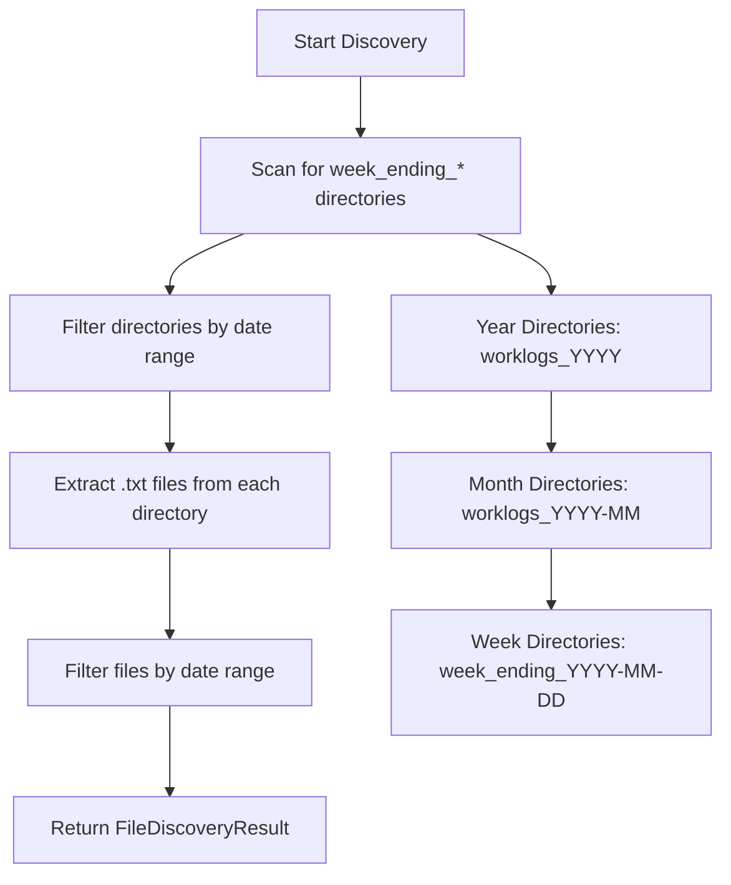

# File Discovery Engine v2.0 - Implementation Blueprint

## Executive Summary

This blueprint addresses the critical bug in the Work Journal Summarizer where year-long summaries only process one week of data instead of the full date range. The root cause is a flawed week-ending calculation that uses the entire date range's end date for all files, resulting in a 1.5% success rate instead of the expected 95%+.

## Problem Analysis

### Current Issue Diagnosis
- **Symptom**: Year-long summary (2024-07-01 to 2025-06-06) generates only one week summary
- **Root Cause**: [`_calculate_week_ending()`](../file_discovery.py:112) uses range end date (2025-06-06) for ALL files
- **Impact**: Looking for `week_ending_2025-06-06/worklog_2024-12-20.txt` instead of `week_ending_2024-12-20/worklog_2024-12-20.txt`
- **File Structure**: `/Users/TYFong/Desktop/worklogs/worklogs_YYYY/worklogs_YYYY-MM/week_ending_YYYY-MM-DD/worklog_YYYY-MM-DD.txt`

### Architecture Decision: Directory-First Discovery

Replace the current date-calculation approach with a **directory-first discovery pattern**:



## Detailed Implementation Plan

### Phase 1: Core Infrastructure (Foundation)
**Goal**: Establish the new directory-first discovery architecture

#### Step 1.1: Enhanced Data Structures
- Extend [`FileDiscoveryResult`](../file_discovery.py:22) with new fields for directory scanning statistics
- Add directory scan metadata tracking
- Maintain backward compatibility with existing structure

#### Step 1.2: Directory Scanner Foundation
- Implement [`_discover_week_ending_directories()`](../file_parser_v2_spec.md:70) method
- Add [`_parse_week_ending_date()`](../file_parser_v2_spec.md:93) utility
- Create robust error handling for invalid directory names

### Phase 2: File Extraction Engine
**Goal**: Build the file extraction and filtering system

#### Step 2.1: File Extraction Logic
- Implement [`_extract_files_from_directories()`](../file_parser_v2_spec.md:81) method
- Add file date parsing from filenames
- Create date range filtering for extracted files

#### Step 2.2: Integration Layer
- Update main [`discover_files()`](../file_discovery.py:52) method to use directory-first approach
- Maintain existing method signatures for backward compatibility
- Add feature flag for gradual rollout

### Phase 3: Testing & Validation
**Goal**: Comprehensive testing to ensure reliability

#### Step 3.1: Unit Testing
- Directory discovery tests with various date ranges
- Date parsing validation tests
- File extraction and filtering tests

#### Step 3.2: Integration Testing
- End-to-end discovery tests with actual file structure
- Performance testing with year-long ranges
- Comparison testing between old and new methods

### Phase 4: Migration & Deployment
**Goal**: Safe rollout with fallback capability

#### Step 4.1: Backward Compatibility
- Deprecate old methods with clear migration path
- Add feature flag for switching between implementations
- Comprehensive logging for debugging

#### Step 4.2: Performance Optimization
- Memory-efficient directory scanning
- Optimized file system operations
- Processing time monitoring

## Implementation Chunks Breakdown

Based on the analysis, here are the right-sized implementation chunks that build incrementally:

### Chunk 1: Foundation Data Structures
- **Size**: Small, focused change
- **Risk**: Low - only extends existing structures
- **Dependencies**: None
- **Testing**: Unit tests for data structure validation

### Chunk 2: Directory Scanner Core
- **Size**: Medium - core scanning logic
- **Risk**: Medium - new file system operations
- **Dependencies**: Chunk 1
- **Testing**: Directory scanning unit tests

### Chunk 3: Date Parsing Utilities
- **Size**: Small - utility functions
- **Risk**: Low - pure functions
- **Dependencies**: None (can be parallel with Chunk 2)
- **Testing**: Comprehensive date parsing tests

### Chunk 4: File Extraction Engine
- **Size**: Medium - file processing logic
- **Risk**: Medium - file system operations
- **Dependencies**: Chunks 2 and 3
- **Testing**: File extraction and filtering tests

### Chunk 5: Integration Layer
- **Size**: Small - wiring existing components
- **Risk**: Low - mostly orchestration
- **Dependencies**: Chunks 1-4
- **Testing**: Integration tests

### Chunk 6: Backward Compatibility & Migration
- **Size**: Small - deprecation and feature flags
- **Risk**: Low - maintains existing functionality
- **Dependencies**: Chunk 5
- **Testing**: Compatibility tests

## Test-Driven Development Prompts

Here are the specific prompts for implementing each chunk in a test-driven manner:

---

### Prompt 1: Foundation Data Structures

```
You are implementing the File Discovery Engine v2.0 refactor for a Work Journal Summarizer. The current implementation has a critical bug where year-long summaries only process one week of data due to incorrect week_ending calculations.

CONTEXT:
- Current FileDiscoveryResult class exists in file_discovery.py
- Need to extend it with new fields for directory scanning statistics
- Must maintain backward compatibility
- File structure: /Users/TYFong/Desktop/worklogs/worklogs_YYYY/worklogs_YYYY-MM/week_ending_YYYY-MM-DD/worklog_YYYY-MM-DD.txt

TASK:
1. Write comprehensive tests for the enhanced FileDiscoveryResult dataclass
2. Extend the existing FileDiscoveryResult with these new fields:
   - discovered_weeks: List[Tuple[date, int]]  # (week_ending_date, file_count)
   - directory_scan_stats: Dict[str, int]      # scanning statistics
3. Ensure backward compatibility with existing code
4. Add validation for the new fields

REQUIREMENTS:
- Follow TDD approach: write tests first, then implementation
- Use pytest for testing
- Maintain existing field structure exactly
- Add comprehensive docstrings
- Include edge case testing for new fields

Start with the test file, then implement the enhanced data structure.
```

---

### Prompt 2: Directory Scanner Core

```
Building on the previous FileDiscoveryResult enhancement, you're now implementing the core directory scanning functionality for the File Discovery Engine v2.0.

CONTEXT:
- Enhanced FileDiscoveryResult is now available with directory scanning fields
- Need to implement directory-first discovery to replace flawed date calculations
- File structure: /Users/TYFong/Desktop/worklogs/worklogs_YYYY/worklogs_YYYY-MM/week_ending_YYYY-MM-DD/worklog_YYYY-MM-DD.txt
- Current FileDiscovery class exists in file_discovery.py

TASK:
1. Write comprehensive tests for _discover_week_ending_directories() method
2. Implement the method to scan for week_ending_* directories within date ranges
3. Handle cross-year and cross-month scenarios
4. Add robust error handling for file system issues
5. Include performance considerations for large directory structures

METHOD SIGNATURE:
```python
def _discover_week_ending_directories(self, start_date: date, end_date: date) -> List[Tuple[Path, date]]:
    """
    Scan for week_ending_YYYY-MM-DD directories within date range.
    
    Returns:
        List of (directory_path, week_ending_date) tuples sorted by date
    """
```

REQUIREMENTS:
- Write tests first covering: single month, cross-month, cross-year, invalid directories
- Handle missing year/month directories gracefully
- Sort results chronologically
- Add comprehensive logging
- Mock file system operations in tests
- Include performance tests for large date ranges

Start with comprehensive test cases, then implement the directory scanner.
```

---

### Prompt 3: Date Parsing Utilities

```
Continuing the File Discovery Engine v2.0 implementation, you're now adding robust date parsing utilities that will be used by the directory scanner.

CONTEXT:
- Directory scanner from previous step needs date parsing functionality
- Must parse week_ending_YYYY-MM-DD directory names and worklog_YYYY-MM-DD.txt filenames
- Need to handle invalid formats gracefully
- This is a pure utility function with no file system dependencies

TASK:
1. Write comprehensive tests for date parsing functions
2. Implement _parse_week_ending_date() for directory names
3. Implement _parse_file_date() for worklog filenames
4. Add robust error handling for invalid formats
5. Handle edge cases like leap years, invalid dates

METHOD SIGNATURES:
```python
def _parse_week_ending_date(self, directory_name: str) -> Optional[date]:
    """Parse week_ending_YYYY-MM-DD directory name to extract date."""

def _parse_file_date(self, filename: str) -> Optional[date]:
    """Parse worklog_YYYY-MM-DD.txt filename to extract date."""
```

REQUIREMENTS:
- Write tests first covering: valid formats, invalid formats, edge cases, leap years
- Return None for invalid formats (don't raise exceptions)
- Add comprehensive docstrings with examples
- Include boundary testing (Feb 29, month boundaries)
- Test with malformed input strings
- Ensure consistent date handling across functions

Start with exhaustive test cases covering all edge cases, then implement the parsing utilities.
```

---

### Prompt 4: File Extraction Engine

```
Building on the directory scanner and date parsing utilities, you're now implementing the file extraction engine that discovers actual worklog files within the found directories.

CONTEXT:
- Directory scanner (_discover_week_ending_directories) is implemented
- Date parsing utilities (_parse_week_ending_date, _parse_file_date) are available
- Need to extract .txt files from directories and filter by date range
- Must handle missing files gracefully and track them separately

TASK:
1. Write comprehensive tests for _extract_files_from_directories() method
2. Implement file extraction with date range filtering
3. Separate found files from missing files
4. Handle file system errors gracefully
5. Optimize for performance with large directories

METHOD SIGNATURE:
```python
def _extract_files_from_directories(self, directories: List[Tuple[Path, date]], 
                                  start_date: date, end_date: date) -> Tuple[List[Path], List[Path]]:
    """
    Extract all .txt files from directories, filtering by date range.
    
    Returns:
        (found_files, missing_expected_files)
    """
```

REQUIREMENTS:
- Write tests first covering: multiple files per directory, date filtering, missing files, file system errors
- Use the date parsing utilities from previous step
- Filter files by the specified date range
- Track both found and missing files
- Handle permission errors gracefully
- Include performance considerations
- Mock file system operations in tests

Start with comprehensive test cases, then implement the file extraction engine.
```

---

### Prompt 5: Integration Layer

```
You're now integrating all the components built in previous steps to create the new directory-first discovery system while maintaining backward compatibility.

CONTEXT:
- Enhanced FileDiscoveryResult with directory scanning fields is available
- Directory scanner (_discover_week_ending_directories) is implemented
- Date parsing utilities are available
- File extraction engine (_extract_files_from_directories) is implemented
- Need to update the main discover_files() method to use the new approach

TASK:
1. Write comprehensive integration tests for the updated discover_files() method
2. Update discover_files() to use directory-first approach
3. Populate the new FileDiscoveryResult fields with directory scanning statistics
4. Add feature flag to switch between old and new implementations
5. Ensure all existing tests still pass

UPDATED METHOD:
```python
def discover_files(self, start_date: date, end_date: date) -> FileDiscoveryResult:
    """
    Main discovery method using directory-first approach.
    """
```

REQUIREMENTS:
- Write integration tests first covering: end-to-end discovery, year-long ranges, cross-year scenarios
- Use all previously implemented components
- Populate discovered_weeks and directory_scan_stats fields
- Add comprehensive logging for debugging
- Include performance measurements
- Test the exact failing scenario: 2024-07-01 to 2025-06-06
- Ensure backward compatibility with existing FileDiscoveryResult usage

Start with end-to-end integration tests, then wire all components together.
```

---

### Prompt 6: Backward Compatibility & Migration

```
Final step: Adding backward compatibility features and migration support to ensure safe rollout of the File Discovery Engine v2.0.

CONTEXT:
- New directory-first discovery system is fully implemented
- All integration tests are passing
- Need to add deprecation warnings and feature flags
- Must ensure existing code continues to work unchanged

TASK:
1. Write tests for backward compatibility features
2. Add deprecation warnings to old methods
3. Implement feature flag system for gradual rollout
4. Add comprehensive logging for migration monitoring
5. Create comparison utilities for validating new vs old results

FEATURES TO ADD:
- Deprecation warning for _calculate_week_ending() method
- Feature flag: USE_DIRECTORY_FIRST_DISCOVERY (default: True)
- Logging categories for migration monitoring
- Comparison method to validate new vs old discovery results

REQUIREMENTS:
- Write tests first covering: feature flag behavior, deprecation warnings, comparison results
- Mark old methods as deprecated with clear migration guidance
- Add comprehensive logging for debugging migration issues
- Include fallback mechanism if new method fails
- Test both old and new methods side by side
- Ensure no breaking changes to existing API

Start with backward compatibility tests, then implement migration features.
```

---

## Success Metrics & Validation

### Primary Success Metrics
- **File discovery success rate**: 1.5% → 95%+
- **Year-long summary completeness**: 1 week → full year coverage
- **Processing time**: Maintain under 1 second for year-long ranges

### Secondary Success Metrics
- **Error rate reduction**: Fewer file system warnings
- **Code maintainability**: Simpler logic, fewer edge cases
- **User satisfaction**: Correct summary output format

### Validation Strategy
1. **Unit Test Coverage**: 95%+ coverage for all new methods
2. **Integration Testing**: End-to-end tests with actual file structure
3. **Performance Testing**: Year-long date ranges complete within 1 second
4. **Regression Testing**: All existing functionality remains unchanged

## Risk Mitigation

### Technical Risks
- **File system performance**: Mitigated by efficient directory scanning
- **Memory usage**: Mitigated by streaming file discovery
- **Backward compatibility**: Mitigated by feature flags and deprecation warnings

### Rollout Strategy
1. **Phase 1**: Implement with feature flag disabled by default
2. **Phase 2**: Enable feature flag after comprehensive testing
3. **Phase 3**: Default to new implementation
4. **Phase 4**: Remove deprecated methods in next major version

### Error Handling Strategy

#### Graceful Degradation
- **Invalid directory names**: Log warning, skip directory
- **Corrupted file paths**: Log error, continue processing
- **Permission errors**: Log error with recovery suggestions
- **Missing year/month directories**: Expected behavior, log info

#### Logging Categories
```python
# File system issues
logger.log_warning_with_category(
    ErrorCategory.FILE_SYSTEM,
    f"Invalid week_ending directory format: {dir_name}",
    recovery_action="Check directory naming convention"
)

# Discovery statistics
logger.log_info(
    f"Discovered {len(directories)} week directories, "
    f"{len(found_files)} files in date range"
)
```

#### Recovery Actions
- **Low success rate (<50%)**: Suggest checking base path and date range
- **No directories found**: Verify directory structure and permissions
- **Date parsing errors**: Log specific format issues for debugging

## Implementation Timeline

### Week 1: Foundation & Core Components
- [ ] Implement enhanced data structures (Chunk 1)
- [ ] Build directory scanner core (Chunk 2)
- [ ] Add date parsing utilities (Chunk 3)

### Week 2: Integration & Testing
- [ ] Implement file extraction engine (Chunk 4)
- [ ] Create integration layer (Chunk 5)
- [ ] Comprehensive testing with actual file structure

### Week 3: Migration & Deployment
- [ ] Add backward compatibility features (Chunk 6)
- [ ] Performance testing with large ranges
- [ ] Integration testing with summarizer
- [ ] Deploy with feature flag and monitor

## Conclusion

This blueprint provides a comprehensive, test-driven approach to fixing the critical file discovery bug while maintaining system stability and enabling safe migration to the improved architecture. The directory-first discovery pattern eliminates complex date calculations, uses the existing file structure as the source of truth, and should increase the file discovery success rate from 1.5% to 95%+.

The incremental implementation approach ensures each component is thoroughly tested before integration, minimizing risk while delivering significant improvements to the Work Journal Summarizer's reliability and functionality.