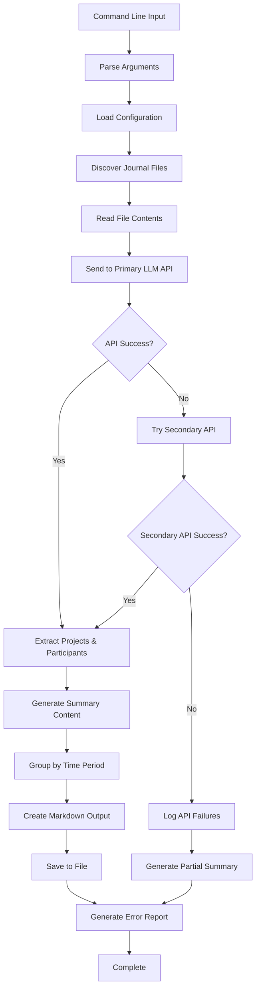

# Work Journal Summarizer - Technical Specification

## Overview
A Python program that generates weekly and monthly summaries of daily work journal text files using LLM APIs. The program processes free-form journal entries, automatically identifies projects and participants, and creates consolidated markdown summaries.

## File Structure Analysis

### Input Directory Structure
```
~/Desktop/worklogs/
├── worklogs_2024/
│   ├── worklogs_2024-01/
│   │   ├── week_ending_2025-01-05/
│   │   │   ├── worklog_2024-01-01.txt
│   │   │   ├── worklog_2024-01-02.txt
│   │   │   └── ...
│   │   └── week_ending_2025-01-12/
│   └── worklogs_2024-02/
└── worklogs_2025/
    └── ...
```

### Output Directory Structure
```
~/Desktop/worklogs/summaries/
├── weekly_summary_2024-04-01_to_2025-04-30_20250616_121600.md
├── monthly_summary_2024-04-01_to_2025-04-30_20250616_121700.md
└── error_logs/
    └── summarizer_20250616_121600.log
```

## Core Requirements

### 1. Command Line Interface
```bash
python work_journal_summarizer.py --start-date 2024-04-01 --end-date 2025-04-30 --summary-type weekly
python work_journal_summarizer.py --start-date 2024-04-01 --end-date 2025-04-30 --summary-type monthly
```

**Required Arguments:**
- `--start-date`: Start date in YYYY-MM-DD format (inclusive)
- `--end-date`: End date in YYYY-MM-DD format (inclusive)  
- `--summary-type`: Either "weekly" or "monthly"

### 2. File Processing Logic

#### Date Range Processing
- Parse all journal files within the specified date range (inclusive)
- Handle cross-year date ranges (e.g., April 2024 to April 2025)
- Navigate the nested directory structure: `worklogs_YYYY/worklogs_YYYY-MM/week_ending_YYYY-MM-DD/worklog_YYYY-MM-DD.txt`

#### File Discovery Algorithm
1. Generate list of all dates within the specified range
2. For each date, construct the expected file path based on directory structure
3. Check if file exists and is readable
4. Log missing files but continue processing

### 3. Content Analysis & Project Tracking

#### AI-Based Identification
- Use LLM APIs to automatically identify:
  - Project names (formal and informal references)
  - Participant names (various formats: full names, first names, initials)
  - Key tasks and activities
  - Major themes

#### Processing Strategy
- Send journal content to LLM with specific prompts for entity extraction
- Build dynamic lists of projects and participants as content is processed
- No predefined lists or manual configuration required

### 4. LLM API Integration

#### Configuration Management
- Configuration file (`config.yaml` or `config.json`) specifying:
  - Primary API preference (CBORG or Bedrock)
  - API endpoints and authentication details
  - Fallback behavior

#### API Options
1. **CBORG Service** (https://cborg.lbl.gov/api_examples/)
2. **Claude on Amazon Bedrock**

#### Authentication
- API keys stored in environment variables or secure configuration file
- Support for different authentication methods per API

#### Fallback Logic
- Attempt primary API first
- If primary fails, automatically try secondary API
- Log all API interactions and failures

### 5. Summary Generation

#### Weekly Summaries
- Group journal entries by calendar week
- Generate one paragraph per week covering:
  - Major themes and projects worked on
  - People collaborated with
  - Key tasks completed
- Output format: Single markdown file with week-based headings

#### Monthly Summaries  
- Group journal entries by calendar month
- Generate one paragraph per month covering:
  - Major themes and projects worked on
  - People collaborated with
  - Key tasks completed
- Output format: Single markdown file with month-based headings

#### Summary Content Requirements
Each summary paragraph should include:
- Major themes identified in the work
- Projects worked on during the period
- People collaborated with
- Specific tasks and activities completed

### 6. Output File Management

#### File Naming Convention
```
{summary_type}_summary_{start_date}_to_{end_date}_{timestamp}.md
```
Examples:
- `weekly_summary_2024-04-01_to_2025-04-30_20250616_121600.md`
- `monthly_summary_2024-04-01_to_2025-04-30_20250616_121700.md`

#### Output Location
- Save to: `~/Desktop/worklogs/summaries/`
- Create directory if it doesn't exist

#### Markdown Structure
```markdown
# {Summary Type} Summary: {Start Date} to {End Date}

Generated on: {Timestamp}
Date Range: {Start Date} to {End Date}
Total Files Processed: {Count}

## {Period} (e.g., Week of 2024-04-01 or April 2024)

{One paragraph summary covering themes, projects, participants, and tasks}

## {Next Period}

{Next paragraph summary}

---

## Processing Notes

### Files Processed
- Total files found: {count}
- Files successfully processed: {count}
- Files with errors: {count}

### Issues Encountered
{List any missing files, API failures, or other issues}
```

### 7. Error Handling & Logging

#### Error Scenarios
- Missing journal files for dates in range
- Unreadable or corrupted files
- API failures or timeouts
- Network connectivity issues
- Invalid date ranges
- Permission issues

#### Logging Strategy
- Create detailed log files in `~/Desktop/worklogs/summaries/error_logs/`
- Log filename: `summarizer_{timestamp}.log`
- Continue processing despite errors
- Include error summary section in output markdown

#### Error Log Content
- Timestamp of each operation
- Files processed successfully
- Missing files with expected paths
- API call results and failures
- Processing statistics

### 8. Configuration Management

#### Configuration File Structure
```yaml
# config.yaml
llm_apis:
  primary: "cborg"  # or "bedrock"
  secondary: "bedrock"  # or "cborg"
  
cborg:
  endpoint: "https://cborg.lbl.gov/api/..."
  api_key_env: "CBORG_API_KEY"
  
bedrock:
  region: "us-west-2"
  model_id: "anthropic.claude-3-sonnet-20240229-v1:0"
  aws_access_key_env: "AWS_ACCESS_KEY_ID"
  aws_secret_key_env: "AWS_SECRET_ACCESS_KEY"

processing:
  max_retries: 3
  timeout_seconds: 30
  batch_size: 10  # files per API call if batching
```

### 9. Data Flow Architecture



### 10. Technical Implementation Notes

#### Dependencies
- Python 3.8+
- Required packages:
  - `argparse` (built-in)
  - `datetime` (built-in)
  - `pathlib` (built-in)
  - `logging` (built-in)
  - `yaml` or `json` (for configuration)
  - `requests` (for API calls)
  - `boto3` (for Bedrock integration)

#### Performance Considerations
- Process files in chronological order
- Implement rate limiting for API calls
- Consider batching multiple days for API efficiency
- Cache API responses to avoid re-processing

#### Security Considerations
- Store API keys in environment variables
- Validate all file paths to prevent directory traversal
- Sanitize content before sending to APIs
- Implement proper error handling for sensitive operations

## Success Criteria

1. **Functional Requirements Met:**
   - Processes journal files within specified date ranges
   - Generates weekly and monthly summaries
   - Automatically identifies projects and participants
   - Creates single markdown output files
   - Handles cross-year date ranges

2. **Quality Requirements:**
   - Robust error handling with detailed logging
   - Graceful fallback between APIs
   - Clear, informative summary content
   - Proper markdown formatting

3. **Usability Requirements:**
   - Simple command-line interface
   - Clear error messages and progress indicators
   - Comprehensive documentation
   - Easy configuration management

## Future Enhancement Opportunities

1. **Advanced Features:**
   - Interactive mode for reviewing/editing summaries
   - Custom summary templates
   - Integration with additional LLM providers
   - Export to other formats (PDF, HTML)

2. **Performance Improvements:**
   - Parallel processing of files
   - Incremental processing (only new/changed files)
   - Local caching of processed content

3. **Analytics Features:**
   - Project time tracking analysis
   - Collaboration pattern insights
   - Productivity trend analysis