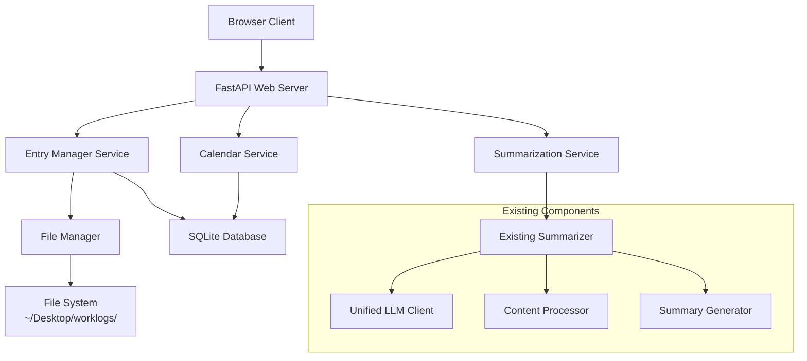

# Daily Work Journal Web Application - Implementation Blueprint

## 🎯 Project Overview

This blueprint transforms the existing CLI-based WorkJournalMaker into a modern web application while maintaining full compatibility with the existing file structure and summarization system. The project will be built incrementally using test-driven development with small, safe iterations.

## 🏗️ High-Level Architecture

## 📋 Implementation Phases

### Phase 1: Foundation & Core Infrastructure
- Project structure setup
- Database schema and models
- Basic FastAPI application
- File system integration

### Phase 2: Entry Management System
- CRUD operations for journal entries
- Auto-save functionality
- File system synchronization

### Phase 3: Calendar Navigation
- Calendar data generation
- Month navigation
- Entry indicators

### Phase 4: Web Interface
- Minimalistic, clean UI design
- Entry editor with real-time features
- Calendar view implementation

### Phase 5: Summarization Integration
- Existing summarizer integration
- Progress tracking
- Results display

### Phase 6: Configuration & Settings
- Settings management
- Path validation
- Configuration persistence

### Phase 7: Testing & Packaging
- Comprehensive testing
- Cross-platform packaging
- Deployment preparation

---

## 🔧 Detailed Implementation Steps

### **PHASE 1: Foundation & Core Infrastructure**

#### Step 1.1: Project Structure Setup

**Objective:** Create the foundational project structure for the web application, establishing clear separation of concerns and preparing for incremental development.

**Deliverables:**
- Clean project directory structure
- Basic configuration files
- Development environment setup
- Initial requirements.txt with web dependencies

**Test Strategy:**
- Verify directory structure exists
- Validate import paths work correctly
- Confirm development server can start

---

#### Step 1.2: Database Schema & Models

**Objective:** Implement the SQLite database schema and Pydantic models for the web application, focusing on indexing journal entries while maintaining file system compatibility.

**Deliverables:**
- SQLite database schema creation
- Pydantic models for API requests/responses
- Database connection management
- Migration system foundation

**Test Strategy:**
- Unit tests for database operations
- Model validation tests
- Connection handling tests

---

#### Step 1.3: Basic FastAPI Application

**Objective:** Create the core FastAPI application with basic routing structure, error handling, and static file serving capabilities.

**Deliverables:**
- FastAPI application instance
- Basic route structure
- Error handling middleware
- Static file serving setup
- Health check endpoint

**Test Strategy:**
- API endpoint tests
- Error handling validation
- Static file serving tests

---

#### Step 1.4: File System Integration Service

**Objective:** Develop the FileManager service that integrates with the existing file discovery system, maintaining compatibility with the current directory structure.

**Deliverables:**
- FileManager service class
- Integration with existing FileDiscovery
- Directory creation utilities
- File read/write operations

**Test Strategy:**
- File system operation tests
- Directory structure validation
- Integration tests with existing code

---

### **PHASE 2: Entry Management System**

#### Step 2.1: Journal Entry CRUD Operations

**Objective:** Implement comprehensive Create, Read, Update, Delete operations for journal entries, ensuring data