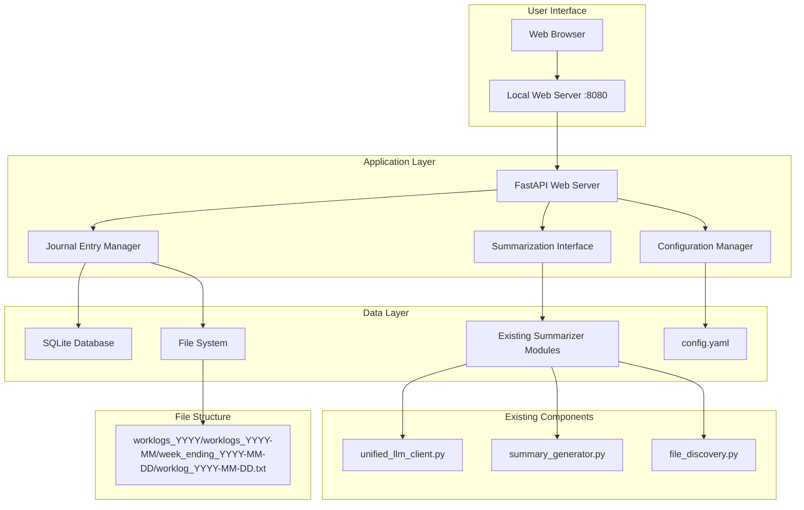
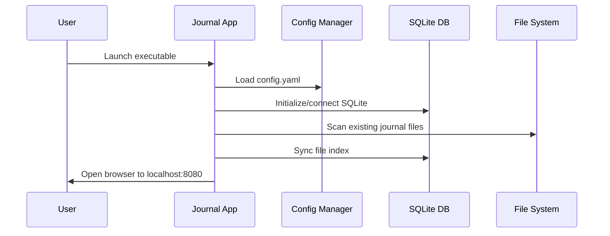
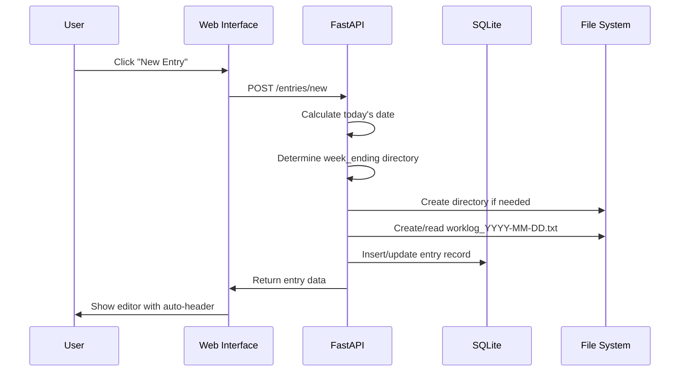
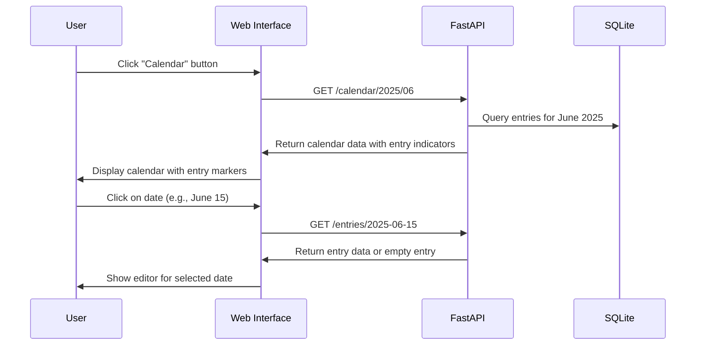
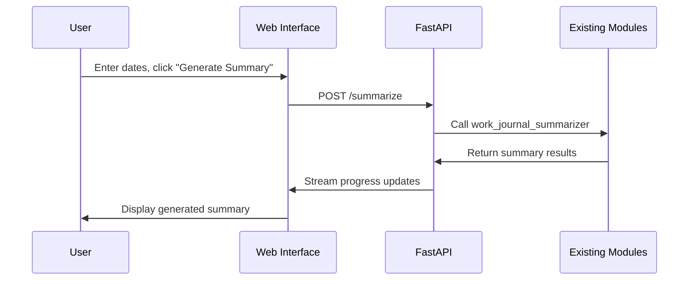

# Daily Work Journal Web Application - Complete Specification

## 🎯 Project Overview

Transform the existing command-line WorkJournalMaker into a user-friendly web application that allows users to create daily work journal entries through a browser interface, while maintaining full compatibility with the existing summarization system.

## 🏗️ Architecture Overview



## 🛠️ Technology Stack

**Backend Framework:** FastAPI
- **Rationale:** Modern Python framework with excellent performance, automatic API documentation, and seamless integration with existing Python codebase
- **Benefits:** Async support, type hints, easy testing, cross-platform compatibility

**Database:** SQLite
- **Purpose:** Index file locations, cache metadata, enable fast searches and calendar views
- **Benefits:** Serverless, cross-platform, no additional setup required

**Frontend:** HTML/CSS/JavaScript (Vanilla)
- **Rationale:** Simple, lightweight, no complex build processes
- **Benefits:** Fast loading, easy to maintain, works in any browser

**Packaging:** PyInstaller
- **Purpose:** Create standalone executables for each platform
- **Benefits:** No Python installation required, double-click to run

## 📊 Data Architecture

### Hybrid Storage System

**Primary Storage:** File System (maintains existing structure)
```
~/Desktop/worklogs/
├── worklogs_2024/
│   ├── worklogs_2024-01/
│   │   └── week_ending_2024-01-05/
│   │       ├── worklog_2024-01-01.txt
│   │       ├── worklog_2024-01-02.txt
│   │       └── worklog_2024-01-05.txt
```

**Secondary Storage:** SQLite Database
```sql
-- Tracks file locations and metadata
CREATE TABLE journal_entries (
    id INTEGER PRIMARY KEY,
    date DATE UNIQUE NOT NULL,
    file_path TEXT NOT NULL,
    week_ending_date DATE NOT NULL,
    word_count INTEGER,
    has_content BOOLEAN DEFAULT FALSE,
    created_at TIMESTAMP DEFAULT CURRENT_TIMESTAMP,
    modified_at TIMESTAMP DEFAULT CURRENT_TIMESTAMP
);

-- Application settings
CREATE TABLE app_settings (
    key TEXT PRIMARY KEY,
    value TEXT NOT NULL,
    modified_at TIMESTAMP DEFAULT CURRENT_TIMESTAMP
);
```

## 🎨 User Interface Design

### Main Dashboard
```
┌─────────────────────────────────────────────────────────┐
│ Daily Work Journal                    [Calendar] Settings│
├─────────────────────────────────────────────────────────┤
│                                                         │
│  📅 Today: Monday, June 23, 2025                       │
│                                                         │
│  ┌─────────────────────────────────────────────────┐   │
│  │              [New Entry]                        │   │
│  └─────────────────────────────────────────────────┘   │
│                                                         │
│  Recent Entries:                                        │
│  ┌─────────────────────────────────────────────────┐   │
│  │ 📝 June 22, 2025 - Friday                      │   │
│  │    "Completed quarterly review meeting..."       │   │
│  │                                    [Edit] [View]│   │
│  ├─────────────────────────────────────────────────┤   │
│  │ 📝 June 21, 2025 - Thursday                    │   │
│  │    "Working on project architecture..."         │   │
│  │                                    [Edit] [View]│   │
│  └─────────────────────────────────────────────────┘   │
│                                                         │
│  ┌─────────────────────────────────────────────────┐   │
│  │                 Summarization                   │   │
│  │  Start Date: [2025-06-01] End Date: [2025-06-23]│   │
│  │  Type: [Weekly ▼] [Monthly ▼]                   │   │
│  │              [Generate Summary]                  │   │
│  └─────────────────────────────────────────────────┘   │
└─────────────────────────────────────────────────────────┘
```

### Calendar View
```
┌─────────────────────────────────────────────────────────┐
│ ← Back to Dashboard        June 2025        [< >] Today │
├─────────────────────────────────────────────────────────┤
│                                                         │
│   Sun   Mon   Tue   Wed   Thu   Fri   Sat              │
│  ┌───┐ ┌───┐ ┌───┐ ┌───┐ ┌───┐ ┌───┐ ┌───┐            │
│  │ 1 │ │ 2 │ │ 3 │ │ 4 │ │ 5 │ │ 6 │ │ 7 │            │
│  │   │ │ ● │ │ ● │ │   │ │ ● │ │ ● │ │   │            │
│  └───┘ └───┘ └───┘ └───┘ └───┘ └───┘ └───┘            │
│  ┌───┐ ┌───┐ ┌───┐ ┌───┐ ┌───┐ ┌───┐ ┌───┐            │
│  │ 8 │ │ 9 │ │10 │ │11 │ │12 │ │13 │ │14 │            │
│  │   │ │ ● │ │ ● │ │ ● │ │ ● │ │ ● │ │   │            │
│  └───┘ └───┘ └───┘ └───┘ └───┘ └───┘ └───┘            │
│  ┌───┐ ┌───┐ ┌───┐ ┌───┐ ┌───┐ ┌───┐ ┌───┐            │
│  │15 │ │16 │ │17 │ │18 │ │19 │ │20 │ │21 │            │
│  │   │ │ ● │ │ ● │ │ ● │ │ ● │ │ ● │ │   │            │
│  └───┘ └───┘ └───┘ └───┘ └───┘ └───┘ └───┘            │
│  ┌───┐ ┌───┐ ┌───┐ ┌───┐ ┌───┐ ┌───┐ ┌───┐            │
│  │22 │ │23*│ │24 │ │25 │ │26 │ │27 │ │28 │            │
│  │   │ │ ● │ │   │ │   │ │   │ │   │ │   │            │
│  └───┘ └───┘ └───┘ └───┘ └───┘ └───┘ └───┘            │
│                                                         │
│  Legend: ● = Has Entry, * = Today                       │
│  Click on any date to view/edit entry                   │
└─────────────────────────────────────────────────────────┘
```

### Entry Editor
```
┌─────────────────────────────────────────────────────────┐
│ ← Back                                           [Save] │
├─────────────────────────────────────────────────────────┤
│                                                         │
│  Monday, June 23, 2025                                 │
│                                                         │
│  ┌─────────────────────────────────────────────────┐   │
│  │                                                 │   │
│  │  [Large text area for journal entry]           │   │
│  │                                                 │   │
│  │                                                 │   │
│  │                                                 │   │
│  │                                                 │   │
│  │                                                 │   │
│  │                                                 │   │
│  └─────────────────────────────────────────────────┘   │
│                                                         │
│  Word Count: 245 words                                 │
│  Auto-saved 2 minutes ago                              │
└─────────────────────────────────────────────────────────┘
```

## 🔧 Core Features

### 1. Journal Entry Management
- **New Entry Creation:** Single button creates entry for today's date
- **Automatic Headers:** Each entry starts with "Day and Date" (e.g., "Monday, June 23, 2025")
- **Full Editing:** Users can modify any entry at any time
- **Auto-save:** Entries saved automatically every 30 seconds
- **Manual Save:** Explicit save button for user control

### 2. Calendar Navigation System
- **Monthly Calendar View:** Grid layout showing all dates in a month
- **Entry Indicators:** Visual markers (●) show which dates have entries
- **Date Navigation:** Click any date to view/edit that day's entry
- **Month Navigation:** Previous/Next buttons to browse different months
- **Today Highlight:** Current date clearly marked
- **Quick Access:** "Today" button to jump to current date

### 3. File System Integration
- **Directory Creation:** Automatically creates required directory structure
- **File Naming:** Follows existing `worklog_YYYY-MM-DD.txt` convention
- **Week Calculation:** Automatically determines correct `week_ending_YYYY-MM-DD` directory
- **File Synchronization:** SQLite database stays in sync with file system

### 4. Summarization Interface
- **Manual Date Entry:** Start and end date input fields (YYYY-MM-DD format)
- **Summary Types:** Weekly and Monthly options
- **Integration:** Direct integration with existing summarization modules
- **Progress Display:** Real-time progress during summarization
- **Result Display:** Show generated summaries in web interface

### 5. Configuration Management
- **Hybrid Config:** Inherits from existing `config.yaml`
- **Web Overrides:** Settings page for common options (base_path, output_path)
- **Persistence:** Web settings stored in SQLite and optionally saved to config file

## 🔄 Application Workflow

### Startup Sequence


### New Entry Creation


### Calendar Navigation


### Summarization Process


## 📁 Project Structure

```
WorkJournalMaker/
├── web_app/
│   ├── main.py                    # FastAPI application entry point
│   ├── api/
│   │   ├── __init__.py
│   │   ├── entries.py             # Journal entry endpoints
│   │   ├── calendar.py            # Calendar view endpoints
│   │   ├── summarization.py       # Summarization endpoints
│   │   └── settings.py            # Configuration endpoints
│   ├── models/
│   │   ├── __init__.py
│   │   ├── database.py            # SQLite models and operations
│   │   └── journal_entry.py       # Entry data structures
│   ├── services/
│   │   ├── __init__.py
│   │   ├── file_manager.py        # File system operations
│   │   ├── entry_service.py       # Business logic for entries
│   │   ├── calendar_service.py    # Calendar data processing
│   │   └── summarization_service.py # Integration with existing summarizer
│   ├── static/
│   │   ├── css/
│   │   │   ├── styles.css
│   │   │   └── calendar.css
│   │   ├── js/
│   │   │   ├── main.js
│   │   │   ├── editor.js
│   │   │   ├── calendar.js
│   │   │   └── summarization.js
│   │   └── favicon.ico
│   └── templates/
│       ├── index.html             # Main dashboard
│       ├── calendar.html          # Calendar view
│       ├── editor.html            # Entry editor
│       ├── settings.html          # Configuration page
│       └── base.html              # Base template
├── existing files...              # All current files remain unchanged
├── requirements-web.txt           # Additional web dependencies
├── build_executable.py           # PyInstaller build script
└── README-WebApp.md              # Web app documentation
```

## 🔧 Technical Implementation Details

### FastAPI Application Structure
```python
# main.py
from fastapi import FastAPI, Request
from fastapi.staticfiles import StaticFiles
from fastapi.templating import Jinja2Templates

app = FastAPI(title="Daily Work Journal")
app.mount("/static", StaticFiles(directory="static"), name="static")
templates = Jinja2Templates(directory="templates")

# Include API routers
app.include_router(entries_router, prefix="/api/entries")
app.include_router(calendar_router, prefix="/api/calendar")
app.include_router(summarization_router, prefix="/api/summarize")
app.include_router(settings_router, prefix="/api/settings")
```

### Calendar Service
```python
# services/calendar_service.py
from datetime import date, timedelta
from typing import Dict, List
import calendar

class CalendarService:
    def __init__(self, db: JournalDatabase):
        self.db = db
    
    def get_month_data(self, year: int, month: int) -> Dict:
        """Get calendar data for a specific month with entry indicators"""
        # Get all entries for the month
        entries = self.db.get_entries_for_month(year, month)
        entry_dates = {entry.date for entry in entries}
        
        # Generate calendar grid
        cal = calendar.monthcalendar(year, month)
        
        return {
            'year': year,
            'month': month,
            'month_name': calendar.month_name[month],
            'calendar_grid': cal,
            'entry_dates': list(entry_dates),
            'today': date.today()
        }
```

### Database Integration
```python
# models/database.py
import sqlite3
from pathlib import Path
from datetime import date
from typing import List, Optional

class JournalDatabase:
    def __init__(self, db_path: Path):
        self.db_path = db_path
        self.init_database()
    
    def add_entry(self, date: date, file_path: Path, week_ending: date):
        """Insert or update entry record"""
        pass
    
    def get_recent_entries(self, limit: int = 10) -> List[JournalEntry]:
        """Return recent entries for dashboard"""
        pass
    
    def get_entries_for_month(self, year: int, month: int) -> List[JournalEntry]:
        """Get all entries for a specific month"""
        pass
    
    def get_entry_by_date(self, entry_date: date) -> Optional[JournalEntry]:
        """Get specific entry by date"""
        pass
```

### File System Manager
```python
# services/file_manager.py
from pathlib import Path
from datetime import date
import calendar

class FileManager:
    def __init__(self, base_path: Path):
        self.base_path = Path(base_path).expanduser()
    
    def get_entry_path(self, entry_date: date) -> Path:
        """Calculate correct file path following existing structure"""
        year = entry_date.year
        month = entry_date.month
        
        # Find the week ending date (Friday of the week)
        week_ending = self.calculate_week_ending(entry_date)
        
        return (self.base_path / 
                f"worklogs_{year}" / 
                f"worklogs_{year}-{month:02d}" / 
                f"week_ending_{week_ending}" / 
                f"worklog_{entry_date}.txt")
    
    def calculate_week_ending(self, entry_date: date) -> str:
        """Calculate the Friday (week ending) for a given date"""
        # Find the Friday of the week containing entry_date
        days_until_friday = (4 - entry_date.weekday()) % 7
        if days_until_friday == 0 and entry_date.weekday() != 4:
            days_until_friday = 7
        friday = entry_date + timedelta(days=days_until_friday)
        return friday.strftime('%Y-%m-%d')
```

## 🚀 Deployment & Distribution

### PyInstaller Configuration
```python
# build_executable.py
import PyInstaller.__main__

PyInstaller.__main__.run([
    'web_app/main.py',
    '--name=DailyWorkJournal',
    '--onefile',
    '--windowed',
    '--add-data=web_app/templates:templates',
    '--add-data=web_app/static:static',
    '--hidden-import=uvicorn',
    '--hidden-import=jinja2',
    '--hidden-import=sqlite3',
])
```

### Cross-Platform Build Process
```bash
# Build for current platform
python build_executable.py

# Platform-specific considerations:
# - macOS: Code signing for distribution
# - Windows: Antivirus whitelist considerations  
# - Linux: AppImage or .deb packaging options
```

## 🔒 Security Considerations

- **Local Only:** Web server binds to localhost only (127.0.0.1)
- **No External Access:** Firewall rules prevent external connections
- **File System Access:** Restricted to configured base directory
- **Input Validation:** All user inputs sanitized and validated
- **CSRF Protection:** Built-in FastAPI security features

## 🧪 Testing Strategy

### Unit Tests
- File system operations
- Database operations  
- Date calculations
- Configuration management
- Calendar data generation

### Integration Tests
- API endpoints
- File system synchronization
- Summarization integration
- Cross-platform compatibility
- Calendar navigation

### User Acceptance Tests
- Entry creation workflow
- Calendar navigation
- Editing functionality
- Summarization process
- Settings management

## 📈 Performance Considerations

- **Startup Time:** < 3 seconds on modern hardware
- **Memory Usage:** < 100MB baseline, scales with journal size
- **File Operations:** Async I/O for large file operations
- **Database Queries:** Indexed for fast searches and calendar views
- **Auto-save:** Debounced to prevent excessive writes
- **Calendar Loading:** Efficient month-based queries

## 🔮 Future Extensibility

The architecture supports future enhancements:
- **Search Functionality:** Full-text search across entries
- **Export Options:** PDF, Word, other formats
- **Themes:** Dark mode, custom styling
- **Backup/Sync:** Cloud storage integration
- **Mobile Access:** Responsive design for tablets
- **Preset Date Ranges:** Quick summary options
- **Entry Templates:** Structured entry formats
- **Calendar Enhancements:** Week view, year view
- **Entry Statistics:** Word count trends, writing patterns

## 📋 Key User Stories

1. **Daily Journaling:** As a user, I want to quickly create today's journal entry with a single click
2. **Historical Access:** As a user, I want to easily find and edit entries from several months ago using a calendar
3. **Visual Overview:** As a user, I want to see at a glance which dates I have journal entries for
4. **Seamless Integration:** As a user, I want my web entries to work with the existing summarization tool
5. **Cross-Platform:** As a user, I want the same experience on Windows, macOS, and Linux
6. **No Setup:** As a user, I want to run the application without installing Python or dependencies

This specification provides a comprehensive roadmap for creating a user-friendly web-based daily work journal that seamlessly integrates with your existing summarization system while providing intuitive calendar-based navigation for accessing entries from any date.