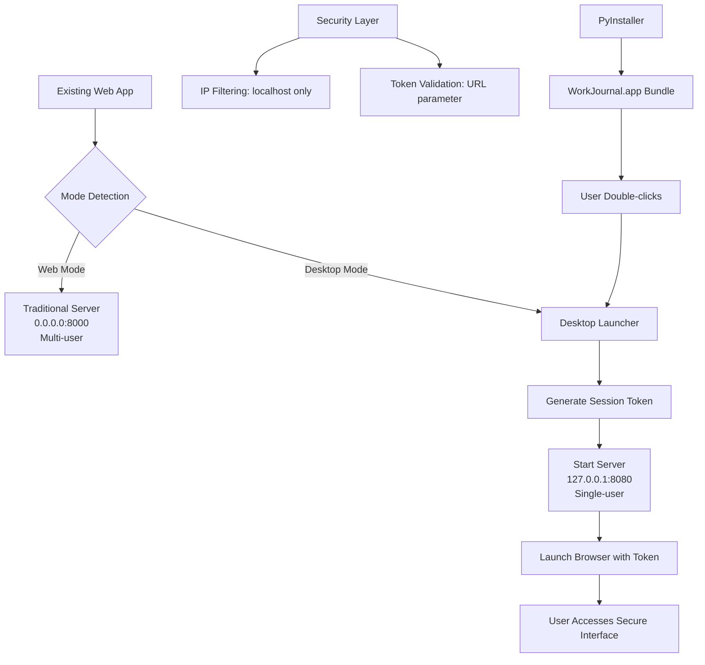

# WorkJournal Desktop Packaging Specification
## Developer-Ready Implementation Guide

### Executive Summary

This specification details how to add desktop packaging capabilities to the existing WorkJournal web application without disrupting current functionality. The solution maintains dual-mode operation: traditional multi-user web server and secure single-user desktop application.

### Project Requirements

#### Core Requirements
- **Platform Target**: macOS only (Linux support excluded)
- **Packaging Method**: PyInstaller single executable
- **Dual Mode Support**: Web server mode + Desktop application mode
- **Security Model**: Localhost binding + session token validation
- **Configuration**: Use existing configuration system unchanged
- **Updates**: Manual replacement (no auto-update checking)
- **Code Signing**: Skip (unsigned application acceptable)

#### User Experience Requirements
- **Launch Method**: Double-click executable → auto-open browser
- **Browser Monitoring**: 10-second timeout before notification
- **Quit Behavior**: 15-second auto-default to "keep running"
- **Security**: Session token in URL for additional protection
- **Data Storage**: Use existing hybrid approach (macOS standard dirs + user-configurable)

### Architecture Overview



### Implementation Components

#### 1. Desktop Launcher (`desktop_launcher.py`)

**Purpose**: Entry point for packaged desktop application

**Location**: Project root

**Implementation**:
```python
#!/usr/bin/env python3
"""
WorkJournal Desktop Launcher
Entry point for packaged macOS desktop application
"""

import asyncio
import webbrowser
import secrets
import time
import sys
import socket
import os
from pathlib import Path

# Import existing web app
from web.app import app, web_app

class DesktopLauncher:
    def __init__(self):
        self.session_token = secrets.token_urlsafe(32)
        self.server_port = 8080
        self.browser_launched = False
        
    async def start_desktop_mode(self):
        """Start the application in desktop mode"""
        try:
            # Set desktop mode environment variable
            os.environ['DESKTOP_TOKEN'] = self.session_token
            os.environ['DESKTOP_MODE'] = 'true'
            
            # Initialize existing web app
            await web_app.startup()
            
            # Find available port
            self.server_port = self._find_available_port()
            
            # Launch browser with session token
            await self._launch_browser_with_delay()
            
            # Start server (localhost only)
            import uvicorn
            config = uvicorn.Config(
                app, 
                host="127.0.0.1",  # localhost only
                port=self.server_port,
                access_log=False,
                server_header=False
            )
            server = uvicorn.Server(config)
            await server.serve()
            
        except Exception as e:
            print(f"Desktop launcher error: {e}")
            sys.exit(1)
    
    async def _launch_browser_with_delay(self):
        """Launch browser after short delay to ensure server is ready"""
        await asyncio.sleep(2)  # Wait for server startup
        url = f"http://127.0.0.1:{self.server_port}?desktop_token={self.session_token}"
        try:
            webbrowser.open(url)
            self.browser_launched = True
            print(f"🚀 WorkJournal launched at {url}")
        except Exception as e:
            print(f"Failed to launch browser: {e}")
    
    def _find_available_port(self):
        """Find available port starting from 8080"""
        for port in range(8080, 8090):
            try:
                with socket.socket(socket.AF_INET, socket.SOCK_STREAM) as s:
                    s.bind(('127.0.0.1', port))
                    return port
            except OSError:
                continue
        raise RuntimeError("No available ports found in range 8080-8089")

async def main():
    """Main entry point"""
    print("🔧 Starting WorkJournal Desktop Application...")
    launcher = DesktopLauncher()
    await launcher.start_desktop_mode()

if __name__ == "__main__":
    asyncio.run(main())
```

**Key Features**:
- Generates cryptographically secure session token
- Finds available port automatically
- Launches browser with token-secured URL
- Integrates seamlessly with existing web app

#### 2. Desktop Security Middleware (`web/desktop_middleware.py`)

**Purpose**: Enforce desktop-specific security policies

**Location**: `web/desktop_middleware.py`

**Implementation**:
```python
from fastapi import Request, HTTPException
from starlette.middleware.base import BaseHTTPMiddleware
import os
import logging

logger = logging.getLogger(__name__)

class DesktopSecurityMiddleware(BaseHTTPMiddleware):
    """Security middleware for desktop mode"""
    
    def __init__(self, app, desktop_token: str = None):
        super().__init__(app)
        self.desktop_token = desktop_token or os.getenv('DESKTOP_TOKEN')
        self.is_desktop_mode = self.desktop_token is not None
        
        if self.is_desktop_mode:
            logger.info("Desktop security middleware enabled")
    
    async def dispatch(self, request: Request, call_next):
        if not self.is_desktop_mode:
            # Normal web mode - no additional restrictions
            return await call_next(request)
        
        # Desktop mode - enforce security
        client_ip = request.client.host
        
        # Allow localhost connections only
        allowed_ips = ['127.0.0.1', '::1', 'localhost']
        if client_ip not in allowed_ips:
            logger.warning(f"Blocked external access attempt from {client_ip}")
            raise HTTPException(
                status_code=403, 
                detail="Desktop mode: External access denied"
            )
        
        # Validate session token (except for health checks)
        if not request.url.path.startswith('/health'):
            token = request.query_params.get('desktop_token')
            if not token or token != self.desktop_token:
                logger.warning(f"Invalid desktop token from {client_ip}")
                raise HTTPException(
                    status_code=403, 
                    detail="Invalid desktop session"
                )
        
        response = await call_next(request)
        
        # Add security headers for desktop mode
        response.headers["X-Frame-Options"] = "DENY"
        response.headers["X-Content-Type-Options"] = "nosniff"
        response.headers["Referrer-Policy"] = "no-referrer"
        
        return response
```

**Security Features**:
- IP address filtering (localhost only)
- Session token validation
- Security headers injection
- Comprehensive logging of security events

#### 3. Web Application Integration

**Purpose**: Minimal changes to existing web app for desktop mode detection

**Location**: `web/app.py` (modification)

**Changes Required**:
```python
# Add after existing imports (around line 20)
import os

# Add after FastAPI app creation (around line 150)
DESKTOP_MODE = os.getenv('DESKTOP_MODE') == 'true'

# Add desktop middleware if in desktop mode
if DESKTOP_MODE:
    from web.desktop_middleware import DesktopSecurityMiddleware
    app.add_middleware(DesktopSecurityMiddleware, desktop_token=os.getenv('DESKTOP_TOKEN'))
    
    # Optional: Add desktop-specific route
    @app.get("/desktop/status")
    async def desktop_status():
        """Desktop mode status endpoint"""
        return {
            "mode": "desktop",
            "secure": True,
            "localhost_only": True
        }
```

**Integration Benefits**:
- Zero disruption to existing functionality
- Clean separation of concerns
- Optional desktop-specific features

#### 4. PyInstaller Configuration (`workjournal.spec`)

**Purpose**: Build configuration for creating macOS executable

**Location**: Project root

**Implementation**:
```python
# -*- mode: python ; coding: utf-8 -*-

import sys
from pathlib import Path

# Get project root
project_root = Path(__file__).parent

a = Analysis(
    ['desktop_launcher.py'],
    pathex=[str(project_root)],
    binaries=[],
    datas=[
        # Web application assets
        ('web/static', 'web/static'),
        ('web/templates', 'web/templates'),
        
        # Configuration files
        ('config.yaml.example', '.'),
        
        # Documentation
        ('README.md', '.'),
    ],
    hiddenimports=[
        # FastAPI/Uvicorn requirements
        'uvicorn.loops.auto',
        'uvicorn.protocols.http.auto',
        'uvicorn.protocols.websockets.auto',
        'uvicorn.lifespan.on',
        
        # Database requirements
        'sqlalchemy.dialects.sqlite',
        'aiosqlite',
        
        # LLM client requirements
        'boto3',
        'botocore',
        'google.genai',
        
        # Web framework requirements
        'jinja2',
        'multipart',
    ],
    hookspath=[],
    hooksconfig={},
    runtime_hooks=[],
    excludes=[
        # Exclude unnecessary packages to reduce size
        'tkinter',
        'matplotlib',
        'numpy',
        'pandas',
        'jupyter',
        'IPython',
    ],
    win_no_prefer_redirects=False,
    win_private_assemblies=False,
    cipher=None,
    noarchive=False,
)

pyz = PYZ(a.pure, a.zipped_data, cipher=None)

exe = EXE(
    pyz,
    a.scripts,
    a.binaries,
    a.zipfiles,
    a.datas,
    [],
    name='WorkJournal',
    debug=False,
    bootloader_ignore_signals=False,
    strip=False,
    upx=True,
    upx_exclude=[],
    runtime_tmpdir=None,
    console=False,  # No console window on macOS
    disable_windowed_traceback=False,
    target_arch=None,
    codesign_identity=None,
    entitlements_file=None,
)

# Create macOS app bundle
app = BUNDLE(
    exe,
    name='WorkJournal.app',
    icon=None,  # Add icon file path if available
    bundle_identifier='com.workjournal.desktop',
    info_plist={
        'CFBundleName': 'WorkJournal',
        'CFBundleDisplayName': 'WorkJournal',
        'CFBundleVersion': '1.0.0',
        'CFBundleShortVersionString': '1.0.0',
        'NSHighResolutionCapable': True,
        'LSUIElement': False,  # Show in dock
        'NSRequiresAquaSystemAppearance': False,  # Support dark mode
    },
)
```

**Configuration Features**:
- Comprehensive dependency inclusion
- Asset bundling (templates, static files)
- macOS-specific app bundle creation
- Size optimization through exclusions

#### 5. Build Automation (`build_desktop.py`)

**Purpose**: Automated build process with error handling

**Location**: Project root

**Implementation**:
```python
#!/usr/bin/env python3
"""
Build script for WorkJournal desktop application
Handles dependency installation, cleanup, and build process
"""

import subprocess
import sys
import shutil
import os
from pathlib import Path
from datetime import datetime

class DesktopBuilder:
    def __init__(self):
        self.project_root = Path(__file__).parent
        self.build_dir = self.project_root / 'build'
        self.dist_dir = self.project_root / 'dist'
        self.spec_file = self.project_root / 'workjournal.spec'
        
    def build_desktop_app(self):
        """Build the desktop application"""
        print("🔨 WorkJournal Desktop Application Builder")
        print(f"📁 Project root: {self.project_root}")
        print(f"⏰ Build started: {datetime.now().strftime('%Y-%m-%d %H:%M:%S')}")
        print("-" * 60)
        
        try:
            self._check_prerequisites()
            self._install_dependencies()
            self._clean_previous_builds()
            self._run_build()
            self._verify_build()
            self._show_success_message()
            
        except Exception as e:
            self._show_error_message(str(e))
            sys.exit(1)
    
    def _check_prerequisites(self):
        """Check build prerequisites"""
        print("🔍 Checking prerequisites...")
        
        # Check Python version
        if sys.version_info < (3, 8):
            raise RuntimeError("Python 3.8+ required")
        
        # Check spec file exists
        if not self.spec_file.exists():
            raise RuntimeError(f"Spec file not found: {self.spec_file}")
        
        # Check desktop launcher exists
        launcher_file = self.project_root / 'desktop_launcher.py'
        if not launcher_file.exists():
            raise RuntimeError(f"Desktop launcher not found: {launcher_file}")
        
        print("✅ Prerequisites check passed")
    
    def _install_dependencies(self):
        """Install build dependencies"""
        print("📦 Installing build dependencies...")
        
        try:
            # Install PyInstaller
            subprocess.run([
                sys.executable, '-m', 'pip', 'install', 
                'pyinstaller>=6.0.0'
            ], check=True, capture_output=True, text=True)
            
            print("✅ Dependencies installed")
            
        except subprocess.CalledProcessError as e:
            raise RuntimeError(f"Failed to install dependencies: {e.stderr}")
    
    def _clean_previous_builds(self):
        """Clean previous build artifacts"""
        print("🧹 Cleaning previous builds...")
        
        for directory in [self.build_dir, self.dist_dir]:
            if directory.exists():
                shutil.rmtree(directory)
                print(f"   Removed {directory.name}/")
        
        print("✅ Cleanup completed")
    
    def _run_build(self):
        """Run PyInstaller build"""
        print("🏗️  Building executable...")
        
        try:
            result = subprocess.run([
                'pyinstaller', 
                str(self.spec_file),
                '--clean',
                '--noconfirm'
            ], check=True, capture_output=True, text=True, cwd=self.project_root)
            
            print("✅ Build completed successfully")
            
        except subprocess.CalledProcessError as e:
            error_msg = f"Build failed:\nSTDOUT: {e.stdout}\nSTDERR: {e.stderr}"
            raise RuntimeError(error_msg)
    
    def _verify_build(self):
        """Verify build output"""
        print("🔍 Verifying build output...")
        
        app_bundle = self.dist_dir / 'WorkJournal.app'
        executable = app_bundle / 'Contents' / 'MacOS' / 'WorkJournal'
        
        if not app_bundle.exists():
            raise RuntimeError("App bundle not created")
        
        if not executable.exists():
            raise RuntimeError("Executable not found in app bundle")
        
        # Check executable permissions
        if not os.access(executable, os.X_OK):
            raise RuntimeError("Executable lacks execute permissions")
        
        print("✅ Build verification passed")
    
    def _show_success_message(self):
        """Show success message with instructions"""
        app_path = self.dist_dir / 'WorkJournal.app'
        executable_path = app_path / 'Contents' / 'MacOS' / 'WorkJournal'
        
        print("\n" + "=" * 60)
        print("🎉 BUILD SUCCESSFUL!")
        print("=" * 60)
        print(f"📦 Application bundle: {app_path}")
        print(f"🚀 Direct executable: {executable_path}")
        print("\n📋 Testing Instructions:")
        print("   1. Double-click WorkJournal.app to launch")
        print("   2. Or run from terminal:")
        print(f"      {executable_path}")
        print("\n📝 Distribution:")
        print("   - Copy WorkJournal.app to Applications folder")
        print("   - Or distribute the entire .app bundle")
        print("\n⚠️  Note: Unsigned application - users may see security warnings")
        print("=" * 60)
    
    def _show_error_message(self, error):
        """Show error message"""
        print("\n" + "❌" * 20)
        print("BUILD FAILED")
        print("❌" * 20)
        print(f"Error: {error}")
        print("\n🔧 Troubleshooting:")
        print("   1. Check Python version (3.8+ required)")
        print("   2. Ensure all dependencies are installed")
        print("   3. Verify project structure is intact")
        print("   4. Check build logs above for specific errors")

def main():
    """Main entry point"""
    builder = DesktopBuilder()
    builder.build_desktop_app()

if __name__ == "__main__":
    main()
```

**Build Features**:
- Comprehensive prerequisite checking
- Automatic dependency installation
- Build verification
- Detailed error reporting
- User-friendly success messages

#### 6. Dependencies Management

**Purpose**: Manage desktop-specific dependencies

**Location**: `requirements-desktop.txt`

**Implementation**:
```txt
# Base requirements (include existing)
-r requirements.txt

# Desktop packaging requirements
pyinstaller>=6.0.0

# Additional desktop utilities (optional)
psutil>=5.9.0  # System monitoring
plyer>=2.1.0   # Cross-platform notifications (future use)
```

### Data Storage Strategy

#### Directory Structure (macOS)
```
~/Library/Application Support/WorkJournal/
├── config.yaml                    # User configuration
├── workjournal.log                # Application logs
├── workjournal.log.1              # Rotated logs
└── database_migrations/           # Migration scripts

~/WorkJournal/data/                # Default journal data directory
├── workjournal.db                 # SQLite database
├── attachments/                   # File attachments
└── exports/                       # Exported data
```

#### Configuration Loading Priority
1. Environment variables (`WJS_*` pattern)
2. `~/Library/Application Support/WorkJournal/config.yaml`
3. Default values from existing system

#### Database Handling
- Use existing database initialization and migration system
- No changes required to current database code
- Desktop mode uses same database structure as web mode

### Error Handling Strategy

#### Error Categories

1. **Startup Errors**
   - Port conflicts → Automatic port selection from range 8080-8089
   - Permission issues → Log error and show user-friendly message
   - Configuration errors → Use defaults and log warnings
   - Missing dependencies → Clear error message with resolution steps

2. **Runtime Errors**
   - LLM API failures → Use existing error handling (graceful degradation)
   - Database errors → Use existing error handling (retry logic)
   - Browser launch failures → Log error but continue server operation
   - Network errors → Use existing error handling

3. **Build Errors**
   - Missing files → Comprehensive file checking in build script
   - Dependency issues → Automatic dependency installation
   - PyInstaller failures → Detailed error reporting with troubleshooting

#### Error Handling Implementation

```python
# Desktop-specific error handling in desktop_launcher.py
class DesktopError(Exception):
    """Base exception for desktop-specific errors"""
    pass

class PortUnavailableError(DesktopError):
    """Raised when no ports are available in the configured range"""
    pass

class BrowserLaunchError(DesktopError):
    """Raised when browser cannot be launched"""
    pass

# Error handling in launcher
try:
    await launcher.start_desktop_mode()
except PortUnavailableError:
    print("❌ No available ports found. Please close other applications using ports 8080-8089.")
    sys.exit(1)
except BrowserLaunchError:
    print("⚠️  Could not launch browser automatically. Please open: http://127.0.0.1:8080")
    # Continue running server
except Exception as e:
    print(f"❌ Unexpected error: {e}")
    sys.exit(1)
```

### Security Implementation

#### Security Layers

1. **Network Security**
   - Localhost binding only (`127.0.0.1`)
   - IP address filtering middleware
   - No external network access allowed

2. **Session Security**
   - Cryptographically secure session tokens
   - Token validation on every request
   - Token passed via URL parameter

3. **Application Security**
   - Security headers injection
   - Frame options protection
   - Content type sniffing prevention

#### Security Configuration

```python
# Security settings in desktop mode
SECURITY_CONFIG = {
    'allowed_hosts': ['127.0.0.1', 'localhost'],
    'token_length': 32,  # URL-safe base64 characters
    'token_algorithm': 'secrets.token_urlsafe',
    'security_headers': {
        'X-Frame-Options': 'DENY',
        'X-Content-Type-Options': 'nosniff',
        'Referrer-Policy': 'no-referrer',
        'X-XSS-Protection': '1; mode=block'
    }
}
```

### Testing Strategy

#### Unit Tests

**Desktop Launcher Tests** (`tests/test_desktop_launcher.py`):
```python
import pytest
import asyncio
from unittest.mock import AsyncMock, patch, MagicMock
from desktop_launcher import DesktopLauncher, DesktopError

class TestDesktopLauncher:
    @pytest.fixture
    def launcher(self):
        return DesktopLauncher()
    
    def test_session_token_generation(self, launcher):
        """Test session token is generated correctly"""
        assert launcher.session_token
        assert len(launcher.session_token) > 20  # URL-safe base64
    
    def test_port_finding_success(self, launcher):
        """Test successful port finding"""
        with patch('socket.socket') as mock_socket:
            mock_socket.return_value.__enter__.return_value.bind.return_value = None
            port = launcher._find_available_port()
            assert 8080 <= port <= 8089
    
    def test_port_finding_failure(self, launcher):
        """Test port finding when all ports busy"""
        with patch('socket.socket') as mock_socket:
            mock_socket.return_value.__enter__.return_value.bind.side_effect = OSError()
            with pytest.raises(RuntimeError, match="No available ports"):
                launcher._find_available_port()
    
    @pytest.mark.asyncio
    async def test_browser_launch(self, launcher):
        """Test browser launching"""
        with patch('webbrowser.open') as mock_open:
            await launcher._launch_browser_with_delay()
            mock_open.assert_called_once()
            assert launcher.browser_launched
```

**Security Middleware Tests** (`tests/test_desktop_middleware.py`):
```python
import pytest
from fastapi import FastAPI
from fastapi.testclient import TestClient
from web.desktop_middleware import DesktopSecurityMiddleware

class TestDesktopSecurityMiddleware:
    @pytest.fixture
    def app_with_middleware(self):
        app = FastAPI()
        app.add_middleware(DesktopSecurityMiddleware, desktop_token="test_token")
        
        @app.get("/test")
        async def test_endpoint():
            return {"status": "ok"}
        
        return app
    
    def test_localhost_access_allowed(self, app_with_middleware):
        """Test localhost access is allowed"""
        client = TestClient(app_with_middleware)
        response = client.get("/test?desktop_token=test_token")
        assert response.status_code == 200
    
    def test_external_access_denied(self, app_with_middleware):
        """Test external access is denied"""
        # This test would require mocking the client IP
        # Implementation depends on testing framework capabilities
        pass
    
    def test_invalid_token_denied(self, app_with_middleware):
        """Test invalid token is denied"""
        client = TestClient(app_with_middleware)
        response = client.get("/test?desktop_token=wrong_token")
        assert response.status_code == 403
```

#### Integration Tests

**Full Application Lifecycle** (`tests/test_desktop_integration.py`):
```python
import pytest
import asyncio
import aiohttp
from desktop_launcher import DesktopLauncher

class TestDesktopIntegration:
    @pytest.mark.asyncio
    async def test_full_startup_cycle(self):
        """Test complete application startup and shutdown"""
        launcher = DesktopLauncher()
        
        # Start in background
        server_task = asyncio.create_task(launcher.start_desktop_mode())
        
        # Wait for startup
        await asyncio.sleep(3)
        
        # Test server is responding
        url = f"http://127.0.0.1:{launcher.server_port}?desktop_token={launcher.session_token}"
        async with aiohttp.ClientSession() as session:
            async with session.get(url) as response:
                assert response.status == 200
        
        # Cleanup
        server_task.cancel()
        try:
            await server_task
        except asyncio.CancelledError:
            pass
    
    @pytest.mark.asyncio
    async def test_security_enforcement(self):
        """Test security measures are enforced"""
        launcher = DesktopLauncher()
        
        # Test without token should fail
        url = f"http://127.0.0.1:{launcher.server_port}"
        async with aiohttp.ClientSession() as session:
            try:
                async with session.get(url) as response:
                    assert response.status == 403
            except aiohttp.ClientError:
                # Connection refused is also acceptable
                pass
```

#### Build Tests

**Build Process Validation** (`tests/test_build_process.py`):
```python
import pytest
import subprocess
import tempfile
from pathlib import Path
from build_desktop import DesktopBuilder

class TestBuildProcess:
    def test_prerequisites_check(self):
        """Test build prerequisites checking"""
        builder = DesktopBuilder()
        # Should not raise exception in normal environment
        builder._check_prerequisites()
    
    def test_spec_file_validation(self):
        """Test PyInstaller spec file is valid"""
        spec_file = Path('workjournal.spec')
        assert spec_file.exists()
        
        # Basic syntax check
        with open(spec_file) as f:
            content = f.read()
            assert 'Analysis' in content
            assert 'desktop_launcher.py' in content
    
    @pytest.mark.slow
    def test_build_process(self):
        """Test actual build process (slow test)"""
        builder = DesktopBuilder()
        
        # This would be a slow integration test
        # Only run with special marker: pytest -m slow
        try:
            builder.build_desktop_app()
            
            # Verify output
            app_bundle = Path('dist/WorkJournal.app')
            assert app_bundle.exists()
            
            executable = app_bundle / 'Contents/MacOS/WorkJournal'
            assert executable.exists()
            assert executable.is_file()
            
        except Exception as e:
            pytest.skip(f"Build test failed (expected in CI): {e}")
```

#### Manual Testing Checklist

**Desktop Application Testing**:
- [ ] Double-click launch works on macOS 12+
- [ ] Browser opens automatically to correct URL
- [ ] Application appears in Activity Monitor
- [ ] Localhost-only access verified (external access blocked)
- [ ] Session token validation works
- [ ] Port conflict resolution works
- [ ] Graceful shutdown functions
- [ ] Data persists between sessions
- [ ] Log files created in correct location
- [ ] Configuration loading works from standard macOS locations
- [ ] Error messages are user-friendly
- [ ] Performance is acceptable (startup < 10 seconds)
- [ ] Memory usage is reasonable (< 200MB idle)

**Web Application Compatibility**:
- [ ] Normal web mode still works: `python web/app.py`
- [ ] Multi-user access still functions
- [ ] All existing features work unchanged
- [ ] Configuration system unchanged
- [ ] Database operations unchanged
- [ ] LLM integration unchanged

### Implementation Timeline

#### Phase 1: Core Desktop Infrastructure (Week 1)
**Days 1-2: Foundation**
- [ ] Create `desktop_launcher.py` with basic functionality
- [ ] Implement port finding and browser launching
- [ ] Test basic desktop mode startup

**Days 3-4: Security**
- [ ] Create `web/desktop_middleware.py`
- [ ] Implement session token system
- [ ] Add IP filtering and security headers
- [ ] Test security enforcement

**Days 5-7: Integration**
- [ ] Integrate desktop middleware with existing web app
- [ ] Test dual-mode operation
- [ ] Verify no disruption to existing functionality

#### Phase 2: Build System (Week 2)
**Days 1-3: PyInstaller Configuration**
- [ ] Create `workjournal.spec` with all dependencies
- [ ] Test basic executable creation
- [ ] Resolve any import or asset issues

**Days 4-5: Build Automation**
- [ ] Create `build_desktop.py` with error handling
- [ ] Test automated build process
- [ ] Verify build output and permissions

**Days 6-7: Build Optimization**
- [ ] Optimize executable size
- [ ] Test startup performance
- [ ] Resolve any macOS-specific issues

#### Phase 3: Testing and Polish (Week 3)
**Days 1-3: Automated Testing**
- [ ] Write unit tests for desktop components
- [ ] Create integration tests
- [ ] Set up build validation tests

**Days 4-5: Manual Testing**
- [ ] Comprehensive manual testing on macOS
- [ ] User experience testing
- [ ] Performance and resource usage testing

**Days 6-7: Documentation and Polish**
- [ ] Create user documentation
- [ ] Polish error messages and user feedback
- [ ] Final testing and bug fixes

#### Phase 4: Distribution Preparation (Week 4)
**Days 1-2: Distribution Package**
- [ ] Create distribution bundle
- [ ] Write installation instructions
- [ ] Test distribution process

**Days 3-4: Documentation**
- [ ] Complete user manual
- [ ] Create troubleshooting guide
- [ ] Document configuration options

**Days 5-7: Final Validation**
- [ ] End-to-end testing
- [ ] Performance validation
- [ ] Security audit
- [ ] Release preparation

### File Structure Summary

**New Files to Create**:
```
WorkJournalMaker/
├── desktop_launcher.py              # Desktop entry point
├── workjournal.spec                 # PyInstaller configuration
├── build_desktop.py                 # Build automation
├── requirements-desktop.txt         # Desktop dependencies
├── WorkJournal_Desktop_Packaging_Specification.md  # This document
├── web/
│   └── desktop_middleware.py        # Desktop security middleware
└── tests/
    ├── test_desktop_launcher.py     # Desktop launcher tests
    ├── test_desktop_middleware.py   #