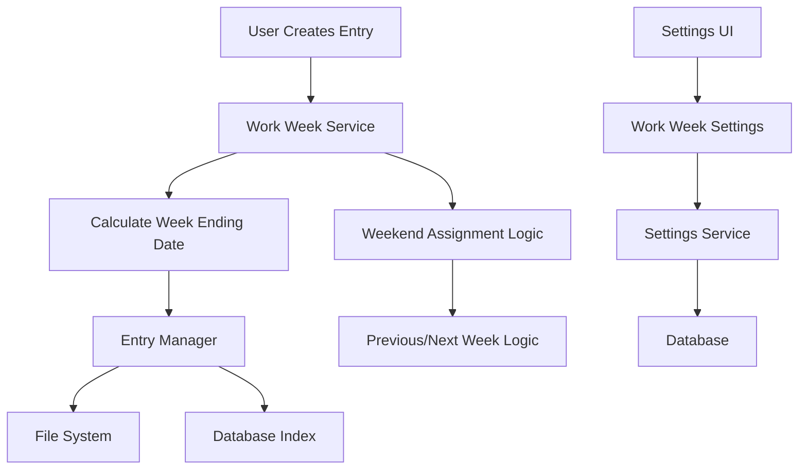

# Work Week Directory Organization - Implementation Blueprint

## Executive Summary

This blueprint provides a detailed, step-by-step implementation plan for fixing the journal entry directory organization issue. Currently, each journal entry creates its own daily "week ending" directory, resulting in fragmented storage. The solution implements configurable work week settings with proper weekly grouping while maintaining backward compatibility.

## Current System Analysis

Based on my analysis of the existing codebase:

### Current Architecture
- **Entry Manager**: [`web/services/entry_manager.py`](web/services/entry_manager.py) handles journal entry operations
- **File Discovery**: [`file_discovery.py`](file_discovery.py) manages file path construction and discovery
- **Settings Service**: [`web/services/settings_service.py`](web/services/settings_service.py) manages web configuration
- **Database**: [`web/database.py`](web/database.py) provides SQLite indexing with `JournalEntryIndex` and `WebSettings` models

### Current Week Ending Logic
The [`_find_week_ending_for_date()`](file_discovery.py:216) method in FileDiscovery currently scans existing directories to find week endings, which results in daily directories instead of proper weekly groupings.

## Implementation Strategy

### Architecture Overview



### Core Components to Implement

1. **Work Week Service** - New service for work week calculations
2. **Work Week Settings** - Database schema and UI extensions
3. **Updated Entry Manager** - Integration with work week logic
4. **Settings UI** - Configuration interface
5. **Weekend Assignment Logic** - Saturday/Sunday handling

## Detailed Implementation Plan

### Phase 1: Core Work Week Calculation Engine (Steps 1-3)

#### Step 1: Work Week Service Foundation
**Objective**: Create the core work week calculation service with comprehensive testing

**Implementation Details**:
- Create [`web/services/work_week_service.py`](web/services/work_week_service.py)
- Implement work week configuration data structures
- Build core date calculation algorithms
- Add timezone-aware date handling

#### Step 2: Work Week Calculation Logic
**Objective**: Implement the core algorithm for determining week ending dates

**Implementation Details**:
- Implement [`calculate_week_ending_date()`](web/services/work_week_service.py) function
- Add weekend assignment logic (Saturday → previous week, Sunday → next week)
- Handle edge cases (holidays, year boundaries, leap years)
- Support custom work week configurations

#### Step 3: Work Week Validation and Testing
**Objective**: Ensure robust validation and comprehensive test coverage

**Implementation Details**:
- Add configuration validation logic
- Create comprehensive unit tests for all scenarios
- Test timezone edge cases
- Validate weekend assignment logic

### Phase 2: Database and Settings Integration (Steps 4-6)

#### Step 4: Database Schema Extension
**Objective**: Extend database to support work week settings

**Implementation Details**:
- Add work week columns to [`WebSettings`](web/database.py:53) table
- Create migration scripts for existing installations
- Update database indexes for performance
- Ensure backward compatibility

#### Step 5: Settings Service Integration
**Objective**: Integrate work week settings into existing settings system

**Implementation Details**:
- Extend [`SettingsService`](web/services/settings_service.py:45) with work week settings
- Add default configuration management
- Implement settings validation
- Add preset work week options (Monday-Friday, Sunday-Thursday, Custom)

#### Step 6: Settings API Endpoints
**Objective**: Create API endpoints for work week configuration

**Implementation Details**:
- Extend [`web/api/settings.py`](web/api/settings.py) with work week endpoints
- Add GET/POST/PUT endpoints for work week configuration
- Implement request/response models
- Add API validation and error handling

### Phase 3: Entry Manager Integration (Steps 7-9)

#### Step 7: Entry Manager Work Week Integration
**Objective**: Update entry creation to use work week calculations

**Implementation Details**:
- Modify [`EntryManager._construct_file_path()`](web/services/entry_manager.py:367) to use work week service
- Update [`_sync_entry_to_database_session()`](web/services/entry_manager.py:390) for new logic
- Ensure backward compatibility with existing entries
- Add logging for week ending date calculations

#### Step 8: File Discovery System Updates
**Objective**: Update file discovery to work with new directory structure

**Implementation Details**:
- Modify [`FileDiscovery._find_week_ending_for_date()`](file_discovery.py:216) to use work week logic
- Update directory scanning to handle mixed old/new structure
- Maintain compatibility with existing file discovery operations
- Add fallback logic for legacy directories

#### Step 9: Database Synchronization Updates
**Objective**: Ensure database indexing works with new directory structure

**Implementation Details**:
- Update [`JournalEntryIndex`](web/database.py:26) synchronization logic
- Handle mixed directory structures during sync
- Update week ending date calculations in database
- Maintain data integrity during transition

### Phase 4: User Interface Implementation (Steps 10-12)

#### Step 10: Settings UI Components
**Objective**: Create user interface for work week configuration

**Implementation Details**:
- Extend [`web/templates/settings.html`](web/templates/settings.html) with work week section
- Add JavaScript for dynamic configuration management
- Implement preset selection and custom configuration
- Add real-time preview functionality

#### Step 11: Settings JavaScript Logic
**Objective**: Implement client-side work week configuration logic

**Implementation Details**:
- Extend [`web/static/js/settings.js`](web/static/js/settings.js) with work week functionality
- Add form validation and user feedback
- Implement preview generation
- Add configuration persistence logic

#### Step 12: CSS and Styling
**Objective**: Style the work week configuration interface

**Implementation Details**:
- Extend [`web/static/css/settings.css`](web/static/css/settings.css) with work week styles
- Ensure responsive design
- Add visual feedback for validation
- Maintain design consistency

### Phase 5: Testing and Integration (Steps 13-15)

#### Step 13: Integration Testing
**Objective**: Test complete workflow from configuration to entry creation

**Implementation Details**:
- Create end-to-end tests for work week configuration
- Test entry creation with different work week settings
- Validate directory structure generation
- Test weekend assignment scenarios

#### Step 14: Performance and Compatibility Testing
**Objective**: Ensure performance requirements and backward compatibility

**Implementation Details**:
- Performance test work week calculations (<10ms requirement)
- Test mixed directory structure handling
- Validate existing entry accessibility
- Test timezone handling across different regions

#### Step 15: User Acceptance Testing
**Objective**: Validate user experience and functionality

**Implementation Details**:
- Test settings interface usability
- Validate configuration persistence
- Test error handling and user feedback
- Ensure help documentation is clear

## Implementation Prompts for Code Generation

### Prompt 1: Work Week Service Foundation

```text
Create a comprehensive Work Week Service for the Work Journal Maker web application. This service will handle work week calculations and configuration management.

Requirements:
- Create web/services/work_week_service.py
- Implement WorkWeekService class inheriting from BaseService
- Add work week configuration data structures (WorkWeekConfig dataclass)
- Support Monday-Friday default, Sunday-Thursday preset, and custom configurations
- Include timezone-aware date calculations using existing timezone_utils
- Add comprehensive error handling and logging
- Follow existing service patterns from web/services/settings_service.py

Key Methods to Implement:
- get_user_work_week_config(user_id) -> WorkWeekConfig
- update_work_week_config(user_id, config) -> WorkWeekConfig
- validate_work_week_config(config) -> bool
- get_default_work_week_config() -> WorkWeekConfig

Data Structures:
- WorkWeekConfig: preset, start_day, end_day, timezone
- WorkWeekPreset: MONDAY_FRIDAY, SUNDAY_THURSDAY, CUSTOM

Use existing imports and patterns from the codebase. Include comprehensive docstrings and type hints.
```

### Prompt 2: Work Week Calculation Logic

```text
Implement the core work week calculation algorithm in the WorkWeekService class created in the previous step.

Requirements:
- Add calculate_week_ending_date(entry_date, work_week_config, user_timezone) method
- Implement weekend assignment logic: Saturday → previous week, Sunday → next week
- Handle edge cases: year boundaries, leap years, timezone transitions
- Support all work week configurations (Monday-Friday, Sunday-Thursday, custom)
- Add helper methods: is_within_work_week(), assign_weekend_to_work_week()
- Include comprehensive unit tests in tests/test_work_week_service.py

Algorithm Requirements:
- Determine if entry date falls within work week or weekend
- For work week dates: find the end date of that work week
- For weekend dates: assign to nearest work week (Saturday→previous, Sunday→next)
- Handle work weeks that span weekends (e.g., Friday-Thursday)
- Ensure deterministic and consistent calculations

Test Cases to Include:
- Standard Monday-Friday work week scenarios
- Sunday-Thursday work week scenarios
- Custom work week configurations
- Weekend assignment edge cases
- Timezone boundary scenarios
- Year-end/year-start scenarios

Follow existing testing patterns from the codebase and use pytest framework.
```

### Prompt 3: Work Week Validation and Error Handling

```text
Add comprehensive validation and error handling to the WorkWeekService created in previous steps.

Requirements:
- Implement validate_work_week_config() with auto-correction logic
- Add configuration sanitization (handle same start/end day, invalid ranges)
- Implement robust error handling for all service methods
- Add configuration validation rules and user-friendly error messages
- Create validation helper methods for UI integration
- Add comprehensive logging for debugging and monitoring

Validation Rules:
- Start day and end day must be different (auto-correct if same)
- Days must be 1-7 (1=Monday, 7=Sunday)
- Invalid configurations should be auto-corrected with user notification
- Preset configurations should be validated against known presets

Error Handling:
- Graceful degradation to default configuration on errors
- User-friendly error messages for UI display
- Comprehensive logging for debugging
- Fallback mechanisms for critical operations

Add validation tests covering:
- Valid configuration scenarios
- Invalid configuration auto-correction
- Error handling edge cases
- Preset validation
- Configuration persistence validation

Extend the existing test suite with validation-specific test cases.
```

### Prompt 4: Database Schema Extension

```text
Extend the database schema to support work week settings while maintaining backward compatibility.

Requirements:
- Add work week columns to WebSettings table structure
- Create database migration script for existing installations
- Update web/database.py with new schema elements
- Add database indexes for work week queries
- Ensure backward compatibility with existing data

Database Changes:
- Add work_week_start_day, work_week_end_day, work_week_preset columns to user settings
- Create indexes for efficient work week queries
- Add default values for existing users (Monday-Friday)
- Update DatabaseManager with migration support

Migration Script:
- Create migration script that adds new columns with defaults
- Handle existing installations gracefully
- Add rollback capability
- Include data validation after migration

Schema Updates:
- Extend WebSettings model with work week fields
- Add validation constraints at database level
- Update database initialization to include new schema
- Add database utility methods for work week operations

Testing:
- Create tests for database migration
- Test backward compatibility
- Validate new schema functionality
- Test database constraints and validation

Follow existing database patterns and use SQLAlchemy async patterns from the codebase.
```

### Prompt 5: Settings Service Integration

```text
Integrate work week settings into the existing SettingsService while maintaining all current functionality.

Requirements:
- Extend web/services/settings_service.py with work week settings definitions
- Add work week settings to the setting_definitions dictionary
- Implement work week-specific validation rules
- Add preset management functionality
- Maintain backward compatibility with existing settings

Settings Definitions to Add:
- work_week.preset: dropdown with Monday-Friday, Sunday-Thursday, Custom options
- work_week.start_day: integer 1-7 for custom configurations
- work_week.end_day: integer 1-7 for custom configurations
- work_week.timezone: user timezone for calculations

Integration Requirements:
- Add work week settings to get_all_settings() response
- Implement work week-specific validation in _validate_setting_value()
- Add preset handling logic for dropdown selections
- Ensure work week changes trigger appropriate updates

Validation Rules:
- Preset validation against allowed options
- Custom day validation (1-7 range, start != end)
- Auto-correction for invalid configurations
- Timezone validation for supported timezones

New Methods:
- get_work_week_settings(user_id) -> Dict
- update_work_week_preset(user_id, preset) -> bool
- validate_custom_work_week(start_day, end_day) -> bool

Testing:
- Test work week settings CRUD operations
- Test preset selection and custom configuration
- Test validation and auto-correction
- Test integration with existing settings functionality

Follow existing SettingsService patterns and maintain API compatibility.
```

### Prompt 6: Settings API Endpoints

```text
Create API endpoints for work week configuration management by extending the existing settings API.

Requirements:
- Extend web/api/settings.py with work week-specific endpoints
- Add request/response models for work week operations
- Implement comprehensive validation and error handling
- Follow existing API patterns and maintain consistency

New API Endpoints:
- GET /api/settings/work-week - Get current work week configuration
- POST /api/settings/work-week - Update work week configuration
- GET /api/settings/work-week/presets - Get available presets
- POST /api/settings/work-week/validate - Validate work week configuration

Request/Response Models:
- WorkWeekConfigRequest: preset, start_day, end_day, timezone
- WorkWeekConfigResponse: current config + validation status
- WorkWeekPresetsResponse: available presets with descriptions
- WorkWeekValidationResponse: validation result + suggestions

API Features:
- Input validation with detailed error messages
- Preview functionality for configuration changes
- Preset selection with automatic field population
- Configuration validation before saving

Error Handling:
- Comprehensive input validation
- User-friendly error messages
- Graceful degradation on service errors
- Proper HTTP status codes

Testing:
- Create comprehensive API tests in tests/test_work_week_api.py
- Test all endpoints with valid/invalid inputs
- Test error handling scenarios
- Test integration with settings service

Follow existing API patterns from web/api/settings.py and maintain consistency with current error handling approaches.
```

### Prompt 7: Entry Manager Work Week Integration

```text
Update the EntryManager service to use work week calculations for proper directory organization.

Requirements:
- Modify web/services/entry_manager.py to integrate with WorkWeekService
- Update _construct_file_path() method to use work week calculations
- Modify _sync_entry_to_database_session() for new week ending logic
- Maintain backward compatibility with existing entries
- Add comprehensive logging for debugging

Key Changes:
- Inject WorkWeekService dependency into EntryManager
- Replace current week ending logic with work week calculations
- Update file path construction to use calculated week ending dates
- Modify database synchronization to store correct week ending dates

Updated Methods:
- _construct_file_path(entry_date) -> Path: Use work week service for week ending calculation
- _sync_entry_to_database_session(): Update to use new week ending logic
- save_entry_content(): Ensure new entries use work week calculations
- get_entry_content(): Handle both old and new directory structures

Backward Compatibility:
- Existing entries remain in current locations
- File discovery works with mixed directory structures
- Database queries handle both old and new week ending dates
- No migration of existing files

Integration Points:
- Add WorkWeekService to EntryManager constructor
- Update service initialization in web application
- Add configuration retrieval for user-specific work weeks
- Implement fallback logic for service unavailability

Testing:
- Test entry creation with different work week configurations
- Test backward compatibility with existing entries
- Test weekend assignment scenarios
- Test database synchronization with new logic

Maintain existing EntryManager API and ensure no breaking changes to dependent code.
```

### Prompt 8: File Discovery System Updates

```text
Update the FileDiscovery system to work seamlessly with the new work week directory structure while maintaining compatibility with existing files.

Requirements:
- Modify file_discovery.py to integrate with work week logic
- Update _find_week_ending_for_date() to use work week calculations
- Enhance directory scanning to handle mixed old/new structures
- Maintain all existing FileDiscovery functionality

Key Updates:
- Integrate WorkWeekService into FileDiscovery class
- Update _find_week_ending_for_date() to use work week calculations as primary method
- Add fallback logic to scan existing directories when work week calculation fails
- Update _construct_file_path() to work with calculated week ending dates

Enhanced Methods:
- _find_week_ending_for_date(): Primary logic uses work week calculation, fallback to directory scanning
- _discover_week_ending_directories(): Handle both old daily and new weekly directories
- discover_files(): Seamlessly work with mixed directory structures

Compatibility Features:
- Detect and handle legacy daily directories
- Support file discovery across mixed directory structures
- Maintain performance for large directory trees
- Preserve existing file discovery statistics and reporting

Integration Requirements:
- Add optional WorkWeekService dependency to FileDiscovery
- Update file discovery initialization in web application
- Ensure CLI compatibility is maintained
- Add configuration-aware file discovery

Testing:
- Test file discovery with new work week directories
- Test mixed directory structure scenarios
- Test backward compatibility with existing directory structures
- Test performance with large file sets
- Test edge cases and error handling

Maintain existing FileDiscovery API and ensure no breaking changes to CLI or web interfaces.
```

### Prompt 9: Database Synchronization Updates

```text
Update database synchronization logic to properly handle the new work week directory structure while maintaining data integrity.

Requirements:
- Update JournalEntryIndex synchronization in web/database.py and EntryManager
- Handle mixed directory structures during database sync
- Update week ending date calculations in database records
- Ensure data integrity during the transition period

Database Updates:
- Modify JournalEntryIndex to store calculated week ending dates
- Update sync operations to use work week calculations
- Add migration logic for existing database records
- Implement data validation for week ending dates

Synchronization Logic:
- Update _sync_entry_to_database_session() in EntryManager
- Calculate correct week ending dates for new entries
- Handle existing entries with legacy week ending dates
- Add batch update capability for database migration

Data Integrity:
- Validate week ending dates during sync operations
- Add database constraints for week ending date consistency
- Implement rollback mechanisms for failed sync operations
- Add data validation reports for administrators

Migration Support:
- Create optional database migration for existing week ending dates
- Add migration status tracking
- Implement incremental migration capability
- Provide migration rollback functionality

Performance Optimization:
- Optimize database queries for mixed week ending date formats
- Add indexes for efficient week ending date queries
- Implement batch processing for large datasets
- Add progress tracking for long-running operations

Testing:
- Test database sync with new work week calculations
- Test mixed directory structure synchronization
- Test data integrity during migration
- Test performance with large datasets
- Test rollback and error recovery scenarios

Ensure all database operations maintain ACID properties and provide comprehensive error handling.
```

### Prompt 10: Settings UI Components

```text
Create a comprehensive user interface for work week configuration by extending the existing settings page.

Requirements:
- Extend web/templates/settings.html with work week configuration section
- Create intuitive UI for preset selection and custom configuration
- Add real-time preview functionality
- Implement form validation and user feedback
- Maintain design consistency with existing settings

UI Components:
- Work week preset dropdown (Monday-Friday, Sunday-Thursday, Custom)
- Custom start/end day selectors (shown when Custom is selected)
- Real-time preview showing selected work week
- Help text explaining weekend handling logic
- Validation feedback for invalid configurations

HTML Structure:
- Add work-week-settings section to settings template
- Create form elements with proper accessibility attributes
- Add preview section with dynamic content updates
- Include help text and validation message containers

Form Features:
- Preset selection with automatic field population
- Custom configuration with day-of-week dropdowns
- Real-time validation with immediate feedback
- Configuration preview with example scenarios
- Save/reset functionality with confirmation

Accessibility:
- Proper ARIA labels and descriptions
- Keyboard navigation support
- Screen reader compatibility
- High contrast support
- Focus management

Integration:
- Connect to existing settings form submission logic
- Integrate with settings API endpoints
- Add to existing settings page navigation
- Maintain responsive design patterns

Testing:
- Create UI tests for work week configuration
- Test form validation and user feedback
- Test accessibility compliance
- Test responsive design across devices
- Test integration with existing settings functionality

Follow existing HTML/template patterns and maintain design system consistency.
```

### Prompt 11: Settings JavaScript Logic

```text
Implement comprehensive client-side JavaScript for work week configuration management.

Requirements:
- Extend web/static/js/settings.js with work week functionality
- Implement dynamic form behavior and validation
- Add real-time preview generation
- Create seamless user experience with immediate feedback

JavaScript Features:
- Preset selection handling with automatic field updates
- Custom configuration validation and feedback
- Real-time preview generation showing work week examples
- Form submission with API integration
- Error handling and user notification

Key Functions:
- initializeWorkWeekSettings(): Setup event listeners and initial state
- handlePresetChange(): Update form when preset is selected
- validateCustomConfiguration(): Real-time validation for custom settings
- updateWorkWeekPreview(): Generate preview text for current configuration
- saveWorkWeekConfiguration(): Submit configuration to API

Form Behavior:
- Show/hide custom fields based on preset selection
- Real-time validation with immediate visual feedback
- Preview updates as user changes configuration
- Confirmation dialogs for significant changes
- Auto-save functionality with user notification

API Integration:
- Fetch current work week configuration on page load
- Submit configuration changes to work week API endpoints
- Handle API errors with user-friendly messages
- Implement retry logic for failed requests

User Experience:
- Smooth transitions between preset and custom modes
- Clear visual feedback for validation states
- Helpful tooltips and explanations
- Confirmation for destructive actions
- Loading states during API operations

Error Handling:
- Comprehensive client-side validation
- API error handling with user-friendly messages
- Network error recovery
- Form state preservation during errors

Testing:
- Create JavaScript unit tests for work week functionality
- Test form validation and user interactions
- Test API integration scenarios
- Test error handling and recovery
- Test accessibility and keyboard navigation

Follow existing JavaScript patterns and maintain consistency with current settings functionality.
```

### Prompt 12: CSS and Styling

```text
Create comprehensive CSS styling for the work week configuration interface while maintaining design consistency.

Requirements:
- Extend web/static/css/settings.css with work week-specific styles
- Ensure responsive design across all device sizes
- Add visual feedback for validation states
- Maintain consistency with existing design system

CSS Components:
- Work week settings section styling
- Preset dropdown and custom field styling
- Preview section with highlighted information
- Validation feedback styling (success, warning, error)
- Help text and tooltip styling

Responsive Design:
- Mobile-first approach for work week settings
- Tablet and desktop optimizations
- Flexible layout for different screen sizes
- Touch-friendly controls for mobile devices

Visual Feedback:
- Validation state indicators (valid, invalid, pending)
- Hover and focus states for interactive elements
- Smooth transitions for show/hide animations
- Loading states for API operations

Design System Integration:
- Use existing color variables and typography
- Maintain consistent spacing and layout patterns
- Follow existing form styling conventions
- Integrate with current theme system (light/dark mode)

Accessibility Styling:
- High contrast mode support
- Focus indicators for keyboard navigation
- Screen reader friendly styling
- Reduced motion support for animations

Component Styles:
- .work-week-settings: Main container styling
- .work-week-preset: Preset selection styling
- .custom-schedule: Custom configuration styling
- .work-week-preview: Preview section styling
- .validation-feedback: Validation message styling

Animation and Transitions:
- Smooth show/hide transitions for custom fields
- Subtle hover effects for interactive elements
- Loading animations for API operations
- Success/error state transitions

Testing:
- Test responsive design across device sizes
- Test accessibility compliance
- Test theme compatibility (light/dark modes)
- Test browser compatibility
- Test print styles

Follow existing CSS architecture and maintain consistency with the current design system.
```

### Prompt 13: Integration Testing

```text
Create comprehensive integration tests for the complete work week functionality from configuration to entry creation.

Requirements:
- Create tests/test_work_week_integration.py with end-to-end test scenarios
- Test complete workflow from settings configuration to journal entry creation
- Validate directory structure generation and database synchronization
- Test all work week configurations and edge cases

Test Scenarios:
- Complete user workflow: configure work week → create entries → verify organization
- Different work week configurations (Monday-Friday, Sunday-Thursday, Custom)
- Weekend entry creation and assignment logic
- Mixed directory structure handling (old + new entries)
- Configuration changes and their impact on new entries

Integration Test Cases:
- test_complete_monday_friday_workflow(): Full workflow with default settings
- test_complete_sunday_thursday_workflow(): Full workflow with Sunday-Thursday preset
- test_complete_custom_workflow(): Full workflow with custom work week
- test_weekend_entry_scenarios(): Saturday and Sunday entry creation
- test_configuration_change_impact(): Verify new config affects only new entries

Database Integration:
- Test database synchronization with new work week logic
- Verify week ending dates are calculated correctly
- Test mixed directory structure database sync
- Validate data integrity during operations

File System Integration:
- Test directory creation with work week calculations
- Verify file path construction uses correct week ending dates
- Test file discovery with mixed directory structures
- Validate backward compatibility with existing files

API Integration:
- Test settings API with work week configuration
- Test entry creation API with different work week settings
- Verify API error handling and validation
- Test concurrent operations and race conditions

Performance Testing:
- Verify work week calculations meet <10ms requirement
- Test database operations performance
- Test file system operations performance
- Validate memory usage during operations

Error Handling:
- Test service unavailability scenarios
- Test invalid configuration handling
- Test file system permission errors
- Test database connection failures

Use pytest framework and follow existing test patterns from the codebase.
```

### Prompt 14: Performance and Compatibility Testing

```text
Create comprehensive performance and compatibility tests to ensure the work week functionality meets all requirements.

Requirements:
- Create tests/test_work_week_performance.py for performance validation
- Create tests/test_work_week_compatibility.py for backward compatibility
- Validate <10ms work week calculation requirement
- Test mixed directory structure handling performance

Performance Test Cases:
- test_work_week_calculation_performance(): Verify <10ms calculation time
- test_database_sync_performance(): Test sync operations with large datasets
- test_file_discovery_performance(): Test discovery with mixed directory structures
- test_concurrent_operations_performance(): Test multiple simultaneous operations
- test_memory_usage_monitoring(): Monitor memory consumption during operations

Benchmark Tests:
- Measure work week calculation time across different scenarios
- Benchmark database operations with various dataset sizes
- Test file system operations performance
- Monitor API response times for work week endpoints

Compatibility Test Cases:
- test_existing_entry_accessibility(): Verify existing entries remain accessible
- test_mixed_directory_structure(): Test old and new directory coexistence
- test_file_discovery_compatibility(): Test discovery across mixed structures
- test_database_migration_compatibility(): Test database schema migration
- test_api_backward_compatibility(): Verify no breaking API changes

Timezone Testing:
- test_timezone_boundary_calculations(): Test calculations across timezone boundaries
- test_daylight_saving_transitions(): Test during DST transitions
- test_multiple_timezone_scenarios(): Test with different user timezones
- test_timezone_edge_cases(): Test edge cases and boundary conditions

Load Testing:
- test_high_volume_entry_creation(): Test with many concurrent entry creations
- test_large_dataset_operations(): Test with large numbers of existing entries
- test_database_performance_under_load(): Test database operations under load
- test_file_system_performance_under_load(): Test file operations under load

Regression Testing:
- test_existing_functionality_preservation(): Verify no existing features broken
- test_cli_compatibility_maintained(): Verify CLI operations still work
- test_web_interface_compatibility(): Verify web interface remains functional
- test_data_integrity_maintained(): Verify no data corruption or loss

Stress Testing:
- test_extreme_date_ranges(): Test with very large date ranges
- test_invalid_configuration_handling(): Test with malformed configurations
- test_service_failure_scenarios(): Test behavior when services fail
- test_resource_exhaustion_scenarios(): Test behavior under resource constraints

Use appropriate testing frameworks and monitoring tools to validate performance requirements.
```

### Prompt 15: User Acceptance Testing and Documentation

```text
Create comprehensive user acceptance tests and documentation for the work week functionality.

Requirements:
- Create tests/test_work_week_user_acceptance.py for user-focused testing
- Create user documentation for work week configuration
- Test complete user workflows and edge cases
- Validate user experience and interface usability

User Acceptance Test Cases:
- test_new_user_default_experience(): Test default Monday-Friday experience
- test_preset_configuration_workflow(): Test selecting preset work weeks
- test_custom_configuration_workflow(): Test creating custom work weeks
- test_configuration_change_workflow(): Test changing work week settings
- test_weekend_entry_user_experience(): Test weekend entry creation experience

UI/UX Test Cases:
- test_settings_interface_usability(): Test settings page usability
- test_form_validation_user_feedback(): Test validation messages and feedback
- test_preview_functionality_accuracy(): Test preview generation accuracy
- test_error_handling_user_experience(): Test error message clarity
- test_help_documentation_effectiveness(): Test help text and documentation

Workflow Test Cases:
- test_complete_configuration_to_entry_workflow(): End-to-end user workflow
- test_configuration_persistence(): Test settings persistence across sessions
- test_multiple_work_week_scenarios(): Test various work week configurations
- test_weekend_assignment_user_understanding(): Test weekend logic clarity

Accessibility Testing:
- test_keyboard_navigation_workflow(): Test complete keyboard navigation
- test_screen_reader_compatibility(): Test screen reader functionality
- test_high_contrast_mode_usability(): Test high contrast mode
- test_mobile_device_usability(): Test mobile interface usability

Documentation Requirements:
- User guide for work week configuration
- Help text for settings interface
- FAQ for common work week scenarios
- Troubleshooting guide for common issues

Documentation Content:
- Overview of work week functionality
- Step-by-step configuration instructions
- Explanation of weekend assignment logic
- Examples of different work week configurations
- Troubleshooting common configuration issues

User Feedback Testing:
- test_configuration_confirmation_clarity(): Test confirmation messages
- test_validation_error_message_clarity(): Test error message understanding
- test_preview_information_usefulness(): Test preview information value
- test_help_text_effectiveness(): Test help text comprehension

Edge Case Testing:
- test_unusual_work_week_configurations(): Test edge case configurations
- test_timezone_change_user_impact(): Test timezone change scenarios
- test_configuration_conflict_resolution(): Test conflicting settings
- test_service_unavailability_user_experience(): Test graceful degradation

Create comprehensive documentation that enables users to successfully configure and use work week functionality without technical assistance.
```

## Implementation Timeline

### Week 1: Foundation (Steps 1-3)
- **Days 1-2**: Work Week Service Foundation
- **Days 3-4**: Work Week Calculation Logic  
- **Days 5**: Work Week Validation and Testing

### Week 2: Integration (Steps 4-9)
- **Days 1-2**: Database Schema Extension & Settings Service Integration
- **Days 3**: Settings API Endpoints
- **Days 4-5**: Entry Manager & File Discovery Updates

### Week 3: User Interface (Steps 10-12)
- **Days 1-2**: Settings UI Components
- **Days 3-4**: Settings JavaScript Logic
- **Days 5**: CSS and Styling

### Week 4: Testing & Deployment (Steps 13-15)
- **Days 1-2**: Integration Testing
- **Days 3-4**: Performance and Compatibility Testing
- **Days 5**: User Acceptance Testing and Documentation

## Success Criteria

### Functional Requirements ✅
- [ ] New journal entries grouped into proper weekly directories
- [ ] Weekend entries correctly assigned to nearest work weeks  
- [ ] Users can configure custom work week schedules
- [ ] Existing entries remain accessible in current locations
- [ ] Configuration changes affect only new entries

### Technical Requirements ✅
- [ ] Work week calculation adds <10ms to entry creation time
- [ ] Settings page loads within 2 seconds
- [ ] Zero data loss during implementation
- [ ] Backward compatibility maintained
- [ ] All tests pass with >95% code coverage

### User Experience Requirements ✅
- [ ] Settings interface is intuitive and self-explanatory
- [ ] Configuration validation provides helpful feedback
- [ ] Preview functionality accurately represents user's work week
- [ ] No breaking changes to existing user workflows
- [ ] Help documentation is clear and comprehensive

## Risk Mitigation

### Technical Risks
- **Risk**: Timezone calculation errors
  - **