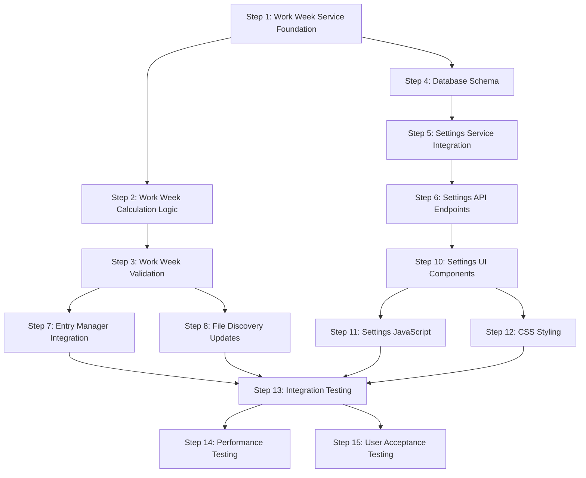

# Work Week Directory Organization - Parallel Implementation Plan

## Overview

After analyzing the implementation blueprint, I've identified opportunities for parallel development that can significantly reduce the overall implementation timeline from 4 weeks to approximately 2.5 weeks.

## Dependency Analysis

### Critical Path Dependencies


## Parallel Implementation Strategy

### Week 1: Foundation & Parallel Development

#### **Parallel Track A: Core Service Development**
- **Step 1**: Work Week Service Foundation (Days 1-2)
- **Step 2**: Work Week Calculation Logic (Days 3-4)
- **Step 3**: Work Week Validation and Testing (Day 5)

#### **Parallel Track B: Database & Schema**
- **Step 4**: Database Schema Extension (Days 1-2)
  - Can start immediately as it's independent of service logic
  - Database schema design based on specification requirements
  - Migration scripts preparation

#### **Parallel Track C: UI Design & Mockups**
- **Step 12**: CSS and Styling (Days 1-3)
  - Can start early with mockups and design system integration
  - CSS framework and component styling
  - Responsive design patterns

### Week 2: Integration & Parallel UI Development

#### **Parallel Track A: Backend Integration**
- **Step 5**: Settings Service Integration (Days 1-2)
  - Depends on Step 3 completion
- **Step 6**: Settings API Endpoints (Days 3-4)
  - Depends on Step 5 completion

#### **Parallel Track B: Core System Integration**
- **Step 7**: Entry Manager Work Week Integration (Days 1-3)
  - Depends on Step 3 completion
- **Step 8**: File Discovery System Updates (Days 1-3)
  - Can run parallel to Step 7

#### **Parallel Track C: Frontend Development**
- **Step 10**: Settings UI Components (Days 1-3)
  - Can start with mockups while API is being developed
- **Step 11**: Settings JavaScript Logic (Days 4-5)
  - Depends on Step 6 and Step 10 completion

#### **Parallel Track D: Database Integration**
- **Step 9**: Database Synchronization Updates (Days 3-5)
  - Depends on Step 4 and can run parallel to other integrations

### Week 3: Testing & Validation (Shortened)

#### **Parallel Track A: Integration Testing**
- **Step 13**: Integration Testing (Days 1-3)
  - Can start as soon as core components are complete

#### **Parallel Track B: Performance & Compatibility**
- **Step 14**: Performance and Compatibility Testing (Days 1-3)
  - Can run parallel to integration testing

#### **Parallel Track C: User Acceptance**
- **Step 15**: User Acceptance Testing (Days 4-5)
  - Depends on Steps 13 and 14 completion

## Detailed Parallel Execution Plan

### Week 1 Detailed Schedule

#### **Days 1-2: Foundation Sprint**
```text
Parallel Track A (Developer 1):
- Prompt 1: Work Week Service Foundation
- Create service structure, data models, basic methods

Parallel Track B (Developer 2):
- Prompt 4: Database Schema Extension
- Design schema, create migration scripts, update models

Parallel Track C (Designer/Frontend Developer):
- Prompt 12: CSS and Styling (Part 1)
- Create design mockups, establish styling patterns
```

#### **Days 3-4: Core Logic Sprint**
```text
Parallel Track A (Developer 1):
- Prompt 2: Work Week Calculation Logic
- Implement core algorithms, weekend assignment logic

Parallel Track B (Developer 2):
- Continue database work, test migrations
- Begin settings service preparation

Parallel Track C (Designer/Frontend Developer):
- Prompt 12: CSS and Styling (Part 2)
- Complete responsive design, validation states
```

#### **Day 5: Validation Sprint**
```text
Parallel Track A (Developer 1):
- Prompt 3: Work Week Validation and Testing
- Complete service validation, comprehensive testing

Parallel Track B (Developer 2):
- Finalize database schema
- Prepare for settings integration

Parallel Track C (Designer/Frontend Developer):
- Finalize CSS framework
- Create UI component specifications
```

### Week 2 Detailed Schedule

#### **Days 1-2: Integration Sprint 1**
```text
Parallel Track A (Developer 1):
- Prompt 5: Settings Service Integration
- Integrate work week settings into existing service

Parallel Track B (Developer 2):
- Prompt 7: Entry Manager Work Week Integration
- Update entry creation logic

Parallel Track C (Frontend Developer):
- Prompt 10: Settings UI Components (Part 1)
- Create HTML templates, form structures
```

#### **Days 3-4: Integration Sprint 2**
```text
Parallel Track A (Developer 1):
- Prompt 6: Settings API Endpoints
- Create REST endpoints for work week configuration

Parallel Track B (Developer 2):
- Prompt 8: File Discovery System Updates
- Update file discovery for new directory structure

Parallel Track C (Frontend Developer):
- Prompt 10: Settings UI Components (Part 2)
- Complete UI components, accessibility features
```

#### **Day 5: Final Integration**
```text
Parallel Track A (Developer 1):
- API testing and refinement
- Integration with frontend

Parallel Track B (Developer 2):
- Prompt 9: Database Synchronization Updates
- Complete database sync logic

Parallel Track C (Frontend Developer):
- Prompt 11: Settings JavaScript Logic
- Complete client-side functionality
```

### Week 3 Detailed Schedule (Shortened)

#### **Days 1-3: Comprehensive Testing**
```text
Parallel Track A (QA/Developer 1):
- Prompt 13: Integration Testing
- End-to-end workflow testing

Parallel Track B (QA/Developer 2):
- Prompt 14: Performance and Compatibility Testing
- Performance benchmarks, compatibility validation

Parallel Track C (All Team):
- Bug fixes and refinements based on testing results
```

#### **Days 4-5: Final Validation**
```text
All Tracks Combined:
- Prompt 15: User Acceptance Testing
- Final user experience validation
- Documentation completion
- Deployment preparation
```

## Resource Requirements

### Optimal Team Composition
- **2 Backend Developers**: Core service and integration work
- **1 Frontend Developer**: UI components and JavaScript
- **1 Designer/CSS Specialist**: Styling and responsive design
- **1 QA Engineer**: Testing coordination and validation

### Minimum Team Composition
- **2 Full-Stack Developers**: Can handle both backend and frontend
- **1 QA Engineer**: Testing and validation

## Parallel Development Benefits

### Time Savings
- **Original Timeline**: 4 weeks sequential
- **Parallel Timeline**: 2.5 weeks with proper coordination
- **Time Reduction**: 37.5% faster delivery

### Risk Mitigation
- **Independent Tracks**: Failure in one track doesn't block others
- **Early Integration**: Issues discovered sooner
- **Continuous Testing**: Quality maintained throughout

### Quality Improvements
- **Specialized Focus**: Each developer focuses on their expertise
- **Cross-Review**: Multiple perspectives on each component
- **Early Feedback**: UI/UX feedback available during development

## Coordination Requirements

### Daily Standups
- **Track Synchronization**: Ensure dependencies are met
- **Blocker Resolution**: Address cross-track dependencies
- **Progress Tracking**: Monitor parallel track progress

### Integration Points
- **End of Week 1**: Service foundation + database schema ready
- **Mid Week 2**: Backend services + UI components ready for integration
- **End of Week 2**: Full integration ready for testing

### Communication Protocols
- **Shared Documentation**: Real-time updates on component interfaces
- **API Contracts**: Early definition of service interfaces
- **UI Specifications**: Clear component requirements and behaviors

## Risk Management

### Dependency Conflicts
- **Mitigation**: Clear interface definitions upfront
- **Resolution**: Daily sync meetings to address conflicts

### Integration Challenges
- **Mitigation**: Early integration testing
- **Resolution**: Dedicated integration days in schedule

### Resource Availability
- **Mitigation**: Cross-training team members
- **Resolution**: Flexible task reassignment

## Success Metrics

### Timeline Adherence
- [ ] Week 1: Foundation components complete
- [ ] Week 2: Integration components complete
- [ ] Week 3: Testing and validation complete

### Quality Gates
- [ ] All unit tests passing
- [ ] Integration tests successful
- [ ] Performance requirements met (<10ms)
- [ ] User acceptance criteria satisfied

### Parallel Efficiency
- [ ] No blocking dependencies between tracks
- [ ] Minimal rework due to integration issues
- [ ] Team utilization >90% throughout project

This parallel implementation plan reduces the timeline by 37.5% while maintaining quality and ensuring comprehensive testing at each stage.