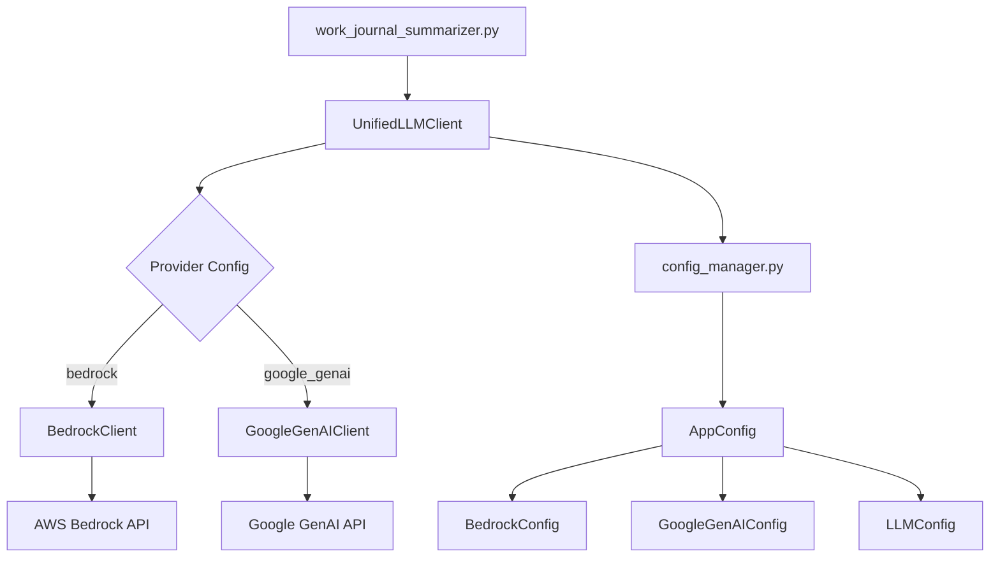

# JournalSummarizer Google GenAI Integration Specification

## Overview
Refactor the JournalSummarizer to support both AWS Bedrock and Google GenAI through a unified client architecture, allowing users to choose their preferred LLM provider via configuration.

## Current Architecture Analysis
- **Main Entry Point**: [`work_journal_summarizer.py`](work_journal_summarizer.py) imports and uses [`BedrockClient`](bedrock_client.py) directly
- **LLM Integration**: [`bedrock_client.py`](bedrock_client.py) handles AWS Bedrock Claude API calls
- **Configuration**: [`config_manager.py`](config_manager.py) manages [`BedrockConfig`](config_manager.py) settings
- **Working Example**: [`geminitest.py`](geminitest.py) demonstrates Google GenAI client usage

## Proposed Architecture



## Implementation Plan

### Phase 1: Configuration Extension
**File**: [`config_manager.py`](config_manager.py)

1. **Add GoogleGenAIConfig class**:
   ```python
   @dataclass
   class GoogleGenAIConfig:
       """Configuration for Google GenAI API integration."""
       project: str = "geminijournal-463220"
       location: str = "us-central1"
       model: str = "gemini-2.0-flash-001"
   ```

2. **Add LLMConfig class**:
   ```python
   @dataclass
   class LLMConfig:
       """Configuration for LLM provider selection."""
       provider: str = "bedrock"  # "bedrock" or "google_genai"
   ```

3. **Update AppConfig class**:
   ```python
   @dataclass
   class AppConfig:
       """Complete application configuration."""
       bedrock: BedrockConfig = field(default_factory=BedrockConfig)
       google_genai: GoogleGenAIConfig = field(default_factory=GoogleGenAIConfig)
       llm: LLMConfig = field(default_factory=LLMConfig)
       processing: ProcessingConfig = field(default_factory=ProcessingConfig)
       logging: LogConfig = field(default_factory=LogConfig)
   ```

### Phase 2: Google GenAI Client Implementation
**File**: `google_genai_client.py` (new)

1. **Create GoogleGenAIClient class** that mirrors [`BedrockClient`](bedrock_client.py) interface:
   - Same [`AnalysisResult`](bedrock_client.py) and [`APIStats`](bedrock_client.py) data structures
   - [`analyze_content()`](bedrock_client.py) method with identical signature
   - [`get_stats()`](bedrock_client.py) and [`reset_stats()`](bedrock_client.py) methods
   - Same error handling and retry logic patterns

2. **Key Implementation Details**:
   ```python
   class GoogleGenAIClient:
       def __init__(self, config: GoogleGenAIConfig):
           self.config = config
           self.client = genai.Client(
               vertexai=True,
               project=config.project,
               location=config.location
           )
           self.stats = APIStats(0, 0, 0, 0.0, 0.0, 0)
       
       def analyze_content(self, content: str, file_path: Path) -> AnalysisResult:
           # Use same analysis prompt as BedrockClient
           # Adapt for Google GenAI API format
           # Return same AnalysisResult structure
   ```

3. **Implement Google GenAI integration**:
   - Use `from google import genai` as shown in [`geminitest.py`](geminitest.py)
   - Configure client with `vertexai=True`, project, and location
   - Adapt the analysis prompt for Google GenAI format
   - Handle Google GenAI response parsing and error handling

### Phase 3: Unified Client Implementation
**File**: `unified_llm_client.py` (new)

1. **Create UnifiedLLMClient class**:
   ```python
   class UnifiedLLMClient:
       """
       Unified LLM client that can switch between different providers
       based on configuration settings.
       """
       
       def __init__(self, config: AppConfig):
           self.config = config
           self.client = self._create_client()
       
       def _create_client(self):
           """Create the appropriate client based on provider configuration."""
           if self.config.llm.provider == "google_genai":
               return GoogleGenAIClient(self.config.google_genai)
           elif self.config.llm.provider == "bedrock":
               return BedrockClient(self.config.bedrock)
           else:
               raise ValueError(f"Unknown LLM provider: {self.config.llm.provider}")
       
       def analyze_content(self, content: str, file_path: Path) -> AnalysisResult:
           """Delegate to the configured client."""
           return self.client.analyze_content(content, file_path)
       
       def get_stats(self) -> APIStats:
           """Get API usage statistics from the configured client."""
           return self.client.get_stats()
       
       def reset_stats(self) -> None:
           """Reset API usage statistics."""
           return self.client.reset_stats()
       
       def test_connection(self) -> bool:
           """Test connection to the configured provider."""
           return self.client.test_connection()
   ```

### Phase 4: Main Application Integration
**File**: [`work_journal_summarizer.py`](work_journal_summarizer.py)

1. **Update imports**:
   ```python
   # Replace this import:
   # from bedrock_client import BedrockClient, AnalysisResult, APIStats
   
   # With this import:
   from unified_llm_client import UnifiedLLMClient
   from bedrock_client import AnalysisResult, APIStats  # Keep data structures
   ```

2. **Update client initialization** (around line 572):
   ```python
   # Replace:
   # llm_client = BedrockClient(config.bedrock)
   
   # With:
   llm_client = UnifiedLLMClient(config)
   ```

3. **Update dry run validation** (around line 298):
   - Add provider-specific connection testing
   - Display current provider in configuration summary
   ```python
   print(f"🤖 LLM Provider: {config.llm.provider}")
   if config.llm.provider == "bedrock":
       print(f"📝 AWS Region: {config.bedrock.region}")
       print(f"🤖 Model ID: {config.bedrock.model_id}")
   elif config.llm.provider == "google_genai":
       print(f"📝 GCP Project: {config.google_genai.project}")
       print(f"📍 Location: {config.google_genai.location}")
       print(f"🤖 Model: {config.google_genai.model}")
   ```

### Phase 5: Dependencies and Requirements
**File**: [`requirements.txt`](requirements.txt)

1. **Add Google GenAI dependency**:
   ```
   google-genai
   ```

### Phase 6: Configuration Examples
**File**: `config.yaml.example` (update existing)

1. **Add LLM provider configuration**:
   ```yaml
   # LLM Provider Configuration
   llm:
     provider: "google_genai"  # Options: "bedrock", "google_genai"
   
   # Google GenAI Configuration
   google_genai:
     project: "geminijournal-463220"
     location: "us-central1"
     model: "gemini-2.0-flash-001"
   
   # AWS Bedrock Configuration (existing)
   bedrock:
     region: "us-east-2"
     model_id: "anthropic.claude-sonnet-4-20250514-v1:0"
     # ... existing bedrock config
   ```

## Implementation Details

### Error Handling Strategy
- Maintain existing error handling patterns from [`BedrockClient`](bedrock_client.py)
- Add Google GenAI-specific error handling for authentication and API errors
- Ensure graceful degradation when provider is unavailable
- Provide clear error messages for configuration issues

### Testing Strategy
- Create unit tests for `GoogleGenAIClient`
- Create integration tests for `UnifiedLLMClient`
- Test provider switching functionality
- Validate that both providers produce equivalent [`AnalysisResult`](bedrock_client.py) structures
- Test configuration validation and error handling

### Backward Compatibility
- Default provider remains "bedrock" to maintain existing behavior
- Existing configuration files continue to work without modification
- No breaking changes to the main application interface
- Existing command-line arguments remain unchanged

### Configuration Validation
- Validate provider-specific configuration parameters
- Ensure required credentials/settings are available for chosen provider
- Provide clear error messages for missing or invalid configuration
- Add validation in [`ConfigManager`](config_manager.py) class

### Data Structure Compatibility
Both providers must return identical data structures:
- [`AnalysisResult`](bedrock_client.py): Contains extracted entities (projects, participants, tasks, themes)
- [`APIStats`](bedrock_client.py): Contains API usage statistics
- Error handling and retry logic should be consistent

## Migration Path
1. **Phase 1-2**: Implement new components without affecting existing functionality
2. **Phase 3**: Create unified client with backward compatibility
3. **Phase 4**: Update main application to use unified client
4. **Phase 5-6**: Update dependencies and documentation
5. **Testing**: Comprehensive testing of both providers
6. **Documentation**: Update README and setup guides

## Benefits
- **Flexibility**: Users can choose between AWS Bedrock and Google GenAI
- **Maintainability**: Clean separation of concerns with unified interface
- **Extensibility**: Easy to add additional LLM providers in the future
- **Backward Compatibility**: Existing users experience no disruption
- **Cost Optimization**: Users can choose the most cost-effective provider
- **Performance**: Users can select the provider that works best for their use case

## Files to be Created/Modified

### New Files
- `google_genai_client.py` - Google GenAI client implementation
- `unified_llm_client.py` - Unified client interface

### Modified Files
- [`config_manager.py`](config_manager.py) - Add Google GenAI and LLM configuration
- [`work_journal_summarizer.py`](work_journal_summarizer.py) - Update to use unified client
- [`requirements.txt`](requirements.txt) - Add Google GenAI dependency
- `config.yaml.example` - Add example configuration for new provider

### Unchanged Files
- [`bedrock_client.py`](bedrock_client.py) - Remains as-is for backward compatibility
- All other existing files remain unchanged

## Next Steps
1. Review and approve this specification
2. Switch to code mode to begin implementation
3. Implement phases in order to maintain system stability
4. Test thoroughly with both providers
5. Update documentation and examples