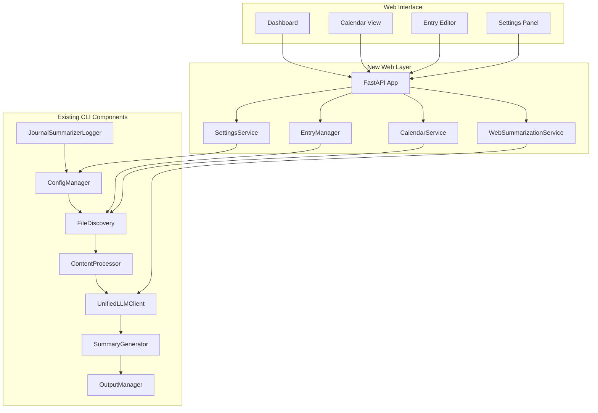

# WorkJournalMaker - Architecture and Key Components

## Project Overview

WorkJournalMaker is a hybrid work journal application that combines a web interface with command-line functionality for managing journal entries and generating AI-powered insights. The application is built with Python 3.9+, FastAPI, SQLite, and integrates with Google Gemini for AI summarization.

## Core Architecture

The application follows a modular architecture that separates concerns between the existing CLI components and the new web layer. This design allows for clean integration and maintains compatibility with both interfaces.

### Architectural Diagram

### Key Components

- **FastAPI App (`web/app.py`):** The core of the web application, responsible for routing, middleware, and overall application lifecycle.
- **EntryManager (`web/services/entry_manager.py`):** Manages journal entries by wrapping the `FileDiscovery` service, providing async interfaces for web operations.
- **WebSummarizationService (`web/services/web_summarizer.py`):** Integrates the existing summarization pipeline with async interfaces and progress tracking for the web UI.
- **CalendarService (`web/services/calendar_service.py`):** Provides calendar data and navigation for the web interface, using `FileDiscovery` for date calculations.
- **SettingsService (`web/services/settings_service.py`):** Extends the `ConfigManager` to handle web-specific settings and configurations.
- **Database (`web/database.py`):** SQLite database for indexing journal entries, enabling fast queries and data synchronization for the web interface.