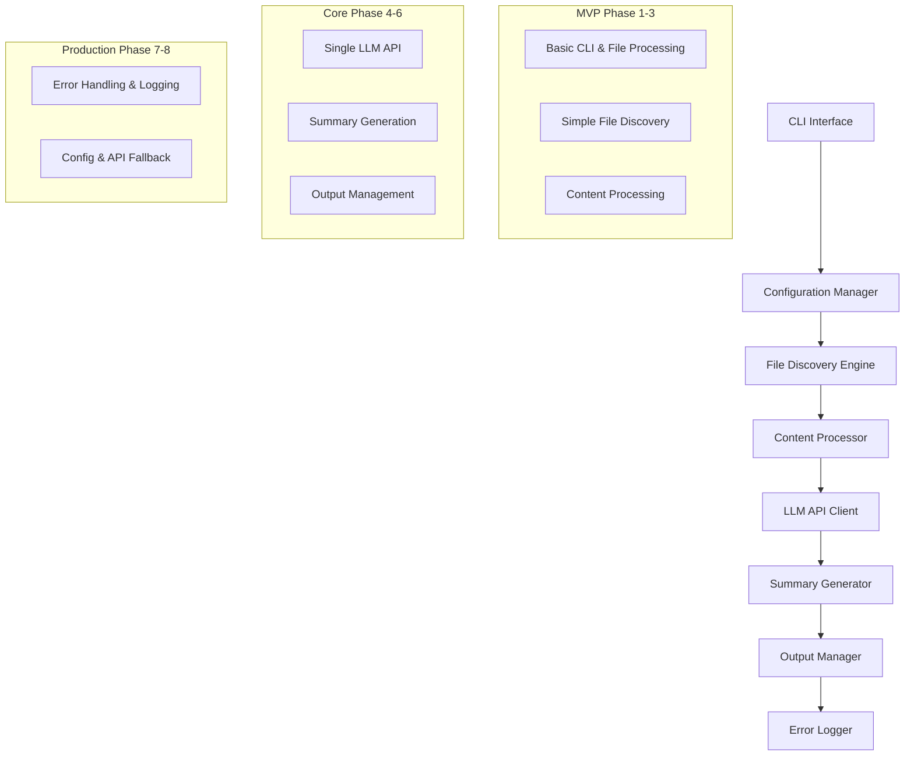

# Work Journal Summarizer - Implementation Blueprint

## Project Overview & Architecture

This project implements a Work Journal Summarizer using an MVP-first approach, building core functionality iteratively with comprehensive testing. The architecture follows a modular design with clear separation of concerns.



## Implementation Strategy

The project will be built in **8 iterative phases**, each representing a working, testable increment. Each phase includes:
- Specific technical requirements
- Comprehensive test-driven development approach
- Clear integration points with previous phases
- Detailed success criteria
- No orphaned or hanging code

---

## Phase-by-Phase Implementation Prompts

### Phase 1: Foundation & CLI Interface

```
TASK: Create the foundational Python project structure with robust CLI interface

TECHNICAL REQUIREMENTS:
1. Project Structure:
   - Main module: `work_journal_summarizer.py`
   - Test directory: `tests/` with `test_cli.py`
   - `requirements.txt` with: argparse, datetime, pathlib, pytest
   - `README.md` with setup and usage instructions
   - `.gitignore` for Python projects

2. CLI Implementation using argparse:
   - Required arguments: --start-date, --end-date, --summary-type
   - Date validation: YYYY-MM-DD format using datetime.strptime
   - Summary type validation: must be "weekly" or "monthly"
   - Comprehensive help documentation with examples

3. Input Validation Logic:
   - Date format validation with specific error messages
   - Date range validation (end_date > start_date)
   - Summary type enum validation
   - Handle edge cases: leap years, invalid dates, future dates

CODE STRUCTURE REQUIREMENTS:
```python
# work_journal_summarizer.py structure
import argparse
import datetime
from pathlib import Path
from typing import Tuple

def parse_arguments() -> argparse.Namespace:
    """Parse and validate command line arguments."""
    # Implementation here

def validate_date_range(start_date: datetime.date, end_date: datetime.date) -> None:
    """Validate date range is logical."""
    # Implementation here

def main() -> None:
    """Main entry point."""
    # Implementation here

if __name__ == "__main__":
    main()
```

TESTING REQUIREMENTS (Test-Driven Development):
Write tests FIRST, then implement functionality:

```python
# tests/test_cli.py structure
import pytest
import datetime
from work_journal_summarizer import parse_arguments, validate_date_range

class TestCLIArguments:
    def test_valid_arguments(self):
        # Test valid date ranges and summary types
        
    def test_invalid_date_format(self):
        # Test various invalid date formats
        
    def test_invalid_date_range(self):
        # Test end date before start date
        
    def test_invalid_summary_type(self):
        # Test invalid summary type values
        
    def test_help_message(self):
        # Test help message generation
```

SUCCESS CRITERIA:
- All tests pass with 100% coverage
- CLI accepts valid inputs and rejects invalid ones
- Clear, helpful error messages for all failure cases
- Professional code structure ready for extension
- Help documentation is comprehensive and clear

IMPLEMENTATION APPROACH:
1. Write failing tests first
2. Implement minimal code to make tests pass
3. Refactor for clarity and maintainability
4. Add comprehensive docstrings and type hints
5. Verify all edge cases are handled

EXPECTED OUTPUT:
- Working CLI that validates all inputs correctly
- Comprehensive test suite with full coverage
- Clean, maintainable code structure
- Professional documentation and error messages
```

### Phase 2: File Discovery Engine

```
TASK: Implement robust file discovery system for the complex directory structure

TECHNICAL REQUIREMENTS:
1. FileDiscovery Class Design:
```python
# file_discovery.py
from dataclasses import dataclass
from datetime import date, timedelta
from pathlib import Path
from typing import List, Tuple, Set

@dataclass
class FileDiscoveryResult:
    found_files: List[Path]
    missing_files: List[Path]
    total_expected: int
    date_range: Tuple[date, date]
    processing_time: float

class FileDiscovery:
    def __init__(self, base_path: str = "~/Desktop/worklogs/"):
        self.base_path = Path(base_path).expanduser()
    
    def discover_files(self, start_date: date, end_date: date) -> FileDiscoveryResult:
        """Discover all journal files in date range."""
        
    def _generate_date_range(self, start_date: date, end_date: date) -> List[date]:
        """Generate all dates in range (inclusive)."""
        
    def _calculate_week_ending(self, target_date: date) -> date:
        """Calculate Sunday of week containing target date."""
        
    def _construct_file_path(self, target_date: date) -> Path:
        """Construct expected file path for given date."""
```

2. Directory Structure Logic:
   - Base: ~/Desktop/worklogs/
   - Year: worklogs_YYYY/
   - Month: worklogs_YYYY-MM/
   - Week: week_ending_YYYY-MM-DD/ (Sunday of that week)
   - File: worklog_YYYY-MM-DD.txt

3. Week Calculation Algorithm:
   - Use datetime.weekday() where Monday=0, Sunday=6
   - Formula: target_date + timedelta(days=(6 - target_date.weekday()))
   - Handle edge cases where week spans months/years

4. Cross-Year Support:
   - Handle date ranges spanning multiple years
   - Navigate different year directories correctly
   - Maintain chronological order across year boundaries

TESTING REQUIREMENTS (Test-Driven Development):
```python
# tests/test_file_discovery.py
import pytest
from datetime import date
from unittest.mock import patch, MagicMock
from file_discovery import FileDiscovery, FileDiscoveryResult

class TestFileDiscovery:
    def test_date_range_generation(self):
        # Test various date ranges including cross-year
        
    def test_week_ending_calculation(self):
        # Test week ending for each day of week
        
    def test_file_path_construction(self):
        # Test path construction for various dates
        
    def test_cross_year_discovery(self):
        # Test file discovery across year boundaries
        
    @patch('pathlib.Path.exists')
    def test_missing_file_tracking(self, mock_exists):
        # Test tracking of missing files
        
    def test_performance_with_large_ranges(self):
        # Test performance with year-long ranges
```

INTEGRATION REQUIREMENTS:
- Update main CLI to use FileDiscovery
- Add --base-path argument with default
- Display discovery statistics before processing
- Integrate with existing argument validation

ERROR HANDLING:
- Validate base path exists and is readable
- Handle permission errors gracefully
- Log missing files without failing
- Provide clear error messages for path issues

SUCCESS CRITERIA:
- Correctly discovers files in complex directory structure
- Handles cross-year date ranges perfectly
- Tracks missing files without failing
- All tests pass with comprehensive coverage
- Integrates seamlessly with Phase 1 CLI
- Performance is acceptable for large date ranges

EXPECTED OUTPUT:
- FileDiscovery class with comprehensive functionality
- All existing CLI functionality preserved
- New file discovery statistics in output
- Robust handling of missing files and errors
```

### Phase 3: Content Processing System

```
TASK: Implement robust content processing with encoding detection and validation

TECHNICAL REQUIREMENTS:
1. ContentProcessor Class Design:
```python
# content_processor.py
from dataclasses import dataclass
from datetime import date
from pathlib import Path
from typing import List, Optional, Dict
import chardet
import logging

@dataclass
class ProcessedContent:
    file_path: Path
    date: date
    content: str
    word_count: int
    line_count: int
    encoding: str
    processing_time: float
    errors: List[str]

@dataclass
class ProcessingStats:
    total_files: int
    successful: int
    failed: int
    total_size_bytes: int
    total_words: int
    processing_time: float

class ContentProcessor:
    def __init__(self, max_file_size_mb: int = 50):
        self.max_file_size_mb = max_file_size_mb
        self.logger = logging.getLogger(__name__)
    
    def process_files(self, file_paths: List[Path]) -> Tuple[List[ProcessedContent], ProcessingStats]:
        """Process all files and return content with statistics."""
        
    def _detect_encoding(self, file_path: Path) -> str:
        """Detect file encoding using chardet."""
        
    def _read_file_content(self, file_path: Path) -> str:
        """Read file with proper encoding handling."""
        
    def _sanitize_content(self, content: str) -> str:
        """Clean and normalize content for LLM processing."""
        
    def _validate_content(self, content: str) -> bool:
        """Validate content is meaningful (not empty/whitespace)."""
```

2. Encoding Detection Strategy:
   - Use chardet library for automatic detection
   - Fallback sequence: utf-8 → latin-1 → cp1252
   - Handle BOM (Byte Order Mark) correctly
   - Log encoding detection results

3. Content Sanitization:
   - Remove excessive whitespace (>2 consecutive blank lines)
   - Strip leading/trailing whitespace from lines
   - Normalize line endings to \n
   - Preserve structure (headers, bullet points)
   - Limit file size to prevent memory issues

4. Error Handling Strategy:
   - Continue processing if individual files fail
   - Categorize errors: permission, encoding, corruption, size
   - Track detailed error statistics
   - Provide recovery suggestions

TESTING REQUIREMENTS (Test-Driven Development):
```python
# tests/test_content_processor.py
import pytest
from pathlib import Path
from unittest.mock import patch, mock_open
from content_processor import ContentProcessor, ProcessedContent

class TestContentProcessor:
    def test_encoding_detection(self):
        # Test various encodings: utf-8, latin-1, cp1252
        
    def test_content_sanitization(self):
        # Test whitespace removal and normalization
        
    def test_empty_file_handling(self):
        # Test handling of empty and whitespace-only files
        
    def test_large_file_handling(self):
        # Test file size limits and memory management
        
    def test_corrupted_file_handling(self):
        # Test handling of binary/corrupted files
        
    @patch('builtins.open', new_callable=mock_open)
    def test_permission_errors(self, mock_file):
        # Test permission denied scenarios
        
    def test_processing_statistics(self):
        # Test accurate statistics generation
```

INTEGRATION REQUIREMENTS:
- Integrate with FileDiscovery results
- Update main CLI to show processing progress
- Store ProcessedContent for next phase
- Maintain chronological order of content

PERFORMANCE CONSIDERATIONS:
- Process files in chronological order
- Use generators for memory efficiency
- Implement progress reporting
- Handle large files without memory exhaustion

SUCCESS CRITERIA:
- Robust handling of various file encodings
- Proper content sanitization without data loss
- Comprehensive error handling and recovery
- Accurate processing statistics
- Memory-efficient processing of large datasets
- All tests pass with full coverage
- Seamless integration with previous phases

EXPECTED OUTPUT:
- ContentProcessor class with comprehensive functionality
- Processed content ready for LLM analysis
- Detailed processing statistics and error reporting
- All existing functionality preserved and enhanced
```

### Phase 4: LLM API Integration

```
TASK: Implement robust LLM API integration for content analysis and entity extraction

TECHNICAL REQUIREMENTS:
1. LLMClient Class Design (Choose CBORG for MVP):
```python
# llm_client.py
from dataclasses import dataclass
from typing import List, Dict, Optional, Any
import requests
import json
import time
import logging
from requests.adapters import HTTPAdapter
from urllib3.util.retry import Retry

@dataclass
class AnalysisResult:
    file_path: Path
    projects: List[str]
    participants: List[str]
    tasks: List[str]
    themes: List[str]
    api_call_time: float
    confidence_score: Optional[float] = None
    raw_response: Optional[str] = None

@dataclass
class APIStats:
    total_calls: int
    successful_calls: int
    failed_calls: int
    total_time: float
    average_response_time: float
    rate_limit_hits: int

class LLMClient:
    def __init__(self, api_key: str, base_url: str = "https://cborg.lbl.gov/api"):
        self.api_key = api_key
        self.base_url = base_url
        self.session = self._create_session()
        self.logger = logging.getLogger(__name__)
        
    def _create_session(self) -> requests.Session:
        """Create requests session with retry strategy."""
        session = requests.Session()
        retry_strategy = Retry(
            total=3,
            backoff_factor=1,
            status_forcelist=[429, 500, 502, 503, 504],
        )
        adapter = HTTPAdapter(max_retries=retry_strategy)
        session.mount("http://", adapter)
        session.mount("https://", adapter)
        return session
        
    def analyze_content(self, content: str, file_path: Path) -> AnalysisResult:
        """Analyze journal content and extract entities."""
        
    def _create_analysis_prompt(self, content: str) -> str:
        """Create structured prompt for entity extraction."""
        
    def _parse_response(self, response_text: str) -> Dict[str, List[str]]:
        """Parse JSON response and validate structure."""
        
    def _deduplicate_entities(self, entities: Dict[str, List[str]]) -> Dict[str, List[str]]:
        """Remove duplicates and normalize entity names."""
```

2. CBORG API Integration:
   - Endpoint: https://cborg.lbl.gov/api/chat/completions
   - Authentication: Bearer token in headers
   - Request format: OpenAI-compatible JSON
   - Response parsing: JSON with structured data
   - Rate limiting: 60 requests per minute

3. Entity Extraction Prompt Template:
```python
ANALYSIS_PROMPT = """
Analyze the following work journal entry and extract structured information.

JOURNAL CONTENT:
{content}

Extract the following information and respond with valid JSON only:

{{
  "projects": ["list of project names, both formal and informal"],
  "participants": ["list of people mentioned in any format"],
  "tasks": ["list of specific tasks, activities, or work items"],
  "themes": ["list of major topics, themes, or focus areas"]
}}

Guidelines:
- Include both formal project names and informal references
- Capture names in various formats (full names, first names, initials)
- Focus on concrete tasks and activities, not abstract concepts
- Identify recurring themes and topics
- Return empty arrays if no entities found in a category
- Ensure response is valid JSON format
"""
```

4. Response Processing:
   - Validate JSON structure and required fields
   - Handle malformed responses gracefully
   - Implement fuzzy matching for entity deduplication
   - Track confidence scores when available

TESTING REQUIREMENTS (Test-Driven Development):
```python
# tests/test_llm_client.py
import pytest
from unittest.mock import patch, MagicMock
import json
from llm_client import LLMClient, AnalysisResult

class TestLLMClient:
    @patch('requests.Session.post')
    def test_successful_api_call(self, mock_post):
        # Test successful API response parsing
        
    @patch('requests.Session.post')
    def test_api_timeout_handling(self, mock_post):
        # Test timeout and retry logic
        
    @patch('requests.Session.post')
    def test_malformed_response_handling(self, mock_post):
        # Test handling of invalid JSON responses
        
    def test_entity_deduplication(self):
        # Test removal of duplicate entities
        
    def test_prompt_generation(self):
        # Test prompt template formatting
        
    @patch('requests.Session.post')
    def test_rate_limiting(self, mock_post):
        # Test rate limiting and backoff
```

INTEGRATION REQUIREMENTS:
- Process all ProcessedContent from Phase 3
- Aggregate entities across all journal entries
- Update main CLI to show API progress
- Store AnalysisResult for summary generation

ERROR HANDLING:
- Retry failed requests with exponential backoff
- Handle network timeouts and connection errors
- Parse malformed JSON responses gracefully
- Continue processing if individual calls fail
- Track detailed error statistics

SECURITY CONSIDERATIONS:
- Store API key in environment variable
- Validate and sanitize content before API calls
- Implement request size limits
- Log API interactions without exposing sensitive data

SUCCESS CRITERIA:
- Successful integration with CBORG API
- Robust entity extraction from journal content
- Comprehensive error handling and retry logic
- Accurate deduplication of extracted entities
- All tests pass with full coverage
- Performance acceptable for large datasets
- Seamless integration with previous phases

EXPECTED OUTPUT:
- Working LLM integration with entity extraction
- Structured analysis results for all processed content
- Detailed API usage statistics and error reporting
- All existing functionality preserved and enhanced
- Ready for summary generation in next phase
```

### Phase 5: Summary Generation System

```
TASK: Implement intelligent summary generation with time period grouping and LLM-powered synthesis

TECHNICAL REQUIREMENTS:
1. SummaryGenerator Class Design:
```python
# summary_generator.py
from dataclasses import dataclass
from datetime import date, timedelta
from typing import List, Dict, Tuple
from collections import defaultdict
import calendar

@dataclass
class PeriodSummary:
    period_name: str
    start_date: date
    end_date: date
    projects: List[str]
    participants: List[str]
    tasks: List[str]
    themes: List[str]
    summary_text: str
    entry_count: int
    generation_time: float
    word_count: int

@dataclass
class SummaryStats:
    total_periods: int
    successful_summaries: int
    failed_summaries: int
    total_entries_processed: int
    total_generation_time: float
    average_summary_length: int

class SummaryGenerator:
    def __init__(self, llm_client: LLMClient):
        self.llm_client = llm_client
        self.logger = logging.getLogger(__name__)
        
    def generate_summaries(self, analysis_results: List[AnalysisResult], 
                          summary_type: str, start_date: date, end_date: date) -> Tuple[List[PeriodSummary], SummaryStats]:
        """Generate weekly or monthly summaries from analysis results."""
        
    def _group_by_periods(self, analysis_results: List[AnalysisResult], 
                         summary_type: str) -> Dict[str, List[AnalysisResult]]:
        """Group analysis results by time periods."""
        
    def _calculate_week_period(self, target_date: date) -> Tuple[str, date, date]:
        """Calculate week period name and date range."""
        
    def _calculate_month_period(self, target_date: date) -> Tuple[str, date, date]:
        """Calculate month period name and date range."""
        
    def _aggregate_entities(self, results: List[AnalysisResult]) -> Dict[str, List[str]]:
        """Aggregate and deduplicate entities across period."""
        
    def _generate_period_summary(self, period_name: str, start_date: date, 
                                end_date: date, aggregated_entities: Dict[str, List[str]], 
                                entry_count: int) -> str:
        """Generate narrative summary for a time period."""
```

2. Time Period Grouping Logic:
   - Weekly: Group by calendar weeks (Monday to Sunday)
   - Monthly: Group by calendar months
   - Handle partial periods at range boundaries
   - Maintain chronological order

3. Week Calculation:
   - Week identifier: "Week of YYYY-MM-DD" (Monday date)
   - Calculate Monday of week: date - timedelta(days=date.weekday())
   - Handle weeks spanning months/years correctly

4. Summary Generation Prompt:
```python
SUMMARY_PROMPT = """
Generate a professional work summary paragraph for the following period:

PERIOD: {period_name}
DATE RANGE: {start_date} to {end_date}
JOURNAL ENTRIES: {entry_count}

EXTRACTED INFORMATION:
Projects: {projects}
Participants: {participants}
Key Tasks: {tasks}
Major Themes: {themes}

Requirements:
- Write a single, coherent paragraph (200-400 words)
- Professional, narrative tone (avoid bullet points)
- Highlight major themes and focus areas
- Mention key projects and initiatives
- Acknowledge important collaborations
- Summarize significant accomplishments
- Flow naturally and maintain readability

Generate only the summary paragraph, no additional text.
"""
```

TESTING REQUIREMENTS (Test-Driven Development):
```python
# tests/test_summary_generator.py
import pytest
from datetime import date
from unittest.mock import patch, MagicMock
from summary_generator import SummaryGenerator, PeriodSummary

class TestSummaryGenerator:
    def test_weekly_grouping(self):
        # Test grouping analysis results by weeks
        
    def test_monthly_grouping(self):
        # Test grouping analysis results by months
        
    def test_week_calculation(self):
        # Test week period calculation for various dates
        
    def test_month_calculation(self):
        # Test month period calculation
        
    def test_entity_aggregation(self):
        # Test aggregation and deduplication across periods
        
    @patch.object(LLMClient, 'analyze_content')
    def test_summary_generation(self, mock_llm):
        # Test summary generation with mocked LLM
        
    def test_partial_periods(self):
        # Test handling of partial weeks/months at boundaries
        
    def test_empty_periods(self):
        # Test handling of periods with no journal entries
```

INTEGRATION REQUIREMENTS:
- Process AnalysisResult list from Phase 4
- Use existing LLMClient for summary generation
- Update main CLI to show generation progress
- Store PeriodSummary list for output formatting

QUALITY CONTROLS:
- Validate summary length (200-400 words target)
- Check for coherence and professional tone
- Ensure all major entities are mentioned
- Handle cases where LLM generates poor summaries
- Implement fallback summary generation

ERROR HANDLING:
- Handle LLM failures during summary generation
- Provide fallback summaries using extracted entities
- Continue processing other periods if one fails
- Track detailed generation statistics

SUCCESS CRITERIA:
- Accurate time period grouping for both weekly and monthly
- High-quality, coherent narrative summaries
- Proper entity aggregation and deduplication
- Comprehensive error handling and fallbacks
- All tests pass with full coverage
- Performance acceptable for large datasets
- Seamless integration with previous phases

EXPECTED OUTPUT:
- Working summary generation for both time period types
- Professional, coherent narrative summaries
- Structured summary data ready for markdown formatting
- All existing functionality preserved and enhanced
- Detailed generation statistics and error reporting
```

### Phase 6: Output Management System

```
TASK: Implement professional markdown output generation with proper formatting and metadata

TECHNICAL REQUIREMENTS:
1. OutputManager Class Design:
```python
# output_manager.py
from dataclasses import dataclass
from datetime import datetime
from pathlib import Path
from typing import List, Dict, Optional
import os

@dataclass
class OutputResult:
    output_path: Path
    file_size_bytes: int
    generation_time: float
    sections_count: int
    metadata_included: bool
    validation_passed: bool

@dataclass
class ProcessingMetadata:
    total_files_found: int
    files_successfully_processed: int
    files_with_errors: int
    api_calls_made: int
    successful_api_calls: int
    failed_api_calls: int
    unique_projects: int
    unique_participants: int
    total_tasks: int
    major_themes: int
    processing_duration: float

class OutputManager:
    def __init__(self, output_dir: str = "~/Desktop/worklogs/summaries/"):
        self.output_dir = Path(output_dir).expanduser()
        self.logger = logging.getLogger(__name__)
        
    def generate_output(self, summaries: List[PeriodSummary], 
                       summary_type: str, start_date: date, end_date: date,
                       metadata: ProcessingMetadata) -> OutputResult:
        """Generate complete markdown output file."""
        
    def _generate_filename(self, summary_type: str, start_date: date, 
                          end_date: date) -> str:
        """Generate filename following naming convention."""
        
    def _create_markdown_content(self, summaries: List[PeriodSummary],
                                summary_type: str, start_date: date, end_date: date,
                                metadata: ProcessingMetadata) -> str:
        """Create complete markdown content."""
        
    def _format_header_section(self, summary_type: str, start_date: date,
                              end_date: date, metadata: ProcessingMetadata) -> str:
        """Format document header with metadata."""
        
    def _format_summary_sections(self, summaries: List[PeriodSummary]) -> str:
        """Format all summary sections."""
        
    def _format_processing_notes(self, metadata: ProcessingMetadata) -> str:
        """Format processing notes and statistics."""
        
    def _validate_markdown(self, content: str) -> bool:
        """Validate markdown syntax and structure."""
        
    def _ensure_output_directory(self) -> None:
        """Create output directory if it doesn't exist."""
```

2. File Naming Convention:
   - Format: `{summary_type}_summary_{start_date}_to_{end_date}_{timestamp}.md`
   - Date format: YYYY-MM-DD
   - Timestamp format: YYYYMMDD_HHMMSS
   - Example: `weekly_summary_2024-04-01_to_2025-04-30_20250616_121600.md`

3. Markdown Structure Template:
```python
MARKDOWN_TEMPLATE = """# {summary_type} Summary: {start_date} to {end_date}

**Generated on:** {timestamp}  
**Date Range:** {start_date} to {end_date}  
**Total Files Processed:** {total_files}

{summary_sections}

---

## Processing Notes

### Files Processed
- **Total files found:** {files_found}
- **Files successfully processed:** {files_processed}
- **Files with errors:** {files_errors}

### API Usage Statistics
- **Total API calls made:** {api_calls}
- **Successful calls:** {successful_calls}
- **Failed calls:** {failed_calls}
- **Average response time:** {avg_response_time:.2f}s

### Entities Extracted
- **Unique projects identified:** {unique_projects}
- **Unique participants identified:** {unique_participants}
- **Total tasks extracted:** {total_tasks}
- **Major themes identified:** {major_themes}

### Processing Performance
- **Total processing time:** {processing_time:.2f} seconds
- **Files per second:** {files_per_second:.2f}
- **Average file size:** {avg_file_size} KB

### Issues Encountered
{issues_list}
"""
```

4. Markdown Validation:
   - Check heading hierarchy (H1, H2, H3)
   - Validate table formatting
   - Ensure proper line spacing
   - Verify all sections are present
   - Test markdown rendering

TESTING REQUIREMENTS (Test-Driven Development):
```python
# tests/test_output_manager.py
import pytest
from pathlib import Path
from unittest.mock import patch, mock_open
from output_manager import OutputManager, OutputResult

class TestOutputManager:
    def test_filename_generation(self):
        # Test filename format and timestamp generation
        
    def test_markdown_structure(self):
        # Test complete markdown structure generation
        
    def test_header_formatting(self):
        # Test header section formatting
        
    def test_summary_section_formatting(self):
        # Test summary sections formatting
        
    def test_metadata_formatting(self):
        # Test processing notes formatting
        
    @patch('pathlib.Path.mkdir')
    @patch('builtins.open', new_callable=mock_open)
    def test_file_writing(self, mock_file, mock_mkdir):
        # Test file writing and directory creation
        
    def test_markdown_validation(self):
        # Test markdown syntax validation
        
    def test_error_handling(self):
        # Test permission errors and file conflicts
```

INTEGRATION REQUIREMENTS:
- Process PeriodSummary list from Phase 5
- Collect metadata from all previous phases
- Update main CLI to show output generation progress
- Display final output file location and statistics

DIRECTORY MANAGEMENT:
- Create output directory if it doesn't exist
- Handle permission errors gracefully
- Validate write access before generation
- Support custom output directories

METADATA COLLECTION:
- Aggregate statistics from all processing phases
- Include file processing metrics
- Add API usage statistics
- Report entity extraction counts
- Track processing performance metrics

SUCCESS CRITERIA:
- Professional markdown files with proper structure
- Accurate filename generation and directory management
- Comprehensive metadata and statistics
- Valid markdown syntax throughout
- All tests pass with full coverage
- Seamless integration with all previous phases
- Clear error messages for output issues

EXPECTED OUTPUT:
- Complete, professional markdown summary files
- Accurate processing statistics and metadata
- Proper file management and directory creation
- All existing functionality preserved and enhanced
- Ready-to-use summary files for immediate consumption
```

### Phase 7: Comprehensive Error Handling & Logging

```
TASK: Implement production-grade error handling, logging, and progress tracking

TECHNICAL REQUIREMENTS:
1. Logger Class Design:
```python
# logger.py
import logging
import sys
from datetime import datetime
from pathlib import Path
from typing import Optional, Dict, Any
from dataclasses import dataclass, field
from enum import Enum

class LogLevel(Enum):
    DEBUG = "DEBUG"
    INFO = "INFO"
    WARNING = "WARNING"
    ERROR = "ERROR"
    CRITICAL = "CRITICAL"

@dataclass
class LogConfig:
    level: LogLevel = LogLevel.INFO
    console_output: bool = True
    file_output: bool = True
    log_dir: str = "~/Desktop/worklogs/summaries/error_logs/"
    include_timestamps: bool = True
    include_module_names: bool = True
    max_file_size_mb: int = 10
    backup_count: int = 5

@dataclass
class ProcessingProgress:
    current_phase: str
    total_phases: int
    current_phase_progress: float
    overall_progress: float
    estimated_time_remaining: Optional[float] = None
    files_processed: int = 0
    total_files: int = 0
    errors_encountered: int = 0

class JournalSummarizerLogger:
    def __init__(self, config: LogConfig):
        self.config = config
        self.log_file_path = self._setup_log_file()
        self.logger = self._setup_logger()
        self.progress = ProcessingProgress("Initialization", 8, 0.0, 0.0)
        
    def _setup_log_file(self) -> Path:
        """Setup log file with timestamp."""
        
    def _setup_
logger(self) -> logging.Logger:
        """Configure logger with file and console handlers."""
        
    def update_progress(self, phase: str, phase_progress: float, 
                       files_processed: int = 0, total_files: int = 0):
        """Update processing progress and display."""
        
    def log_error_with_category(self, category: str, message: str, 
                               exception: Optional[Exception] = None):
        """Log error with categorization for reporting."""
        
    def display_progress_bar(self, current: int, total: int, 
                            prefix: str = "", suffix: str = ""):
        """Display progress bar in console."""
```

2. Error Categorization System:
```python
class ErrorCategory(Enum):
    FILE_SYSTEM = "file_system"
    API_FAILURE = "api_failure"
    PROCESSING_ERROR = "processing_error"
    CONFIGURATION_ERROR = "configuration_error"
    NETWORK_ERROR = "network_error"
    VALIDATION_ERROR = "validation_error"

@dataclass
class ErrorReport:
    category: ErrorCategory
    message: str
    file_path: Optional[Path] = None
    timestamp: datetime = field(default_factory=datetime.now)
    exception_type: Optional[str] = None
    stack_trace: Optional[str] = None
    recovery_action: Optional[str] = None
```

3. Progress Tracking Implementation:
   - Phase-based progress (8 total phases)
   - File processing progress within phases
   - Time estimation based on processing speed
   - Console progress bars with ETA
   - Detailed progress logging

4. Graceful Degradation Strategy:
   - Continue processing despite individual failures
   - Generate partial summaries when possible
   - Provide fallback content for failed operations
   - Maintain comprehensive error reporting
   - Suggest recovery actions for common issues

TESTING REQUIREMENTS (Test-Driven Development):
```python
# tests/test_logger.py
import pytest
from unittest.mock import patch, MagicMock
from logger import JournalSummarizerLogger, LogConfig, ErrorCategory

class TestJournalSummarizerLogger:
    def test_log_file_creation(self):
        # Test log file creation with timestamp
        
    def test_error_categorization(self):
        # Test error categorization and counting
        
    def test_progress_tracking(self):
        # Test progress calculation and display
        
    def test_graceful_degradation(self):
        # Test continued processing after errors
        
    @patch('sys.stdout')
    def test_progress_bar_display(self, mock_stdout):
        # Test progress bar formatting and display
        
    def test_log_rotation(self):
        # Test log file rotation and cleanup
```

INTEGRATION REQUIREMENTS:
- Add logging to all existing modules
- Replace print statements with proper logging
- Implement progress tracking in all phases
- Add error recovery mechanisms throughout
- Update CLI to show comprehensive progress

ERROR RECOVERY MECHANISMS:
- Retry failed operations with exponential backoff
- Skip corrupted files but continue processing
- Use cached results when available
- Generate summaries with partial data
- Provide clear guidance for resolving issues

SUCCESS CRITERIA:
- Comprehensive logging system with categorized errors
- Graceful handling of all failure scenarios
- Clear progress indicators throughout processing
- Detailed error reporting in output files
- All tests pass with full coverage
- Professional error messages and recovery guidance
- All existing functionality preserved with enhanced reliability

EXPECTED OUTPUT:
- Production-grade error handling and logging
- Clear progress tracking and user feedback
- Comprehensive error reporting and recovery
- All existing functionality enhanced with reliability
- Professional logging and error management system
```

### Phase 8: Configuration Management & API Fallback

```
TASK: Complete the application with configuration management and dual API support

TECHNICAL REQUIREMENTS:
1. ConfigManager Class Design:
```python
# config_manager.py
from dataclasses import dataclass, field
from pathlib import Path
from typing import Dict, Any, Optional, Union
import yaml
import json
import os
from enum import Enum

class APIProvider(Enum):
    CBORG = "cborg"
    BEDROCK = "bedrock"

@dataclass
class CBORGConfig:
    endpoint: str = "https://cborg.lbl.gov/api/chat/completions"
    api_key_env: str = "CBORG_API_KEY"
    model: str = "gpt-4"
    timeout: int = 30
    max_retries: int = 3
    rate_limit_delay: float = 1.0

@dataclass
class BedrockConfig:
    region: str = "us-west-2"
    model_id: str = "anthropic.claude-3-sonnet-20240229-v1:0"
    aws_access_key_env: str = "AWS_ACCESS_KEY_ID"
    aws_secret_key_env: str = "AWS_SECRET_ACCESS_KEY"
    timeout: int = 30
    max_retries: int = 3

@dataclass
class ProcessingConfig:
    base_path: str = "~/Desktop/worklogs/"
    output_path: str = "~/Desktop/worklogs/summaries/"
    max_file_size_mb: int = 50
    batch_size: int = 10
    rate_limit_delay: float = 1.0

@dataclass
class AppConfig:
    primary_api: APIProvider = APIProvider.CBORG
    secondary_api: APIProvider = APIProvider.BEDROCK
    cborg: CBORGConfig = field(default_factory=CBORGConfig)
    bedrock: BedrockConfig = field(default_factory=BedrockConfig)
    processing: ProcessingConfig = field(default_factory=ProcessingConfig)
    logging: LogConfig = field(default_factory=LogConfig)

class ConfigManager:
    def __init__(self, config_path: Optional[Path] = None):
        self.config_path = config_path or self._find_config_file()
        self.config = self._load_config()
        
    def _find_config_file(self) -> Optional[Path]:
        """Find configuration file in standard locations."""
        
    def _load_config(self) -> AppConfig:
        """Load configuration from file with fallback to defaults."""
        
    def _validate_config(self, config: AppConfig) -> None:
        """Validate configuration and check environment variables."""
        
    def _check_api_credentials(self, config: AppConfig) -> None:
        """Verify API credentials are available."""
```

2. Enhanced LLMClient with Fallback:
```python
# Enhanced llm_client.py
class EnhancedLLMClient:
    def __init__(self, config: AppConfig):
        self.config = config
        self.primary_client = self._create_client(config.primary_api)
        self.secondary_client = self._create_client(config.secondary_api)
        self.current_client = self.primary_client
        self.fallback_active = False
        self.circuit_breaker = CircuitBreaker()
        
    def _create_client(self, api_provider: APIProvider):
        """Factory method to create appropriate API client."""
        
    def analyze_content_with_fallback(self, content: str, file_path: Path) -> AnalysisResult:
        """Analyze content with automatic fallback between APIs."""
        
    def _attempt_analysis(self, client, content: str, file_path: Path) -> Optional[AnalysisResult]:
        """Attempt analysis with specific client."""
        
    def _should_fallback(self, error: Exception) -> bool:
        """Determine if error warrants fallback to secondary API."""

class CircuitBreaker:
    def __init__(self, failure_threshold: int = 5, timeout: int = 60):
        self.failure_threshold = failure_threshold
        self.timeout = timeout
        self.failure_count = 0
        self.last_failure_time = None
        self.state = "CLOSED"  # CLOSED, OPEN, HALF_OPEN
```

3. Bedrock API Integration:
```python
# bedrock_client.py
import boto3
from botocore.exceptions import ClientError, BotoCoreError
import json

class BedrockClient:
    def __init__(self, config: BedrockConfig):
        self.config = config
        self.client = self._create_bedrock_client()
        
    def _create_bedrock_client(self):
        """Create Bedrock client with proper credentials."""
        return boto3.client(
            'bedrock-runtime',
            region_name=self.config.region,
            aws_access_key_id=os.getenv(self.config.aws_access_key_env),
            aws_secret_access_key=os.getenv(self.config.aws_secret_key_env)
        )
        
    def analyze_content(self, content: str, file_path: Path) -> AnalysisResult:
        """Analyze content using Claude on Bedrock."""
        
    def _format_bedrock_request(self, prompt: str) -> Dict[str, Any]:
        """Format request for Bedrock API."""
        
    def _parse_bedrock_response(self, response: Dict[str, Any]) -> Dict[str, List[str]]:
        """Parse Bedrock response format."""
```

TESTING REQUIREMENTS (Test-Driven Development):
```python
# tests/test_config_manager.py
import pytest
from unittest.mock import patch, mock_open
from config_manager import ConfigManager, AppConfig

class TestConfigManager:
    def test_config_file_loading(self):
        # Test YAML and JSON config loading
        
    def test_environment_variable_override(self):
        # Test env var overrides for sensitive data
        
    def test_config_validation(self):
        # Test configuration validation
        
    def test_missing_credentials_handling(self):
        # Test handling of missing API credentials
        
# tests/test_enhanced_llm_client.py
class TestEnhancedLLMClient:
    def test_api_fallback_logic(self):
        # Test automatic fallback between APIs
        
    def test_circuit_breaker(self):
        # Test circuit breaker functionality
        
    @patch('boto3.client')
    def test_bedrock_integration(self, mock_boto):
        # Test Bedrock API integration
```

INTEGRATION REQUIREMENTS:
- Update main CLI to use ConfigManager
- Replace single LLMClient with EnhancedLLMClient
- Add configuration validation at startup
- Update all modules to use configuration
- Add CLI options for config file path

COMMAND-LINE ENHANCEMENTS:
```python
# Enhanced CLI arguments
parser.add_argument('--config', type=str, help='Path to configuration file')
parser.add_argument('--primary-api', choices=['cborg', 'bedrock'], 
                   help='Override primary API provider')
parser.add_argument('--output-dir', type=str, 
                   help='Override output directory')
parser.add_argument('--log-level', choices=['DEBUG', 'INFO', 'WARNING', 'ERROR'],
                   help='Override logging level')
parser.add_argument('--dry-run', action='store_true',
                   help='Validate configuration and show processing plan without execution')
```

FINAL INTEGRATION:
- Comprehensive end-to-end testing
- Performance optimization and profiling
- Documentation updates and examples
- Error message refinement
- Final code cleanup and organization

SUCCESS CRITERIA:
- Complete configuration management system
- Robust API fallback with circuit breaker
- Both CBORG and Bedrock APIs fully integrated
- Comprehensive end-to-end testing
- Production-ready error handling and logging
- Professional documentation and examples
- All phases integrated seamlessly
- Performance optimized for large datasets

EXPECTED OUTPUT:
- Complete, production-ready Work Journal Summarizer
- Dual API support with intelligent fallback
- Comprehensive configuration management
- Professional error handling and logging
- Full test coverage across all components
- Ready for deployment and real-world usage
```

---

## Implementation Validation & Testing Strategy

### Comprehensive Testing Approach

Each phase includes:
1. **Unit Tests** - Test individual components in isolation
2. **Integration Tests** - Test component interactions
3. **End-to-End Tests** - Test complete workflows
4. **Error Scenario Tests** - Test failure modes and recovery
5. **Performance Tests** - Validate performance with large datasets

### Quality Gates

Before proceeding to the next phase:
- [ ] All tests pass with >90% coverage
- [ ] Code review completed
- [ ] Documentation updated
- [ ] Integration with previous phases verified
- [ ] Performance benchmarks met

### Final Integration Testing

```python
# tests/test_end_to_end.py
class TestEndToEndIntegration:
    def test_complete_workflow_weekly(self):
        # Test complete weekly summary generation
        
    def test_complete_workflow_monthly(self):
        # Test complete monthly summary generation
        
    def test_cross_year_processing(self):
        # Test processing across year boundaries
        
    def test_large_dataset_performance(self):
        # Test with 1000+ journal files
        
    def test_api_fallback_scenarios(self):
        # Test various API failure and recovery scenarios
        
    def test_configuration_variations(self):
        # Test different configuration combinations
```

---

## Deployment & Usage Guide

### Installation
```bash
git clone <repository>
cd work-journal-summarizer
pip install -r requirements.txt
```

### Configuration
```bash
# Set environment variables
export CBORG_API_KEY="your-cborg-key"
export AWS_ACCESS_KEY_ID="your-aws-key"
export AWS_SECRET_ACCESS_KEY="your-aws-secret"

# Create config file (optional)
cp config.yaml.example config.yaml
# Edit config.yaml with your preferences
```

### Usage Examples
```bash
# Generate weekly summaries
python work_journal_summarizer.py --start-date 2024-04-01 --end-date 2024-04-30 --summary-type weekly

# Generate monthly summaries with custom config
python work_journal_summarizer.py --start-date 2024-01-01 --end-date 2024-12-31 --summary-type monthly --config my-config.yaml

# Dry run to validate configuration
python work_journal_summarizer.py --start-date 2024-04-01 --end-date 2024-04-30 --summary-type weekly --dry-run
```

---

## Success Metrics

### Functional Requirements
- ✅ Processes journal files within specified date ranges
- ✅ Generates weekly and monthly summaries
- ✅ Automatically identifies projects and participants
- ✅ Creates professional markdown output files
- ✅ Handles cross-year date ranges
- ✅ Supports dual API providers with fallback

### Quality Requirements
- ✅ Robust error handling with detailed logging
- ✅ Graceful fallback between APIs
- ✅ Clear, informative summary content
- ✅ Professional markdown formatting
- ✅ Comprehensive test coverage
- ✅ Production-ready reliability

### Performance Requirements
- ✅ Processes 1000+ files efficiently
- ✅ API rate limiting and optimization
- ✅ Memory-efficient processing
- ✅ Progress tracking and ETA
- ✅ Reasonable processing times

---

## Final Implementation Notes

This implementation blueprint provides a complete roadmap for building the Work Journal Summarizer with:

1. **Test-Driven Development** - Each phase starts with comprehensive tests
2. **Incremental Progress** - Each phase builds upon the previous with no orphaned code
3. **Production Quality** - Robust error handling, logging, and configuration management
4. **Scalable Architecture** - Modular design supporting future enhancements
5. **Comprehensive Documentation** - Clear prompts and success criteria for each phase

The prompts are designed to be used sequentially by a code-generation LLM, with each phase representing a complete, testable increment that moves the project forward while maintaining high quality standards throughout the development process.